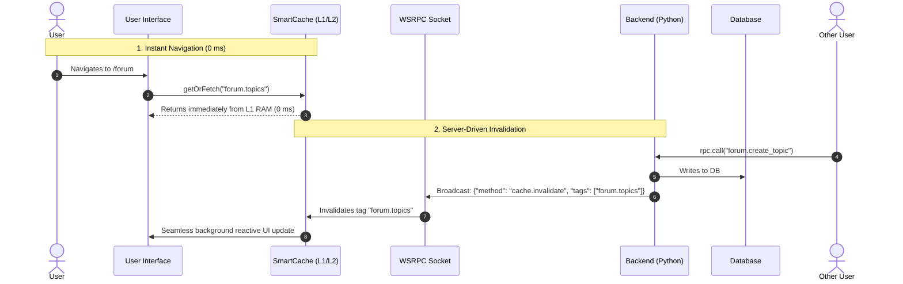

# RFC 0001: Smart Event-Driven Cache with Feedback

* **RFC Number:** 0001
* **Title:** Smart Event-Driven Cache Plugin (`plugins/smart_cache`)
* **Status:** 💡 Proposed
* **Author:** Agrita Core Team
* **Date:** September 2026

---

## 🧭 Table of Contents
1. [Summary](#1-summary)
2. [Motivation](#2-motivation)
3. [Core Philosophy](#3-core-philosophy)
4. [Detailed Design & Specification](#4-detailed-design--specification)
   * [Layer 1: Backend Engine (Python)](#layer-1-backend-engine-python)
   * [Layer 2: Frontend Client (TypeScript)](#layer-2-frontend-client-typescript)
   * [Layer 3: Reconnection Sync Handshake](#layer-3-reconnection-sync-handshake)
5. [Use Cases](#5-use-cases)
6. [Comparison with Existing Solutions](#6-comparison-with-existing-solutions)
7. [Implementation Roadmap](#7-implementation-roadmap)

---

## 1. Summary

This RFC proposes the design and implementation of an official system plugin, **`plugins/smart_cache`** (along with the companion frontend library `smartCache.ts`), for the `rsgi-wsrpc` framework.

The primary objective is to achieve **0 ms perceived UI latency (instant screen transitions)** while maintaining **100% data consistency**, completely eliminating blind polling and stale state displays.

Fundamental axiom:
> **"The server knows when data changes. The client caches everything locally and only invalidates when the server explicitly commands it to do so."**

---

## 2. Motivation

### Why Traditional Web Caching Fails:

1. **HTTP Cache-Control & ETag (Web 2.0 Legacy)**:
   * Built strictly for one-way request-response cycles.
   * If a record changes on the backend, the server **cannot** push an invalidation command to open browser sessions. Users stare at outdated data until `max-age` expires or they manually refresh (F5).

2. **Blind Polling (TanStack Query / SWR / setInterval)**:
   * Frontends continually hammer the backend every 5–15 seconds: *"Any new data? How about now? Now?"*.
   * With 10,000 active concurrent users, this generates millions of redundant database queries, wastes bandwidth, and drains mobile batteries.

3. **Ad-Hoc WebSocket State Management**:
   * Developers write disorganized event listeners (`socket.on("event", ...)`) and manually patch disparate state stores. This inevitably causes cache desynchronization, memory leaks, and race conditions.

Because `rsgi-wsrpc` already maintains a persistent, symmetric WSRPC connection, Smart Cache turns it into an event-driven cache synchronization pipeline.

---

## 3. Core Philosophy



---

## 4. Detailed Design & Specification

### Layer 1: Backend Engine (Python)

#### 1. Version Registry (`plugins/smart_cache/engine.py`)
The server maintains monotonic version counters for entity tags:
* `forum.topics` -> Version `1042`
* `forum.topic:55` -> Version `310`
* `user:10:profile` -> Version `12`

#### 2. `@invalidates` Method Decorator
Decorates mutating RPC handlers:
```python
from plugins.smart_cache import invalidates

@rpc_method("forum.create_reply")
@invalidates(tags=lambda params: [f"forum.topic:{params['topic_id']}", "forum.topics"])
async def create_reply(session, params):
    # Business logic execution...
    return {"reply_id": reply.id}
```
Upon successful handler execution, the server:
1. Increments monotonic version numbers for specified tags.
2. Emits an invalidation frame to active sockets.

#### 3. Reactive Signal Protocols:
* **`cache.invalidate` (Tag-based Invalidation Signal)**:
  ```json
  {
    "jsonrpc": "2.0",
    "method": "cache.invalidate",
    "params": {
      "tags": ["forum.topics", "forum.topic:55"],
      "version": 1043
    }
  }
  ```
  *Usage*: Lists modified, items created/deleted. The client tags the entry as `stale` and refetches in the background only if the view is currently mounted.

* **`cache.patch` (Surgical Delta Patch)**:
  ```json
  {
    "jsonrpc": "2.0",
    "method": "cache.patch",
    "params": {
      "tag": "forum.topic:55",
      "action": "append",
      "field": "replies",
      "item": { "id": 99, "author": "Alex", "text": "Agreed!" }
    }
  }
  ```
  *Usage*: New comment, like counter increment, status update. Data patches directly into browser cache **with zero supplementary network roundtrips**.

---

### Layer 2: Frontend Client (TypeScript: `smartCache.ts`)

Two-Tier Storage Topology (L1 + L2):
* **L1 (RAM State Map)**: Synchronous **0 ms** in-memory retrieval for the active session.
* **L2 (IndexedDB / localStorage)**: Persistent storage across page reloads and for offline PWA operation.

#### Unified `smartCache.getOrFetch()` API:
```typescript
import { smartCache } from '$lib/smartCache';
import { rpc } from '$lib/wsrpc';

// Fetch data with automated caching and invalidation binding
const topics = await smartCache.getOrFetch(
    'forum.topics',
    () => rpc.call('forum.get_topics', {}),
    {
        tags: ['forum.topics'],
        persist: true, // Persist in L2 IndexedDB across browser reloads
        ttlSec: 3600   // Fallback safety TTL
    }
);
```

#### Behavior on Invalidation Event:
1. Upon receiving `cache.invalidate`:
   * If the subscriber is **currently visible in the viewport** — `smartCache` performs a silent background refetch and smoothly updates state without layout jumps or loading spinners.
   * If the view is **not mounted** — the cache key is marked `stale` and will refetch only when the user navigates back to that screen.

---

### Layer 3: Reconnection Sync Handshake

What happens when a user reopens their laptop in the morning or reconnects after 30 minutes in the subway?

1. Upon socket reconnection (`CONNECTED`), the client transmits a version manifest of stored tags:
   ```json
   {
     "jsonrpc": "2.0",
     "method": "cache.sync_check",
     "params": {
       "tags": {
         "forum.topics": 1040,
         "user:42:profile": 12
       }
     }
   }
   ```
2. The server compares client versions against its current state:
   * `user:42:profile` is still `12` ➔ Cache is valid, zero bandwidth used!
   * `forum.topics` progressed to `1045` ➔ Server flags `["forum.topics"]` as stale.
3. The client updates **only the views where changes actually occurred**.

---

## 5. Use Cases

| Scenario | Conventional Approach | Smart Cache Solution |
| :--- | :--- | :--- |
| **Discussion Forum Listing** | Full server reload on every visit (150–300 ms) | **Instant render from L1/L2 (0 ms)**. Silent update only when new threads appear. |
| **Unread Message Counter** | Polling every 10 seconds | **0 queries**. Server sends `cache.patch` the moment another user posts. |
| **Collaborative Order Editing** | Risk of overwriting concurrent edits | Server invalidates order view for all agents when the first agent saves. |
| **Offline PWA Operation** | Network error screen | Seamless offline display via L2 IndexedDB with an "Offline" banner. |

---

## 6. Comparison with Existing Solutions

| Parameter | TanStack Query (React/Svelte Query) | Apollo GraphQL Cache | `rsgi-wsrpc` Smart Cache |
| :--- | :--- | :--- | :--- |
| **Transport** | REST HTTP | GraphQL HTTP | **WSRPC (WebSocket RSGI)** |
| **Server Push** | ❌ None (Requires polling `refetchInterval`) | ⚠️ Requires GraphQL Subscriptions | ✅ **Native (`cache.invalidate`/`patch`)** |
| **Perceived Latency** | 50–200 ms (or stale flicker) | 50–150 ms | **0 ms (Direct L1 RAM State)** |
| **Reconnection Sync** | ❌ Full query refetch cascade | ❌ Manual setup | ✅ **Automated Version Handshake** |
| **AI Token Efficiency** | High consumption (mutations & keys) | Very high (GraphQL schema sprawl) | **Minimal (clean `@invalidates`)** |

---

## 7. Implementation Roadmap

### Phase 1: Backend Plugin (`plugins/smart_cache`)
* [ ] `VersionRegistry` class (in-memory process cache + SQLite persistence).
* [ ] `@invalidates(tags=[...])` decorator for RPC handlers.
* [ ] Broadcast event emitters for `cache.invalidate` and `cache.patch`.
* [ ] `cache.sync_check` RPC method for reconnection version verification.

### Phase 2: Frontend Client (`client/smartCache.ts`)
* [ ] L1 in-memory storage map.
* [ ] L2 IndexedDB / localStorage persistence adapter.
* [ ] `smartCache.getOrFetch(key, fetcher, options)` method.
* [ ] Built-in listeners for `rpc.on("cache.invalidate")` and `rpc.on("cache.patch")`.
* [ ] Automatic sync handshake in `rpc.onConnect`.

### Phase 3: Documentation & Application Ingestion
* [ ] Developer guide in `docs/smart_cache.md` and `docs_ru/smart_cache.md`.
* [ ] Pilot rollout in `app/forum` and `app/articles`.
