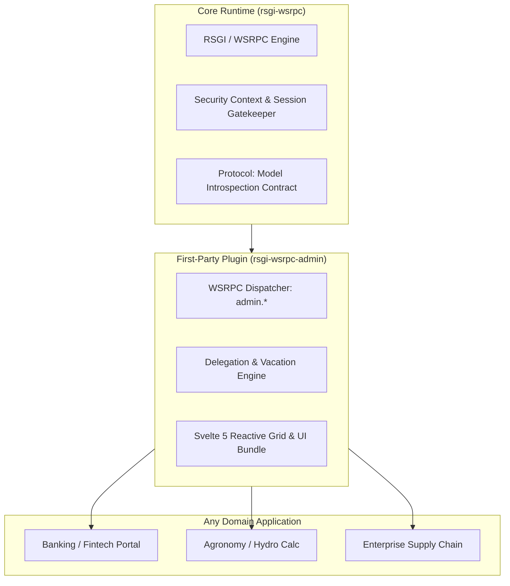

# RFC 0003: Reactive Admin Plugin & Enterprise Delegation Architecture

* **RFC Number:** 0003
* **Title:** Reactive Admin Plugin & Enterprise Delegation Architecture (`rsgi-wsrpc-admin`)
* **Status:** 📝 Proposed / Draft
* **Author:** Core Architecture Team
* **Date:** September 2026

---

## 🧭 Table of Contents
1. [Summary](#1-summary)
2. [Motivation & Background](#2-motivation--background)
3. [Architectural Separation: Core Engine vs Plugin](#3-architectural-separation-core-engine-vs-plugin)
4. [Model Introspection Protocol (`admin.schema`)](#4-model-introspection-protocol-adminschema)
5. [Enterprise Teams, RLS & Delegation Engine](#5-enterprise-teams-rls--delegation-engine)
6. [WSRPC Handlers & Reactive DataGrid Protocol](#6-wsrpc-handlers--reactive-datagrid-protocol)
7. [Frontend Architecture (Svelte 5 & Command Palette)](#7-frontend-architecture-svelte-5--command-palette)
8. [Audit Trail & Four-Eyes Principle](#8-audit-trail--four-eyes-principle)
9. [Integration Example](#9-integration-example)

---

## 1. Summary

This RFC specifies the architecture of **`rsgi-wsrpc-admin`** — an official, domain-agnostic first-party plugin for the `rsgi-wsrpc` framework that delivers a next-generation enterprise administration interface and CRUD engine.

Unlike legacy administration systems (such as Django Admin) built around synchronous WSGI, full-page reloads, and flat model-level permissions, `rsgi-wsrpc-admin` leverages the core strengths of the `rsgi-wsrpc` runtime:
* **Reactive bidirectional transport (WSRPC)** with real-time push synchronization across active operators.
* **Native Row-Level Security (RLS) & Multi-Tenancy** powered by `RowSecureModel` (`creator_id` and `team_id`).
* **Dynamic Enterprise Delegation Engine**: automated temporary portfolio/client reassignment during employee vacation, sick leave, or duty delegation.
* **Deterministic Tabular Payloads (`$tabular: true`)** conforming to RFC 0002 for high-throughput grid streaming.
* **Modern Svelte 5 (Runes) DataGrid UI** featuring virtual scrolling, instant inline editing, Cmd+K command palette, and team context switching.

---

## 2. Motivation & Background

### The Origin: Enterprise & Banking Heritage
The `rsgi-wsrpc` framework core was extracted from a high-security banking enterprise platform. In that environment, records (credit applications, accounts, corporate clients, portfolios) are fundamentally bound to **Teams** and **Ownership**:
1. A front-office manager only has visibility into clients assigned to their specific team or branch (`row_level_only = True`).
2. When a manager departs on vacation or business travel, their assigned clients must be transparently delegated to a substitute colleague without manual data migration or re-keying database rows.
3. Supervisors and audit officers need to switch viewing contexts ("View as Team X") instantly without logging out.

### The Shortcomings of Django Admin in 2026
While Django Admin pioneered rapid web administration in 2005, its paradigm fails modern enterprise requirements:
* **No Reactive Collaboration:** Edits made by another operator are completely invisible until manual browser refresh (F5), causing silent write conflicts.
* **Fragile RLS Support:** Implementing granular team-based visibility requires monkey-patching `get_queryset()` and overriding `has_change_permission()` individually across dozens of `ModelAdmin` definitions.
* **No Built-in Delegation:** Transferring portfolios on vacation requires writing custom workflow engines outside the admin.
* **HTTP Latency & Network Overhead:** Modifying a single cell triggers a full HTTP POST and page rerender instead of a 10ms micro-RPC call.

---

## 3. Architectural Separation: Core Engine vs Plugin

To preserve the minimalism, raw performance, and headless capabilities of the `rsgi-wsrpc` core, the administration system is decoupled into a **Thin Core Contract** and a **Pluggable Admin Extension**:



### Core Responsibilities (`rsgi-wsrpc`):
1. **Introspection Contract**: Base protocols to reflect model fields, types, constraints, and relationships.
2. **Context Resolution**: Invariant propagation of `UserContext` (`user_id`, `roles`, `team_ids`) to all handlers.
3. **Session Interception**: WSRPC Session Gatekeeper ensuring zero unauthorized socket leakage.

### Plugin Responsibilities (`rsgi-wsrpc-admin`):
1. **Schema Exposer (`admin.schema`)**: Translates ORM models into UI column definitions, field widgets, and validation schemas.
2. **Tabular CRUD Handlers (`admin.list`, `admin.update_cell`, `admin.bulk_action`)**.
3. **Delegation Controller**: Manages substitute mappings, schedule bounds, and dynamic RLS query expansion.
4. **Interactive UI**: Svelte 5 frontend component library or standalone SPA.

---

## 4. Model Introspection Protocol (`admin.schema`)

The frontend never hardcodes column configurations. Upon mounting, it calls `admin.schema` over WSRPC to receive the current model catalog and permissions for the authenticated operator:

```json
{
  "jsonrpc": "2.0",
  "method": "admin.schema",
  "result": {
    "models": [
      {
        "key": "client",
        "verbose_name": "Банковский клиент",
        "verbose_name_plural": "Клиенты",
        "is_row_secure": true,
        "permissions": {
          "can_create": true,
          "can_read": true,
          "can_update": true,
          "can_delete": false,
          "row_level_only": true
        },
        "fields": [
          {"name": "id", "type": "integer", "primary_key": true, "read_only": true},
          {"name": "full_name", "type": "string", "label": "ФИО / Наименование", "searchable": true},
          {"name": "tin", "type": "string", "label": "ИНН", "unique": true},
          {"name": "status", "type": "enum", "options": ["active", "suspended", "review"], "editable": true},
          {"name": "team_id", "type": "fk", "target_model": "team", "label": "Отделение / Команда"},
          {"name": "creator_id", "type": "fk", "target_model": "user", "label": "Ответственный менеджер"}
        ]
      }
    ]
  }
}
```

---

## 5. Enterprise Teams, RLS & Delegation Engine

### 5.1 The Delegation Model
Temporary substitution during absences is modeled directly as a persistent first-class entity:

```python
class DelegationRule(RowSecureModel):
    """
    Enterprise delegation: grants temporary operational visibility 
    over delegator's portfolio to substitute user.
    """
    __tablename__ = "auth_delegation_rule"

    delegator_id: Mapped[int] = mapped_column(ForeignKey("auth_user.id", ondelete="CASCADE"), index=True)
    substitute_id: Mapped[int] = mapped_column(ForeignKey("auth_user.id", ondelete="CASCADE"), index=True)
    
    # Scope: None = all models; or specific model name ("client", "order")
    model_scope: Mapped[Optional[str]] = mapped_column(String(50), nullable=True)
    
    # Optional team restriction
    team_id: Mapped[Optional[int]] = mapped_column(ForeignKey("auth_team.id", ondelete="CASCADE"), nullable=True)
    
    valid_from: Mapped[datetime] = mapped_column(DateTime, index=True)
    valid_to: Mapped[datetime] = mapped_column(DateTime, index=True)
    is_active: Mapped[bool] = mapped_column(Boolean, default=True)
    reason: Mapped[str] = mapped_column(String(255))  # e.g., "Ежегодный отпуск"
```

### 5.2 Dynamic RLS Query Rewriting
When an operator queries records via `admin.list`:
1. The engine checks if the user's role requires `row_level_only = True`.
2. The engine resolves active delegations where `substitute_id == current_user.id` and `valid_from <= now <= valid_to`.
3. The SQL `WHERE` clause dynamically expands to include both original and delegated visibility:

$$\text{Visible Rows} = (creator\_id = user\_id) \lor (team\_id \in team\_ids) \lor (creator\_id \in delegated\_user\_ids)$$

No manual reassignment of foreign keys is needed; when the vacation expires, access revokes automatically and deterministically.

---

## 6. WSRPC Handlers & Reactive DataGrid Protocol

### 6.1 Listing Data (`admin.list`) with RFC 0002 Tabular Payloads
Listing requests return packed schemas with zero key duplication:

```json
// Request
{"jsonrpc": "2.0", "id": 1, "method": "admin.list", "params": {"model": "client", "page": 1, "page_size": 50, "team_id": 2}}

// Response
{
  "jsonrpc": "2.0",
  "id": 1,
  "result": {
    "total": 420,
    "page": 1,
    "page_size": 50,
    "$tabular": true,
    "fields": ["id", "full_name", "tin", "status", "team_id", "creator_id"],
    "rows": [
      [101, "ООО Северный Лес", "7701234567", "active", 2, 4],
      [102, "ПАО Энергия", "7709876543", "review", 2, 8]
    ]
  }
}
```

### 6.2 Micro-RPC Inline Cell Editing (`admin.update_cell`)
```json
// Request
{"jsonrpc": "2.0", "id": 2, "method": "admin.update_cell", "params": {"model": "client", "id": 101, "field": "status", "value": "suspended"}}

// Server broadcasts invalidation / live patch to connected team members
{"jsonrpc": "2.0", "method": "cache.patch", "params": {"model": "client", "id": 101, "changes": {"status": "suspended"}, "by_user": "Иван Смирнов"}}
```

### 6.3 Multi-Return Long-Running Bulk Actions (`stream: true`)
For massive operations (e.g., reassigning 5,000 contracts or recalculating commission indices):
* Handlers return intermediate progress notifications (`{"progress": 25, "processed": 1250, "status": "running"}`).
* The UI displays an unblocked real-time progress bar over the WebSocket connection.

---

## 7. Frontend Architecture (Svelte 5 & Command Palette)

The frontend companion package (`@rsgi-wsrpc/admin-ui`) is built on Svelte 5 and modern UI paradigms:
* **Virtual DataGrid**: Renders only visible rows in the viewport, effortlessly supporting 50,000+ records in DOM.
* **Contextual Team Switcher**: A header widget displaying the active team, delegator badges (*"🏖️ Substituting Petrov A. (until Sep 25)"*), and fast switching.
* **Universal Command Palette (Cmd + K)**:
  * Fuzzy search across all entities and tables.
  * Direct action execution (`"Delegate my clients to..."`, `"Export table to Excel"`, `"Filter by status: review"`).
* **Presence & Collaborative Locking**: Shows avatar pills on cells currently being edited by peers to prevent simultaneous collisions.

---

## 8. Audit Trail & Four-Eyes Principle

For compliance in banking, healthcare, and enterprise environments:
1. **Automated Audit Log**: Every `create`, `update_cell`, `delete`, or `bulk_action` automatically logs timestamp, operator ID, surrogate IP, previous value, and new value to `auth_audit_log`.
2. **Four-Eyes Flow (`admin.request_approval`)**:
   * Sensitive mutations (e.g., client deletion, balance write-off) can be configured to require confirmation by a secondary officer.
   * Emits a real-time WSRPC notification to designated supervisors with one-click approve/reject actions.

---

## 9. Integration Example

Registering `rsgi-wsrpc-admin` into any application takes seconds:

```python
from rsgi_wsrpc import App
from rsgi_wsrpc_admin import AdminPlugin, ModelAdmin
from my_app.models import Client, Account, Team, User

app = App()

# Optional model customization
class ClientAdmin(ModelAdmin):
    model = Client
    list_display = ["full_name", "tin", "status", "team_id"]
    search_fields = ["full_name", "tin"]
    enable_inline_edit = True
    four_eyes_approval = ["status"]

admin = AdminPlugin(
    title="Corporate Banking Core Admin",
    route_prefix="/_admin",
    models=[ClientAdmin, Account, Team, User],
    enable_delegation=True,
    enable_audit_log=True,
)

app.register_plugin(admin)
```

---

## 10. Conclusion & Roadmap
RFC 0003 establishes the blueprint for an open, reactive, and enterprise-ready administration standard. By separating model introspection contracts in the core from the rich interactive plugin, `rsgi-wsrpc` gains best-in-class administrative tooling without compromising its lightweight runtime architecture.
