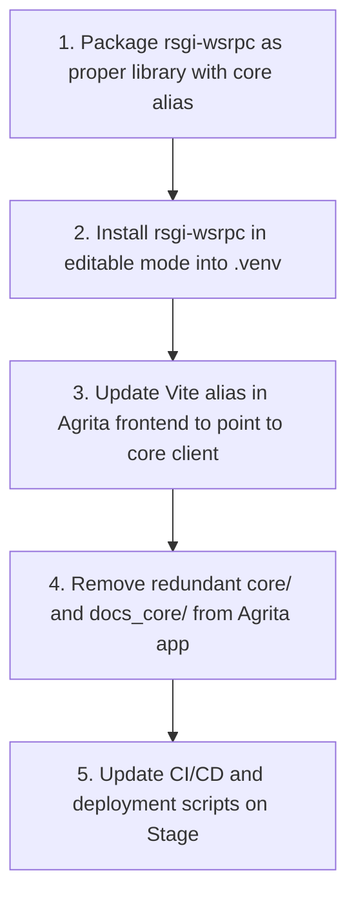

# RFC 0004: Multi-Project Workspace Architecture & Zero-Duality Framework Decoupling

* **RFC Number:** 0004
* **Title:** Multi-Project Workspace Architecture & Zero-Duality Framework Decoupling
* **Status:** 📝 Proposed / Draft
* **Author:** Core Architecture Team
* **Date:** September 2026

---

## 🧭 Table of Contents
1. [Summary](#1-summary)
2. [Motivation & The Problem of Duality](#2-motivation--the-problem-of-duality)
3. [The Single Source of Truth (SSOT) Principle](#3-the-single-source-of-truth-ssot-principle)
4. [Target Workspace Architecture (Umbrella Workspace)](#4-target-workspace-architecture-umbrella-workspace)
5. [Backend Namespace & Packaging (`rsgi_wsrpc`)](#5-backend-namespace--packaging-rsgi_wsrpc)
6. [Frontend Client Integration & Vite Aliasing](#6-frontend-client-integration--vite-aliasing)
7. [Environment, Tooling & Stage Deployment](#7-environment-tooling--stage-deployment)
8. [Step-by-Step Migration Plan](#8-step-by-step-migration-plan)
9. [Conclusion](#9-conclusion)

---

## 1. Summary

This RFC establishes the target architectural standard for organizing multi-project solutions built on top of the **`rsgi-wsrpc`** framework.

The primary objective is the total elimination of **duality** — removing all duplicate codebases, mirrored documentation folders, and desynchronized client libraries. Under RFC 0004:
* **The Core Framework (`rsgi-wsrpc`)** lives strictly as an autonomous, self-contained Git repository and Python package.
* **Domain Applications (e.g. `agrita`, future banking CRM, ERP)** reside in dedicated project directories (`apps/<app_name>`) with zero internal copies of the framework runtime.
* **Canonical Python Namespace (`rsgi_wsrpc`)**: all framework primitives are imported explicitly from `rsgi_wsrpc` (with a transient backward-compatibility alias `core`), completely eliminating namespace collisions.
* **Single Source of Truth for Frontend**: the TypeScript client (`wsrpc.ts`, `smartCache.ts`) resides only inside `rsgi-wsrpc/client/` and is linked directly into applications via Vite aliases or workspace packages.

---

## 2. Motivation & The Problem of Duality

### 2.1 The Historical Compromise
During early development, the `rsgi-wsrpc` runtime was embedded directly inside the `hydro_calc` application repository under a local `core/` folder. While convenient for bootstrapping, this resulted in severe architectural friction as the framework matured into an independent open-source platform:

1. **Dual Core Copies:** `hydro_calc/core/` and `/home/alex/rsgi-wsrpc/core/` existed simultaneously, creating risk of diverged code or missed bugfixes.
2. **Dual Documentation ("The Twins Overhead"):** Documentation was maintained inside `docs_core/` within the application, requiring continuous manual or scripted replication to the standalone `rsgi-wsrpc` repository.
3. **Dual Client Implementations:** Frontend fixes in `frontend/src/lib/wsrpc.ts` had to be manually backported to `rsgi-wsrpc/client/wsrpc.ts`.
4. **Namespace Ambiguity:** Importing `from core.session import ...` is overly generic in Python and collides with standard library or third-party packages.
5. **Git Contamination:** Application-level agronomy commits and core networking protocol commits were tangled in local development trees.

### 2.2 Why Duality Is Fatal in Enterprise Systems
In mission-critical environments (fintech, industrial IoT, large-scale platforms), duality creates:
* **Ghost Bugs:** A critical race condition fixed in the framework repository remains unpatched in an application that relies on an outdated embedded copy.
* **Documentation Drift:** Developers consult outdated API references because the local docs diverge from upstream.
* **Cognitive Fatigue:** Engineers hesitate before making changes: *"Is this Agrita-specific or Core? Where do I commit this? Which file is active?"*

---

## 3. The Single Source of Truth (SSOT) Principle

RFC 0004 mandates strict adherence to the **Single Source of Truth (SSOT)**:

| Asset | Current State (Duality) | Target State (RFC 0004 SSOT) |
| :--- | :--- | :--- |
| **Core Python Code** | Mirrored in `hydro_calc/core/` and `rsgi-wsrpc/core/` | **Strictly in `rsgi-wsrpc/`**, installed via `pip install -e` |
| **Framework Docs & RFCs** | Mirrored in `docs_core/` and `rsgi-wsrpc/docs/` | **Strictly in `rsgi-wsrpc/docs/` & `docs_ru/`** |
| **Frontend Client** | Mirrored in `frontend/src/lib/` and `rsgi-wsrpc/client/` | **Strictly in `rsgi-wsrpc/client/`**, resolved via Vite alias |
| **Python Namespace** | Ambiguous `from core...` | Canonical **`from rsgi_wsrpc...`** |
| **Domain Docs** | Mixed in application root | **Strictly application-specific** (`apps/agrita/docs/`) |

---

## 4. Target Workspace Architecture (Umbrella Workspace)

The development environment is unified under a root workspace directory (e.g. `/home/alex/workspace/` or `/home/alex/projects/`). The name of this top-level container has zero impact on application behavior:

```text
workspace/                                  # Root Umbrella Workspace
├── .venv/                                  # Shared Virtual Environment (Python 3.11+)
│
├── rsgi-wsrpc/                             # REPOSITORY 1: The Core Framework (Git: origin/main)
│   ├── rsgi_wsrpc/                         # Canonical Python package (engine, router, tabular, auth)
│   │   ├── __init__.py
│   │   ├── session.py
│   │   ├── tabular.py
│   │   ├── logger.py
│   │   └── security.py
│   ├── client/                             # Canonical TypeScript Client
│   │   ├── wsrpc.ts                        # WSRPC client with Session Gatekeeper & tabular unpack
│   │   └── smartCache.ts                   # Client-side cache engine
│   ├── docs/ & docs_ru/                    # Canonical Framework Documentation & RFCs (0001, 0002, 0003, 0004)
│   ├── tests/                              # Framework standalone test harness
│   └── pyproject.toml                      # Standard Python packaging configuration
│
├── rsgi-wsrpc-admin/                       # REPOSITORY 2 (Optional): Reactive Admin Plugin (RFC 0003)
│   ├── backend/
│   └── frontend/
│
└── apps/                                   # Domain Applications Directory
    └── agrita/                             # REPOSITORY 3: Agrita Platform (Git: agrita)
        ├── backend/                        # Application Backend
        │   ├── main.py                     # Entry point (boots Granian RSGI via rsgi_wsrpc)
        │   ├── models/                     # Agronomy ORM models (fertilizers, recipes, crops)
        │   ├── handlers/                   # WSRPC business methods (calc.*, forum.*)
        │   ├── settings.yaml               # Database & application configuration
        │   └── migrations/                 # Alembic migrations
        ├── frontend/                       # SvelteKit User Interface
        │   ├── src/
        │   ├── vite.config.ts              # Aliased to ../../rsgi-wsrpc/client
        │   └── package.json
        ├── content/                        # Markdown knowledge base & articles
        ├── docs/                           # Pure agronomy documentation (formulas, passports)
        └── deploy-stage.sh                 # Production/Staging deployment automation
```

---

## 5. Backend Namespace & Packaging (`rsgi_wsrpc`)

### 5.1 Package Definition in `rsgi-wsrpc/pyproject.toml`
The core framework packages its modules under the unambiguous top-level namespace `rsgi_wsrpc`:

```toml
[build-system]
requires = ["setuptools>=61.0"]
build-backend = "setuptools.build_meta"

[project]
name = "rsgi-wsrpc"
version = "0.2.0"
dependencies = [
    "granian>=1.6.0",
    "orjson>=3.9.0",
    "pyjwt>=2.8.0",
    "pyyaml>=6.0.1",
    "cryptography>=42.0.0",
    "argon2-cffi>=23.1.0",
    "sqlalchemy>=2.0.0",
]
```

### 5.2 Canonical Imports
Developers import framework capabilities cleanly and expressively:

```python
# Modern canonical import style
from rsgi_wsrpc import rpc_method, RPCError, pack_tabular
from rsgi_wsrpc.logger import logger
from rsgi_wsrpc.security import current_user_ctx
from rsgi_wsrpc.tabular import tabular_response
```

### 5.3 Zero-Breakage Compatibility Bridge
To allow existing applications to transition smoothly without rewriting hundreds of files overnight, `rsgi-wsrpc` provides a top-level `core` compatibility alias during the transition phase:

```python
# rsgi_wsrpc/__init__.py
import sys
from rsgi_wsrpc import session, tabular, logger, security, constants

# Backward-compatibility alias
sys.modules["core"] = sys.modules[__name__]
sys.modules["core.session"] = session
sys.modules["core.tabular"] = tabular
sys.modules["core.logger"] = logger
sys.modules["core.security"] = security
sys.modules["core.constants"] = constants
```

Legacy statements like `from core.session import rpc_method` continue to execute without modification until refactored.

---

## 6. Frontend Client Integration & Vite Aliasing

### 6.1 Direct Aliasing via `vite.config.ts`
Instead of copying `wsrpc.ts` into every frontend project, applications link directly to the core client via Vite configuration:

```typescript
// apps/agrita/frontend/vite.config.ts
import { sveltekit } from '@sveltejs/kit/vite';
import { defineConfig } from 'vite';
import path from 'path';

export default defineConfig({
    plugins: [sveltekit()],
    resolve: {
        alias: {
            // Direct reference to the canonical framework client
            '@wsrpc': path.resolve(__dirname, '../../../rsgi-wsrpc/client')
        }
    }
});
```

### 6.2 Transparent Component Consumption
Inside any application component or store:
```typescript
import { rpc, wsConnected } from '@wsrpc/wsrpc';
import { smartCache } from '@wsrpc/smartCache';
```

When an engineer fixes an issue or enhances performance in `rsgi-wsrpc/client/wsrpc.ts`:
1. Vite HMR (Hot Module Replacement) instantly updates the running browser tab.
2. Zero file copying or npm republishing is needed during local development.
3. Every application in `apps/` immediately benefits from upstream improvements.

---

## 7. Environment, Tooling & Stage Deployment

### 7.1 Single Python Virtual Environment
To preserve RAM and disk on development and staging servers (such as our 1 GB RAM node):
* A single virtual environment (`.venv`) is created at the workspace root.
* The core framework is installed in **Editable Mode**:
  ```bash
  source /home/alex/workspace/.venv/bin/activate
  pip install -e /home/alex/workspace/rsgi-wsrpc
  pip install -r /home/alex/workspace/apps/agrita/backend/requirements.txt
  ```
* Any code change made inside `rsgi-wsrpc/` is instantly recognized by the running Python runtime without reinstallation.

### 7.2 Staging & Production Deployment
In production/staging scripts (`deploy-stage.sh`):
1. `git -C /home/alex/workspace/rsgi-wsrpc pull origin main`
2. `git -C /home/alex/workspace/apps/agrita pull origin main`
3. `systemctl restart agrita-stage`

---

## 8. Step-by-Step Migration Plan

To ensure 100% service continuity with zero downtime, the decoupling is executed in 5 safe steps:



1. **Phase 1: Packaging & Alias Bridge**
   * Structure `rsgi-wsrpc` with the canonical `rsgi_wsrpc` package and compatibility alias `core`.
   * Test standalone packaging via `pip install -e .`.
2. **Phase 2: Virtualenv Linking**
   * Register editable package in `.venv`.
   * Verify that existing tests (`tests/run.py --target local`) pass without the local `core/` folder on `sys.path`.
3. **Phase 3: Frontend Aliasing**
   * Add `@wsrpc` alias in `apps/agrita/frontend/vite.config.ts`.
   * Replace duplicated `frontend/src/lib/wsrpc.ts` with a 1-line reexport: `export * from '@wsrpc/wsrpc';`.
   * Verify complete frontend compilation (`npm run build`).
4. **Phase 4: Dead Code Elimination**
   * Delete redundant `hydro_calc/core/` and `hydro_calc/docs_core/`.
   * Remove obsolete rules regarding `core_integrity` and `framework_docs_twins` from local project configs.
5. **Phase 5: Staging Verification**
   * Deploy decoupled layout to Stage server (`195.133.5.32`).
   * Run the full integration test harness (`tests/run.py --target stage`).

---

## 9. Conclusion

RFC 0004 permanently resolves architectural friction by decoupling the general-purpose `rsgi-wsrpc` runtime from domain applications. 

By eliminating duplicate code, unifying documentation at the framework level, and standardizing on the canonical `rsgi_wsrpc` namespace, the architecture achieves complete clarity, developer velocity, and enterprise-grade maintainability.
