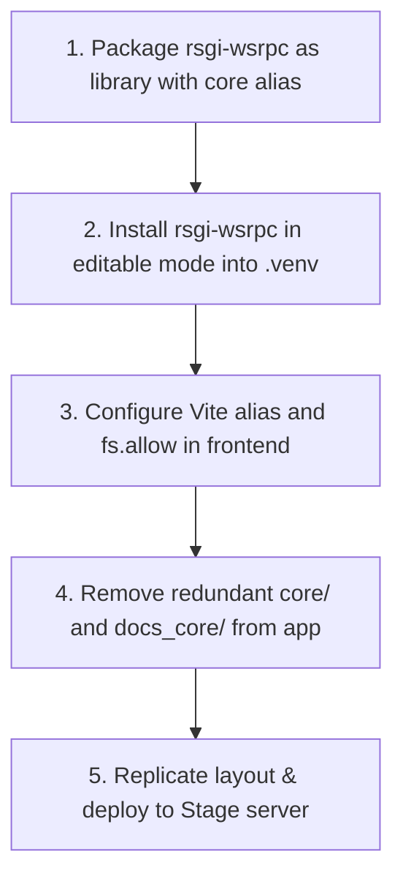

# RFC 0004: Multi-Project Workspace Architecture & Zero-Duality Framework Decoupling

* **RFC Number:** 0004
* **Title:** Multi-Project Workspace Architecture & Zero-Duality Framework Decoupling
* **Status:** 📝 Proposed / Draft
* **Author:** Core Architecture Team
* **Date:** September 2026

---

## 🧭 Table of Contents
1. [Summary](#1-summary)
2. [Motivation & The Problem of Duality](#2-motivation--the-problem-of-duality)
3. [The Single Source of Truth (SSOT) Principle](#3-the-single-source-of-truth-ssot-principle)
4. [Domain Autonomy: Users Belong to Applications, Core Has None](#4-domain-autonomy-users-belong-to-applications-core-has-none)
5. [Target Workspace Architecture (Umbrella Workspace)](#5-target-workspace-architecture-umbrella-workspace)
6. [Backend Namespace & Packaging (`rsgi_wsrpc`)](#6-backend-namespace--packaging-rsgi_wsrpc)
7. [Frontend Client Integration & Vite `fs.allow`](#7-frontend-client-integration--vite-fsallow)
8. [Stage & Production Server Symmetry (`195.133.5.32`)](#8-stage--production-server-symmetry-195133532)
9. [Step-by-Step Migration Plan](#9-step-by-step-migration-plan)
10. [Conclusion](#10-conclusion)

---

## 1. Summary

This RFC establishes the target architectural standard for organizing multi-project solutions built on top of the **`rsgi-wsrpc`** framework.

The primary objective is the total elimination of **duality** — removing all duplicate codebases, mirrored documentation folders, and desynchronized client libraries. Under RFC 0004:
* **The Core Framework (`rsgi-wsrpc`)** lives strictly as an autonomous, self-contained Git repository and Python package.
* **Domain Applications (e.g. `agrita`, future banking CRM, ERP)** reside in dedicated project directories (`apps/<app_name>`) with zero internal copies of the framework runtime.
* **Users Belong to Applications, Core Has None**: the framework core enforces zero database schemas or opinionated user models; it deals solely with an abstract transport `UserContext`.
* **Canonical Python Namespace (`rsgi_wsrpc`)**: all framework primitives are imported explicitly from `rsgi_wsrpc` (with a transient backward-compatibility alias `core`), completely eliminating namespace collisions.
* **Single Source of Truth for Frontend**: the TypeScript client (`wsrpc.ts`, `smartCache.ts`) resides only inside `rsgi-wsrpc/client/` and is linked directly into applications via Vite aliases and `fs.allow`.
* **Exact Server-Local Symmetry**: the staging server layout mirrors the developer's local workspace layout 1:1.

---

## 2. Motivation & The Problem of Duality

### 2.1 The Historical Compromise
During early development, the `rsgi-wsrpc` runtime was embedded directly inside the `hydro_calc` application repository under a local `core/` folder. While convenient for bootstrapping, this resulted in severe architectural friction as the framework matured into an independent open-source platform:

1. **Dual Core Copies:** `hydro_calc/core/` and `/home/alex/rsgi-wsrpc/core/` existed simultaneously, creating risk of diverged code or missed bugfixes.
2. **Dual Documentation ("The Twins Overhead"):** Documentation was maintained inside `docs_core/` within the application, requiring continuous manual or scripted replication to the standalone `rsgi-wsrpc` repository.
3. **Dual Client Implementations:** Frontend fixes in `frontend/src/lib/wsrpc.ts` had to be manually backported to `rsgi-wsrpc/client/wsrpc.ts`.
4. **Namespace Ambiguity:** Importing `from core.session import ...` is overly generic in Python and collides with standard library or third-party packages.
5. **Git Contamination:** Application-level agronomy commits and core networking protocol commits were tangled in local development trees.

### 2.2 Why Duality Is Fatal in Enterprise Systems
In mission-critical environments (fintech, industrial IoT, large-scale platforms), duality creates:
* **Ghost Bugs:** A critical race condition fixed in the framework repository remains unpatched in an application that relies on an outdated embedded copy.
* **Documentation Drift:** Developers consult outdated API references because the local docs diverge from upstream.
* **Cognitive Fatigue:** Engineers hesitate before making changes: *"Is this Agrita-specific or Core? Where do I commit this? Which file is active?"*

---

## 3. The Single Source of Truth (SSOT) Principle

RFC 0004 mandates strict adherence to the **Single Source of Truth (SSOT)**:

| Asset | Current State (Duality) | Target State (RFC 0004 SSOT) |
| :--- | :--- | :--- |
| **Core Python Code** | Mirrored in `hydro_calc/core/` and `rsgi-wsrpc/core/` | **Strictly in `rsgi-wsrpc/`**, installed via `pip install -e` |
| **Framework Docs & RFCs** | Mirrored in `docs_core/` and `rsgi-wsrpc/docs/` | **Strictly in `rsgi-wsrpc/docs/` & `docs_ru/`** |
| **Frontend Client** | Mirrored in `frontend/src/lib/` and `rsgi-wsrpc/client/` | **Strictly in `rsgi-wsrpc/client/`**, resolved via Vite alias |
| **User & Identity Schema** | Unclear boundary between app and core | **Strictly in application domain**; core has NO user schema |
| **Python Namespace** | Ambiguous `from core...` | Canonical **`from rsgi_wsrpc...`** |
| **Domain Docs** | Mixed in application root | **Strictly application-specific** (`apps/agrita/docs/`) |

---

## 4. Domain Autonomy: Users Belong to Applications, Core Has None

A cornerstone architectural principle of `rsgi-wsrpc` is the complete separation between **Session Context** and **User Identity**:

> **"Users belong to the application. The Core does not have them."**

### 4.1 Why Core Has No User Models
Frameworks that enforce an opinionated `User` table (such as early Django's rigid `auth_user`) suffer from catastrophic vendor lock-in. Different domains define users in fundamentally incompatible ways:
* **Agrita (Agronomy/Consumer)**: Users possess crop presets, greenhouse dimensions, subscription tiers, Telegram IDs.
* **Banking / Fintech**: Users possess employee staff IDs, security clearances, digital signature certificates, branch codes.
* **Industrial IoT**: There are no human users; identities represent PLC controllers, sensors, and telemetry gateways.

### 4.2 The Transport Contract (`UserContext`)
The Core framework has no database tables for users, no password hashing opinions, and no email columns. The Core deals solely with the in-memory **Transport Session Context**:

```python
# The only entity rsgi-wsrpc cares about during connection lifecycle
@dataclass
class UserContext:
    user_id: Any                    # int, UUID, string, or device ID
    roles: List[str]                # Canonical role names, e.g. ["admin", "operator"]
    team_ids: List[Union[int, str]] # Team / Branch visibility scope
    metadata: Dict[str, Any]        # Extra arbitrary domain attributes
```

### 4.3 Flow of Control
1. The **Application** defines its own ORM model (e.g. `AgritaUser`, `BankEmployee`, `IotDevice`).
2. The **Application** validates credentials in its custom login handler (passwords, RSA, OAuth2, LDAP, or certificates).
3. The **Application** binds the authenticated context to the active WebSocket session:
   ```python
   session.set_user_context(
       user_id=user.id,
       roles=[r.name for r in user.roles],
       team_ids=user.get_team_ids()
   )
   ```
4. The **Core** propagates this context to all downstream RPC methods, Smart Cache validators, and RLS filters.

---

## 5. Target Workspace Architecture (Umbrella Workspace)

The development environment is unified under a root workspace directory (e.g. `/home/alex/workspace/` or `/home/alex/projects/`). The name of this top-level container has zero impact on application behavior:

```text
workspace/                                  # Root Umbrella Workspace
├── .venv/                                  # Shared Virtual Environment (Python 3.11+)
│
├── rsgi-wsrpc/                             # REPOSITORY 1: The Core Framework (Git: origin/main)
│   ├── rsgi_wsrpc/                         # Canonical Python package (engine, router, tabular, auth)
│   │   ├── __init__.py
│   │   ├── session.py
│   │   ├── tabular.py
│   │   ├── logger.py
│   │   └── security.py
│   ├── client/                             # Canonical TypeScript Client
│   │   ├── wsrpc.ts                        # WSRPC client with Session Gatekeeper & tabular unpack
│   │   └── smartCache.ts                   # Client-side cache engine
│   ├── docs/ & docs_ru/                    # Canonical Framework Documentation & RFCs (0001-0004)
│   ├── tests/                              # Framework standalone test harness
│   └── pyproject.toml                      # Standard Python packaging configuration
│
├── rsgi-wsrpc-admin/                       # REPOSITORY 2 (Optional): Reactive Admin Plugin (RFC 0003)
│   ├── backend/
│   └── frontend/
│
└── apps/                                   # Domain Applications & Environments Directory
    ├── agrita/                             # Production Environment (agrita.ru)
    │   ├── backend/
    │   ├── frontend/
    │   └── deploy-prod.sh
    │
    └── agrita-stage/                       # Staging Environment (stage.agrita.ru)
        ├── backend/
        ├── frontend/
        └── deploy-stage.sh
```

---

## 6. Backend Namespace & Packaging (`rsgi_wsrpc`)

### 6.1 Package Definition in `rsgi-wsrpc/pyproject.toml`
The core framework packages its modules under the unambiguous top-level namespace `rsgi_wsrpc`:

```toml
[build-system]
requires = ["setuptools>=61.0"]
build-backend = "setuptools.build_meta"

[project]
name = "rsgi-wsrpc"
version = "0.2.0"
dependencies = [
    "granian>=1.6.0",
    "orjson>=3.9.0",
    "pyjwt>=2.8.0",
    "pyyaml>=6.0.1",
    "cryptography>=42.0.0",
    "argon2-cffi>=23.1.0",
    "sqlalchemy>=2.0.0",
]
```

### 6.2 Canonical Imports
Developers import framework capabilities cleanly and expressively:

```python
# Modern canonical import style
from rsgi_wsrpc import rpc_method, RPCError, pack_tabular
from rsgi_wsrpc.logger import logger
from rsgi_wsrpc.security import current_user_ctx
from rsgi_wsrpc.tabular import tabular_response
```

### 6.3 Zero-Breakage Compatibility Bridge
To allow existing applications to transition smoothly without rewriting hundreds of files overnight, `rsgi-wsrpc` provides a top-level `core` compatibility alias during the transition phase:

```python
# rsgi_wsrpc/__init__.py
import sys
from rsgi_wsrpc import session, tabular, logger, security, constants

# Backward-compatibility alias
sys.modules["core"] = sys.modules[__name__]
sys.modules["core.session"] = session
sys.modules["core.tabular"] = tabular
sys.modules["core.logger"] = logger
sys.modules["core.security"] = security
sys.modules["core.constants"] = constants
```

Legacy statements like `from core.session import rpc_method` continue to execute without modification until refactored.

---

## 7. Frontend Client Integration & Vite `fs.allow`

### 7.1 Vite Configuration with `fs.allow`
By default, Vite blocks requests to files residing outside the project directory. To safely permit the frontend to import the framework client from the sibling repository, `vite.config.ts` configures both the path alias and `server.fs.allow`:

```typescript
// apps/agrita/frontend/vite.config.ts or apps/agrita-stage/frontend/vite.config.ts
import { sveltekit } from '@sveltejs/kit/vite';
import { defineConfig } from 'vite';
import path from 'path';

export default defineConfig({
    plugins: [sveltekit()],
    resolve: {
        alias: {
            // Direct reference to the canonical framework client
            '@wsrpc': path.resolve(__dirname, '../../../rsgi-wsrpc/client')
        }
    },
    server: {
        fs: {
            // Permit Vite dev server to read canonical client files outside app root
            allow: [
                '..',
                path.resolve(__dirname, '../../../rsgi-wsrpc/client')
            ]
        }
    }
});
```

### 7.2 Transparent Component Consumption
Inside any application component, store, or service:
```typescript
import { rpc, wsConnected } from '@wsrpc/wsrpc';
import { smartCache } from '@wsrpc/smartCache';
```

When an engineer enhances performance or fixes an issue in `rsgi-wsrpc/client/wsrpc.ts`:
1. Vite HMR (Hot Module Replacement) instantly updates the running browser tab.
2. Zero file copying or npm republishing is needed during local development.
3. Every application in `apps/` immediately benefits from upstream improvements.

---

## 8. Server Symmetry: `rsgi-wsrpc`, `apps/agrita`, and `apps/agrita-stage`

To eliminate deployment surprises, the layout on staging and production servers mirrors the local workspace with 100% fidelity, harmoniously supporting both **Production** and **Staging** instances.

### 8.1 Server Directory Layout (`/home/alex/workspace/`)
```text
/home/alex/workspace/                       # Unified root on Server
├── .venv/                                  # Shared virtual environment across Core and all apps
├── rsgi-wsrpc/                             # Single Core repository (cloned from GitHub)
└── apps/
    ├── agrita/                             # Production instance (agrita.ru, port 8090, DB agrita_prod)
    │   ├── backend/
    │   └── frontend/build/
    └── agrita-stage/                       # Staging instance (stage.agrita.ru, port 8092, DB agrita_stage)
        ├── backend/
        └── frontend/build/
```

### 8.2 Systemd Service Units

#### Staging Service (`/etc/systemd/system/agrita-stage.service`):
```ini
[Unit]
Description=Agrita Stage Application (RSGI Granian)
After=network.target postgresql.service

[Service]
User=alex
Group=alex
WorkingDirectory=/home/alex/workspace/apps/agrita-stage/backend
Environment="PATH=/home/alex/workspace/.venv/bin"
Environment="DATABASE_URL=postgresql+asyncpg://agrita_user:AgritaSecurePass2026@/agrita_stage?host=/var/run/postgresql"
ExecStart=/home/alex/workspace/.venv/bin/python main.py
Restart=always
RestartSec=3
StandardOutput=journal
StandardError=journal

[Install]
WantedBy=multi-user.target
```

#### Production Service (`/etc/systemd/system/agrita.service`):
```ini
[Unit]
Description=Agrita Production Application (RSGI Granian)
After=network.target postgresql.service

[Service]
User=alex
Group=alex
WorkingDirectory=/home/alex/workspace/apps/agrita/backend
Environment="PATH=/home/alex/workspace/.venv/bin"
Environment="DATABASE_URL=postgresql+asyncpg://agrita_prod_user:ProdSecurePass2026@/agrita_prod?host=/var/run/postgresql"
ExecStart=/home/alex/workspace/.venv/bin/python main.py
Restart=always
RestartSec=3
StandardOutput=journal
StandardError=journal

[Install]
WantedBy=multi-user.target
```

### 8.3 Nginx Configuration
* **Staging (`stage.agrita.ru`)**:
  * Static Frontend: `root /home/alex/workspace/apps/agrita-stage/frontend/build/client;`
  * Media Uploads: `alias /home/alex/workspace/apps/agrita-stage/backend/data/files/;`
  * WSRPC & API: Proxied to Granian on port 8092 via localhost or Unix Domain Socket.
* **Production (`agrita.ru`)**:
  * Static Frontend: `root /home/alex/workspace/apps/agrita/frontend/build/client;`
  * Media Uploads: `alias /home/alex/workspace/apps/agrita/backend/data/files/;`
  * WSRPC & API: Proxied to Granian on port 8090 via localhost or Unix Domain Socket.

### 8.4 Deterministic Deployment Scripts

#### Staging Deployment (`deploy-stage.sh`):
```bash
#!/usr/bin/env bash
set -e

WORKSPACE="/home/alex/workspace"
CORE_DIR="$WORKSPACE/rsgi-wsrpc"
STAGE_DIR="$WORKSPACE/apps/agrita-stage"

echo "=== 1. Pulling Core Updates ==="
git -C "$CORE_DIR" pull origin main

echo "=== 2. Pulling Stage App Updates ==="
git -C "$STAGE_DIR" pull origin main

echo "=== 3. Building Stage Frontend ==="
cd "$STAGE_DIR/frontend"
npm install --silent
npm run build

echo "=== 4. Restarting Stage Service ==="
sudo systemctl restart agrita-stage

echo "✅ Stage deployment successfully completed!"
```

#### Production Deployment (`deploy-prod.sh`):
```bash
#!/usr/bin/env bash
set -e

WORKSPACE="/home/alex/workspace"
CORE_DIR="$WORKSPACE/rsgi-wsrpc"
PROD_DIR="$WORKSPACE/apps/agrita"

echo "=== 1. Pulling Core Updates ==="
git -C "$CORE_DIR" pull origin main

echo "=== 2. Pulling Production App Updates ==="
git -C "$PROD_DIR" pull origin production

echo "=== 3. Building Production Frontend ==="
cd "$PROD_DIR/frontend"
npm install --silent
npm run build

echo "=== 4. Restarting Production Service ==="
sudo systemctl restart agrita

echo "✅ Production deployment successfully completed!"
```

---

## 9. Step-by-Step Migration Plan

To ensure 100% service continuity with zero downtime, the decoupling is executed in 5 safe steps:



1. **Phase 1: Packaging & Alias Bridge**
   * Structure `rsgi-wsrpc` with the canonical `rsgi_wsrpc` package and compatibility alias `core`.
   * Test standalone packaging via `pip install -e .`.
2. **Phase 2: Virtualenv Linking**
   * Register editable package in `.venv`.
   * Verify that existing tests (`tests/run.py --target local`) pass without the local `core/` folder on `sys.path`.
3. **Phase 3: Frontend Aliasing & `fs.allow`**
   * Add `@wsrpc` alias and `server.fs.allow` in `apps/agrita/frontend/vite.config.ts`.
   * Replace duplicated `frontend/src/lib/wsrpc.ts` with a 1-line reexport: `export * from '@wsrpc/wsrpc';`.
   * Verify complete frontend compilation (`npm run build`).
4. **Phase 4: Dead Code Elimination**
   * Delete redundant `hydro_calc/core/` and `hydro_calc/docs_core/`.
   * Remove obsolete rules regarding `core_integrity` and `framework_docs_twins` from local project configs.
5. **Phase 5: Staging Verification**
   * Deploy decoupled layout to Stage server (`195.133.5.32`).
   * Run the full integration test harness (`tests/run.py --target stage`).

---

## 10. Conclusion

RFC 0004 permanently resolves architectural friction by decoupling the general-purpose `rsgi-wsrpc` runtime from domain applications. 

By eliminating duplicate code, establishing that users belong strictly to applications, unifying documentation at the framework level, and guaranteeing exact server symmetry, the architecture achieves complete clarity, developer velocity, and enterprise-grade maintainability.
