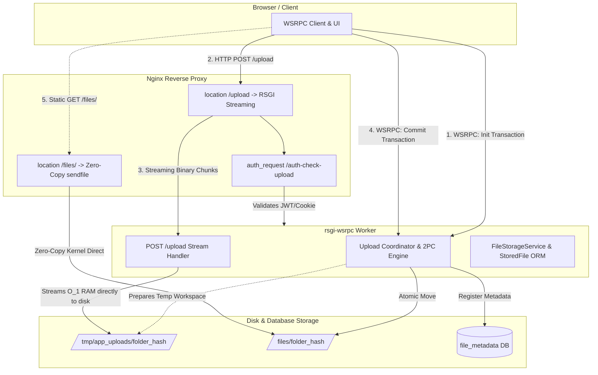
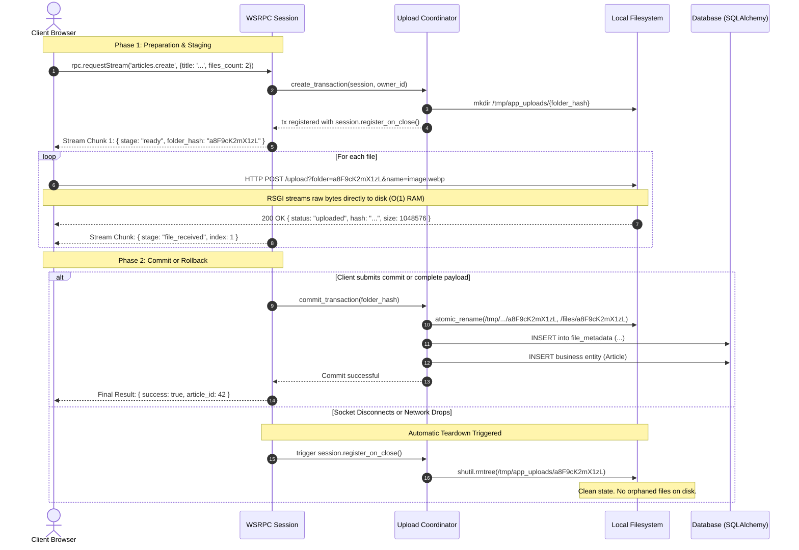

# RFC 0005: File Storage & Two-Phase Commit Upload Subsystem (`plugins.files`)

* **RFC Number:** 0005
* **Title:** File Storage & Two-Phase Commit Upload Subsystem (`plugins.files`)
* **Status:** ✅ Accepted / Implemented (rsgi-wsrpc v0.2.0)
* **Author:** Architecture Team
* **Date:** September 2026

---

## 🧭 Table of Contents
1. [Summary](#1-summary)
2. [Motivation & Problem Statement](#2-motivation--problem-statement)
3. [Core Architectural Principles](#3-core-architectural-principles)
4. [Detailed Specification](#4-detailed-specification)
   * [4.1. Two-Phase Commit (2PC) Upload Lifecycle](#41-two-phase-commit-2pc-upload-lifecycle)
   * [4.2. RSGI Streaming Endpoint (`POST /upload`)](#42-rsgi-streaming-endpoint-post-upload)
   * [4.3. Nginx Pre-Flight Authentication (`/auth-check-upload`)](#43-nginx-pre-flight-authentication-auth-check-upload)
   * [4.4. Socket Disconnect Auto-Rollback](#44-socket-disconnect-auto-rollback)
   * [4.5. Universal Metadata Registry (`StoredFile`)](#45-universal-metadata-registry-storedfile)
   * [4.6. High-Throughput Static Serving & Offloading](#46-high-throughput-static-serving--offloading)
5. [WSRPC Handlers & Reactive Multi-Return Protocol](#5-wsrpc-handlers--reactive-multi-return-protocol)
6. [Security Considerations](#6-security-considerations)
7. [Implementation Roadmap](#7-implementation-roadmap)

---

## 1. Summary

This RFC specifies the official file management and binary upload subsystem for the `rsgi-wsrpc` framework: **`plugins.files`**.

The subsystem resolves the classic architectural conflict in reactive WebSocket applications: **how to upload large binary streams efficiently, securely, and reliably without transmitting Base64 over WebSockets, without running out of server RAM, and without leaving orphaned garbage files upon network interruptions.**

Key capabilities:
* **Hybrid Transport:** WSRPC (JSON-RPC 2.0) acts as the control and transaction coordinator, while RSGI HTTP streaming handles raw binary payload ingest.
* **Two-Phase Commit (2PC):** Uploads are staged in isolated temporary workspaces and atomically committed to permanent storage only when the enclosing business transaction succeeds.
* **Guaranteed Rollback on Disconnect:** Uncommitted files are automatically purged if the user closes their tab or loses internet connection during the upload flow.
* **Kernel-Level Offload:** Committed static files are served directly via Nginx (`sendfile` / `X-Accel-Redirect`), completely bypassing Python worker processes.
* **Deduplication & Integrity:** Built-in SHA-256 content hashing, MIME-type verification, and quota tracking.

---

## 2. Motivation & Problem Statement

Modern web frameworks handle uploads in deeply flawed ways when combined with reactive WebSockets:

1. **Base64 over WebSocket (Anti-Pattern):**
   * Encodes binary data with a 33% bandwidth penalty.
   * Blocks the event loop while serializing/deserializing large JSON payloads, leading to frame drops and lag for real-time socket events.
2. **Multipart Form-Data directly to Target Folder:**
   * If a network failure occurs midway through an upload (or if database validation fails after files are written), orphaned files clutter disk storage indefinitely.
   * Requires complex periodic garbage collection heuristics that risk deleting valid files or missing stale data.
3. **Buffering in Memory (O(N) RAM Exhaustion):**
   * Many WSGI/ASGI handlers buffer file chunks in RAM, making the server vulnerable to denial-of-service (DoS) attacks when several users upload large videos or archives concurrently.

`plugins.files` resolves all three issues by combining RSGI streaming I/O ($O(1)$ memory consumption) with WebSocket transaction lifecycle hooks.

---

## 3. Core Architectural Principles



1. **Control via WSRPC, Data via HTTP:** Metadata, progress stages, and commit signals travel through the persistent JSON-RPC 2.0 socket. Raw binary bytes travel through HTTP POST.
2. **Transaction Isolation:** Files are written to `/tmp/app_uploads/<folder_hash>/`. The hash is cryptographically random (12 alphanumeric characters) and bound strictly to the user's active session.
3. **Atomic 0 ms Commit:** Moving files from temp to permanent storage (`/files/<folder_hash>/`) occurs via atomic filesystem directory rename on the same mount point ($O(1)$ filesystem operation).
4. **Zero-Copy Download Offload:** Python never reads file bytes from disk to serve downloads. Nginx serves public assets directly and handles protected assets via `X-Accel-Redirect`.

---

## 4. Detailed Specification

### 4.1. Two-Phase Commit (2PC) Upload Lifecycle



### 4.2. RSGI Streaming Endpoint (`POST /upload`)

* **Route:** `@http_route("/upload", methods=["POST"])`
* **Query Parameters / Headers:**
  * `folder`: `str` — Cryptographic transaction hash obtained in the initialization stage.
  * `filename`: `str` — Safe destination filename (or sanitized header `X-File-Name`).
* **Streaming Protocol:**
  ```python
  async def stream_request_to_disk(proto, dest_path: str) -> int:
      bytes_written = 0
      with open(dest_path, "wb") as f:
          while True:
              chunk = await proto.receive_bytes()
              if not chunk:
                  break
              f.write(chunk)
              bytes_written += len(chunk)
      return bytes_written
  ```
  RSGI chunk streaming guarantees that memory usage remains strictly flat ($O(1)$) regardless of whether the file is 100 KB or 5 GB.

### 4.3. Nginx Pre-Flight Authentication (`/auth-check-upload`)

To protect the server from unauthenticated clients saturating bandwidth:
* Nginx utilizes the `auth_request` directive before accepting the request body.
* The endpoint `@http_route("/auth-check-upload", methods=["GET", "POST"])` inspects:
  1. `Authorization: Bearer <jwt>`
  2. `Cookie: rpc_jwt=<jwt>`
* If the token is invalid or expired, the endpoint returns `HTTP 401 Unauthorized`. Nginx terminates the connection immediately without buffering or proxying the payload.

### 4.4. Socket Disconnect Auto-Rollback

Every `JsonRpcSession` maintains a registry of on-close callbacks:
```python
def register_on_close(self, callback: Callable[['JsonRpcSession'], Any]) -> None
```
When an upload transaction initializes:
```python
tx = upload_coordinator.create_transaction(session, owner_id=user.id)
session.register_on_close(lambda s: upload_coordinator.rollback_transaction(tx.folder_hash))
```
If the client browser tab is closed, refreshed, or loses connectivity, the temporary directory `/tmp/app_uploads/<folder_hash>` is immediately purged via `shutil.rmtree(temp_folder, ignore_errors=True)`.

### 4.5. Universal Metadata Registry (`StoredFile`)

All permanent files are registered in the unified `file_metadata` table:

```python
class StoredFile(Base):
    __tablename__ = "file_metadata"

    id: Mapped[int] = mapped_column(Integer, primary_key=True, autoincrement=True)
    folder_hash: Mapped[str] = mapped_column(String(64), index=True, nullable=False)
    filename: Mapped[str] = mapped_column(String(255), nullable=False)
    original_name: Mapped[Optional[str]] = mapped_column(Text, nullable=True)
    size: Mapped[int] = mapped_column(Integer, nullable=False)
    mime_type: Mapped[Optional[str]] = mapped_column(String(128), nullable=True)
    sha256: Mapped[Optional[str]] = mapped_column(String(64), index=True, nullable=True)
    owner_id: Mapped[int] = mapped_column(ForeignKey("auth_user.id", ondelete="CASCADE"), index=True)
    is_public: Mapped[bool] = mapped_column(Boolean, default=True, server_default="1")
    download_token: Mapped[Optional[str]] = mapped_column(String(512), nullable=True)
    created_at: Mapped[datetime] = mapped_column(
        DateTime(timezone=True),
        default=lambda: datetime.now(timezone.utc),
        server_default=func.now()
    )
```

### 4.6. High-Throughput Static Serving & Offloading

#### Public Distribution
```nginx
location /files/ {
    alias /home/alex/hydro_calc/files/;
    sendfile on;
    tcp_nopush on;
    tcp_nodelay on;
    expires 30d;
    add_header Cache-Control "public, max-age=2592000, immutable";
    access_log off;
}
```

#### Protected Downloads (`X-Accel-Redirect`)
```python
@http_route("/download/protected", methods=["GET"])
async def download_protected(scope, proto):
    token = extract_token(scope)
    stored_file = await verify_download_token(token)
    if not stored_file:
        proto.response_str(status=403, headers=[], body="Forbidden")
        return

    proto.response_str(
        status=200,
        headers=[
            ("X-Accel-Redirect", f"/internal_files/{stored_file.folder_hash}/{stored_file.filename}"),
            ("Content-Type", stored_file.mime_type or "application/octet-stream"),
            ("Content-Disposition", f'attachment; filename="{stored_file.original_name}"'),
        ],
        body=""
    )
```

---

## 5. WSRPC Handlers & Reactive Multi-Return Protocol

`plugins.files` registers the following standard RPC handlers:

* `files.init_upload(files_count: int, total_expected_size: int) -> {folder_hash, upload_url}`: Prepares transaction workspace.
* `files.commit(folder_hash: str, metadata: list) -> {committed_files: list}`: Explicit 2PC commit without enclosing entity.
* `files.rollback(folder_hash: str) -> {status: "aborted"}`: Explicit client-side cancellation.
* `files.list_my_files(page: int, limit: int) -> $tabular`: User file manager.
* `files.delete(file_id: int) -> {deleted: true}`: Soft-delete or physical unlinking.

---

## 6. Security Considerations

1. **Path Traversal Prevention:** Storage paths sanitize all client-supplied names via `os.path.basename` and enforce strictly alpha-numeric folder hashes.
2. **Quota Enforcement:** Pre-upload checks verify user disk consumption against active tenant/role limits before issuing transaction hashes.
3. **MIME Sniffing Mitigation:** Uploads are validated via `python-magic` / file signatures, preventing malicious scripts masquerading as harmless images.
4. **Temporary Folder Expiry (GC):** A background task cleans any orphaned `/tmp/app_uploads/` folders older than 2 hours that survived abrupt power/server crashes.

---

## 7. Implementation Roadmap

1. Package `plugins/files/` in `rsgi-wsrpc`:
   * `plugins/files/service.py`: `FileStorageService`
   * `plugins/files/upload.py`: `UploadCoordinator` & streaming handlers
   * `plugins/files/models.py`: `StoredFile`
   * `plugins/files/handlers.py`: WSRPC methods
2. Expose application facade in Agrita: `app/system/files/` re-exporting from `plugins.files`.
3. Update framework twin documentation: `docs/files.md` and `docs_ru/files.md`.
