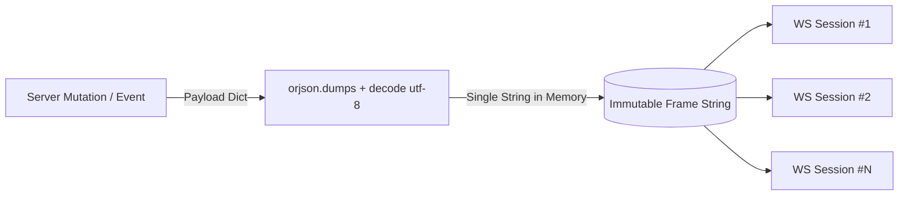

# RFC 0006: WebSocket Broadcast & Real-Time Event Bus (`plugins.broadcast`)

* **RFC Number:** 0006
* **Title:** WebSocket Broadcast & Real-Time Event Bus (`plugins.broadcast`)
* **Status:** 📝 Proposed / In Review
* **Author:** Architecture Team
* **Date:** September 2026

---

## 🧭 Table of Contents
1. [Summary](#1-summary)
2. [Motivation & Architectural Goals](#2-motivation--architectural-goals)
3. [Zero-Copy Broadcast Principle](#3-zero-copy-broadcast-principle)
4. [Targeting & Addressing Patterns](#4-targeting--addressing-patterns)
   * [4.1. Global Broadcast](#41-global-broadcast)
   * [4.2. Targeted User Push (Multi-Device / Multi-Tab)](#42-targeted-user-push-multi-device--multi-tab)
   * [4.3. Role-Based Push (RBAC Targeted Dispatch)](#43-role-based-push-rbac-targeted-dispatch)
   * [4.4. Pub/Sub Channels & Topic Subscriptions](#44-pubsub-channels--topic-subscriptions)
5. [Error Isolation & Non-Blocking Sockets](#5-error-isolation--non-blocking-sockets)
6. [API Specification & Examples](#6-api-specification--examples)
7. [Horizontal Scaling & Cluster Readiness (Redis/NATS Bridge)](#7-horizontal-scaling--cluster-readiness-redisnats-bridge)
8. [Implementation Roadmap](#8-implementation-roadmap)

---

## 1. Summary

This RFC specifies the architecture of **`plugins.broadcast`** — the official real-time event distribution and push notification plugin for the `rsgi-wsrpc` framework.

While standard WSRPC requests operate within a strict request-response or client-initiated stream paradigm, reactive modern web applications frequently require the server to **proactively dispatch events** to one, several, or all connected clients:
* Live cache invalidation frames (`cache.invalidate`, `cache.patch`).
* Real-time notifications (incoming messages, mentions, task completion).
* Collaborative presence updates and operational broadcasts.

`plugins.broadcast` provides high-throughput, non-blocking notification dispatch with $O(1)$ JSON serialization overhead across thousands of concurrent active WebSocket connections.

---

## 2. Motivation & Architectural Goals

In conventional WebSocket setups, broadcasting events to thousands of connected clients commonly suffers from performance bottlenecks:

1. **Redundant Serialization Overhead:** Naive broadcast loops call `json.dumps(payload)` inside a loop for every recipient session. For 10,000 active connections, CPU spends seconds re-encoding identical data.
2. **Slow Client Head-of-Line Blocking:** If one client on a high-latency mobile link blocks or buffers TCP window packets, a synchronous loop causes delays for all subsequent users.
3. **Multi-Tab / Multi-Device Fragmentation:** When an event occurs for a specific user (e.g. User 42 received a message), the server must push the frame to all open tabs and mobile devices belonging to User 42 simultaneously.
4. **Core Decoupling:** The framework core (`core/session.py`) maintains an immutable set of active transport references (`ACTIVE_SESSIONS_SET`), but must remain free of high-level routing logic. `plugins.broadcast` acts as the dedicated distribution engine built atop these primitives.

---

## 3. Zero-Copy Broadcast Principle

To achieve near-zero latency, `plugins.broadcast` strictly enforces the **Serialize Once, Push Everywhere** pattern using `orjson`:



* The JSON-RPC 2.0 notification frame (`{"jsonrpc": "2.0", "method": "...", "params": {...}}`) is encoded to binary UTF-8 **exactly once**.
* The resulting immutable string buffer is dispatched concurrently across active socket handles via `asyncio.gather(*tasks, return_exceptions=True)`.
* Memory allocation is $O(1)$ relative to the number of recipients.

---

## 4. Targeting & Addressing Patterns

### 4.1. Global Broadcast
Sends a notification to all active sessions on the server:
```python
await broadcast_notification(
    method="system.maintenance_warning",
    params={"minutes_left": 5},
    exclude_current=True  # Exclude caller session if invoked from an RPC handler
)
```

### 4.2. Targeted User Push (Multi-Device / Multi-Tab)
Dispatches to all active sessions owned by a specific user account:
```python
await send_to_user(
    user_id=user_id,
    method="chat.message_received",
    params={"dialog_id": 14, "from_user": "Alice", "text": "Hello!"}
)
```
The dispatcher safely inspects session state (`session.uid` or `session.user_data["user_id"]`) and aggregates all active socket transports for that user.

### 4.3. Role-Based Push (RBAC Targeted Dispatch)
Dispatches notifications exclusively to users possessing a designated role:
```python
await send_to_role(
    role="moderator",
    method="forum.flagged_post",
    params={"post_id": 99, "reason": "spam"}
)
```

### 4.4. Pub/Sub Channels & Topic Subscriptions
Allows clients to subscribe to fine-grained live topics (e.g. `order:1024`, `chat:group:5`):
```python
# Server registers subscription
channel_manager.subscribe(session, topic="topic:forum:45")

# Dispatches to all sessions watching that topic
await broadcast_to_topic(
    topic="topic:forum:45",
    method="forum.reply_added",
    params={"reply_id": 128}
)
```
Upon socket disconnect, topic memberships are automatically cleaned up via session teardown callbacks.

---

## 5. Error Isolation & Non-Blocking Sockets

Individual client network failures must never crash or delay broadcasts to other users. Every send operation is wrapped in a safe runner:

```python
async def _safe_send(session: JsonRpcSession, payload_str: str) -> bool:
    try:
        if getattr(session, "_closed", True) or not getattr(session, "ws", None):
            return False
        awaitable = session.ws.send_str(payload_str)
        # Prevent premature cancellation on task switching
        if not hasattr(awaitable, "cancelled"):
            try:
                awaitable.cancelled = lambda: False
            except AttributeError:
                pass
        await awaitable
        return True
    except Exception as e:
        logger.debug(f"[Broadcast] Send error to session {getattr(session, 'session_id', '?')}: {e}")
        return False
```

Failed sends are silently logged at `DEBUG` level and do not raise exceptions into the calling application code.

---

## 6. API Specification & Examples

`plugins.broadcast` exports the following public functions:

```python
from plugins.broadcast import (
    broadcast_notification,
    send_to_user,
    send_to_role,
    broadcast_to_topic,
    subscribe_topic,
    unsubscribe_topic,
)
```

### Practical Application: Granular Cache Invalidation
```python
from plugins.broadcast import broadcast_notification
from plugins.smart_cache import invalidate_tags

async def on_product_updated(product_id: int):
    # Increments tag version in database
    await invalidate_tags([f"product:{product_id}", "products:list"])
    # Notifies all active frontends to update their cache
    await broadcast_notification(
        method="cache.invalidate",
        params={"tags": [f"product:{product_id}", "products:list"]}
    )
```

---

## 7. Horizontal Scaling & Cluster Readiness (Redis/NATS Bridge)

When running `rsgi-wsrpc` in multi-worker or multi-node clusters:
* In-process broadcast distributes across active sockets attached to the **local worker**.
* For distributed nodes, `plugins.broadcast` provides an optional backend adapter:
  * `BroadcastEngine(adapter=RedisPubSubAdapter("redis://..."))`
  * Publishing an event sends a Redis PUB command; all worker instances subscribe to the channel and fan out the frame to their respective local sockets.

---

## 8. Implementation Roadmap

1. Package `plugins/broadcast/`:
   * `plugins/broadcast/__init__.py`: Public API export
   * `plugins/broadcast/engine.py`: Core broadcast routines & zero-copy serializer
   * `plugins/broadcast/channels.py`: Topic subscription registry
2. Introduce facade in Agrita: `app/system/broadcast.py` re-exporting from `plugins.broadcast`.
3. Synchronize twin documentation in `docs/` and `docs_ru/`.
