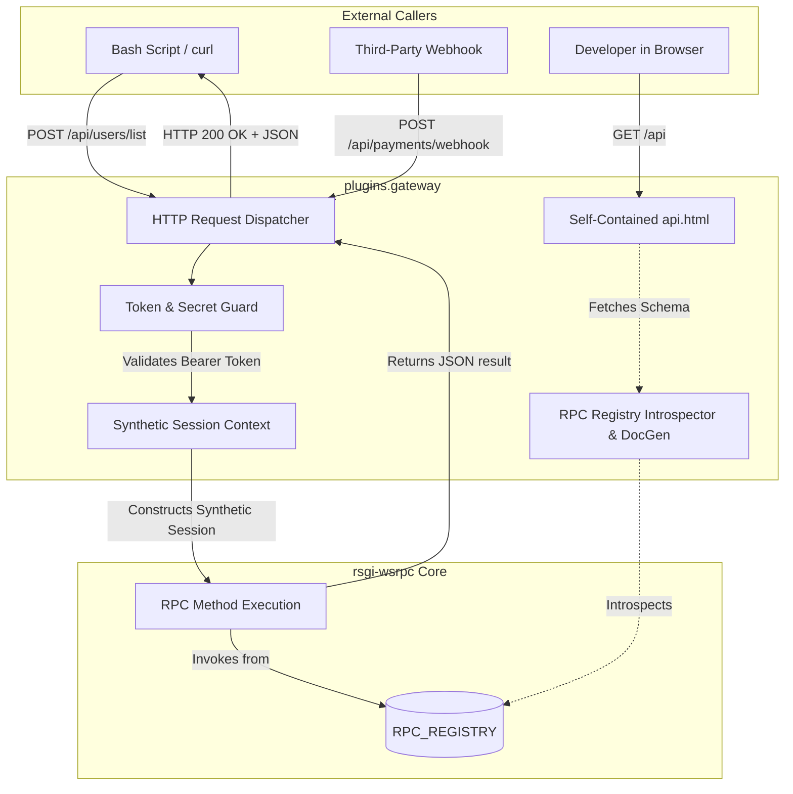

# RFC 0007: HTTP API Gateway & Interactive RPC Documentation (`plugins.gateway`)

* **RFC Number:** 0007
* **Title:** HTTP API Gateway & Interactive RPC Documentation (`plugins.gateway`)
* **Status:** 📝 Proposed / In Review
* **Author:** Architecture Team
* **Date:** September 2026

---

## 🧭 Table of Contents
1. [Summary](#1-summary)
2. [Motivation & Use Cases](#2-motivation--use-cases)
3. [Architecture: The Bridge Between HTTP and WSRPC](#3-architecture-the-bridge-between-http-and-wsrpc)
4. [Detailed Specification](#4-detailed-specification)
   * [4.1. Transparent Route Mapping (`POST /api/...`)](#41-transparent-route-mapping-post-api)
   * [4.2. Bearer Token & Machine-to-Machine Authentication](#42-bearer-token--machine-to-machine-authentication)
   * [4.3. Synthetic Transport Context & Log Traceability](#43-synthetic-transport-context--log-traceability)
   * [4.4. Auto-Documentation Generator (`generate_docs.py`)](#44-auto-documentation-generator-generate_docspy)
   * [4.5. Built-In Interactive API Explorer (`api.html`)](#45-built-in-interactive-api-explorer-apihtml)
5. [Configuration Schema](#5-configuration-schema)
6. [Security & Abuse Prevention](#6-security--abuse-prevention)
7. [Implementation Roadmap](#7-implementation-roadmap)

---

## 1. Summary

This RFC specifies **`plugins.gateway`** — the official HTTP gateway and interactive API documentation plugin for the `rsgi-wsrpc` framework.

While client browsers and mobile apps communicate with `rsgi-wsrpc` via symmetric bidirectional WebSockets, modern systems invariably require interoperability with the broader web:
* Third-party webhooks (Stripe, GitHub, payment systems).
* Backend-to-backend automation scripts, scheduled ETL jobs, and legacy curl integrations.
* Instant interactive API exploration without requiring third-party tools like Postman or custom WebSocket clients.

`plugins.gateway` bridges this gap by mapping standard HTTP requests directly to existing `@rpc_method` handlers with zero code duplication, while automatically generating a self-contained, interactive Swagger-like API documentation interface (`/api`).

---

## 2. Motivation & Use Cases

1. **Dual Codebase Anti-Pattern:** When developers need to expose functionality over HTTP alongside WebSockets, they often duplicate logic (e.g. writing FastAPI/Flask routes that call the same internal services as their RPC methods). This leads to maintenance drift, double validation schemas, and divergent auth models.
2. **Third-Party Webhooks & Scripts:** External systems cannot establish persistent JSON-RPC 2.0 WebSockets. They expect a deterministic HTTP POST endpoint returning standard status codes and JSON payloads.
3. **Interactive Developer Experience (DX):** Frontend engineers and partner developers benefit immensely from an interactive sandbox (similar to Swagger UI) where they can test endpoints, view parameter schemas, and inspect real-time responses.

`plugins.gateway` allows any `@rpc_method` to be securely called over HTTP without modifying its Python implementation.

---

## 3. Architecture: The Bridge Between HTTP and WSRPC



---

## 4. Detailed Specification

### 4.1. Transparent Route Mapping (`POST /api/...`)

When an HTTP request enters the gateway:
1. The route path is parsed into an RPC method name:
   * `POST /api/users/list` $\rightarrow$ invokes `users.list`
   * `POST /api/billing/invoice` $\rightarrow$ invokes `billing.invoice`
2. The HTTP request body (JSON) is decoded via `orjson` and passed as the `params` argument.
3. The response is formatted into a standard HTTP response:
   * Success: `HTTP 200 OK` with body `{"status": "ok", "result": ...}`.
   * Business Error (`RPCError`): `HTTP 400 Bad Request` with `{"status": "error", "message": "..."}`.
   * Permission Denied: `HTTP 403 Forbidden`.
   * Method Not Found: `HTTP 404 Not Found`.

### 4.2. Bearer Token & Machine-to-Machine Authentication

Calls from external scripts and webhooks are authorized via a pre-shared API key or service token:
* Header: `Authorization: Bearer <api_token>`
* The token is validated against `settings.gateway.token` or dynamic API keys stored in database credentials.

### 4.3. Synthetic Transport Context & Log Traceability

Because the core `@rpc_method` expects a `session: JsonRpcSession` and sets context variables (`current_session_ctx`, `current_transport_ctx`), the gateway instantiates a lightweight `MockTransportSession`:

```python
class MockTransportSession:
    def __init__(self, ip: str, token_id: str):
        self.ip = ip
        self.session_id = f"http-gw-{token_id[:8]}"
        self.user_data = {"role": "service_account", "auth_type": "api_token"}
```
This guarantees that auditing, logging, and permission checks function identically whether an invocation originated from a live WebSocket or an HTTP webhook.

### 4.4. Auto-Documentation Generator (`generate_docs.py`)

At server startup or on demand, the gateway introspects all entries in `RPC_REGISTRY`:
* Parses Python docstrings (Markdown/reST) to extract description, parameter tables, and return specifications.
* Inspects type hints and default values using Python's `inspect` module.
* Produces a structured JSON catalog of available methods, authentication requirements, and example payloads.

### 4.5. Built-In Interactive API Explorer (`api.html`)

Accessing `GET /api/` renders a sleek, zero-dependency HTML/CSS/JS explorer:
* Method search and category filtering.
* Visual parameter editor with JSON syntax highlighting.
* "Send Request" button executing direct HTTP calls against the gateway with real-time response rendering and timing metrics.

---

## 5. Configuration Schema

In `app_settings.yaml`:
```yaml
gateway:
  enabled: true
  prefix: "/api"
  # Shared secret token for automation scripts
  token: "secret-production-gateway-token"
  # Optional: expose interactive UI in production
  enable_ui: true
  # Expose only methods with @rpc_method(http=True) or all methods
  expose_all: false
```

---

## 6. Security & Abuse Prevention

1. **Selective Exposure (`http=True`):** By default, only methods explicitly flagged with `http=True` are exposed through the public gateway to prevent unintended exposure of internal socket primitives.
2. **Timing-Safe Token Comparison:** Token verification uses `secrets.compare_digest` to prevent timing attacks.
3. **Payload Size Enforcement:** The RSGI body reader rejects payloads exceeding `settings.gateway.max_body_size` (default: 10 MB) to prevent denial-of-service attempts.

---

## 7. Implementation Roadmap

1. Extract and package `plugins/gateway/`:
   * `plugins/gateway/__init__.py`: Package initialization & route registration
   * `plugins/gateway/router.py`: HTTP to RPC dispatcher
   * `plugins/gateway/introspect.py`: Schema generator
   * `plugins/gateway/static/api.html`: Zero-dependency web UI
2. In Agrita, replace `app/system/internal_api/` with a clean facade to `plugins.gateway`.
3. Add dual-language documentation in `docs/` and `docs_ru/`.
