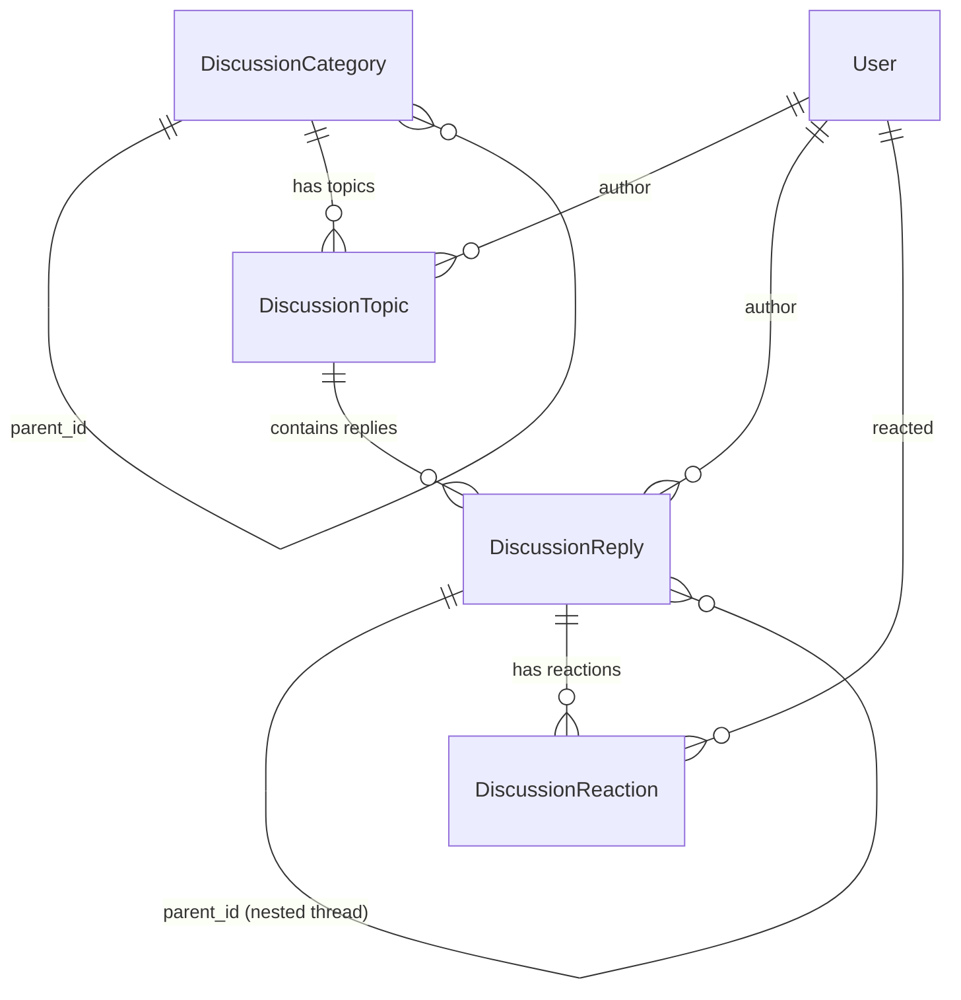

# RFC 0008: Threaded Discussions & Community Forum (`plugins.discussions`)

* **RFC Number:** 0008
* **Title:** Threaded Discussions & Community Forum (`plugins.discussions`)
* **Status:** 📝 Proposed / In Review
* **Author:** Architecture Team
* **Date:** September 2026

---

## 🧭 Table of Contents
1. [Summary](#1-summary)
2. [Motivation & Target Domains](#2-motivation--target-domains)
3. [Domain Model Architecture](#3-domain-model-architecture)
   * [3.1. Categories & Hierarchical Taxonomy](#31-categories--hierarchical-taxonomy)
   * [3.2. Topics & Moderation Flags](#32-topics--moderation-flags)
   * [3.3. Threaded Replies & Accepted Answers](#33-threaded-replies--accepted-answers)
   * [3.4. Emoji Reactions Engine](#34-emoji-reactions-engine)
4. [WSRPC Handlers & Reactive Data Flow](#4-wsrpc-handlers--reactive-data-flow)
5. [High-Performance Tabular Payloads (RFC 0002)](#5-high-performance-tabular-payloads-rfc-0002)
6. [Live Subscriptions & Push Notifications](#6-live-subscriptions--push-notifications)
7. [Security & Access Control (RBAC)](#7-security--access-control-rbac)
8. [Implementation Roadmap](#8-implementation-roadmap)

---

## 1. Summary

This RFC specifies **`plugins.discussions`** — an official, domain-agnostic community discussion, forum, and Q&A engine for the `rsgi-wsrpc` framework.

Modern business applications increasingly demand integrated collaborative features: support communities, internal knowledge sharing, incident post-mortems, feedback forums, and structured Q&A threads.

`plugins.discussions` delivers a high-performance discussion platform fully integrated with:
* **`plugins.auth`:** User attribution, role-based moderation privileges (`moderator`, `admin`).
* **`plugins.broadcast`:** Instant real-time pushes when new replies or reactions are posted.
* **`plugins.smart_cache`:** Zero-latency view rendering with reactive invalidation upon edits.
* **RFC 0002 Tabular Compression:** Minimal bandwidth consumption for large thread listings.

---

## 2. Motivation & Target Domains

Building discussion systems from scratch within domain-specific applications is error-prone and causes massive code duplication across projects. Developers continually reimplement:
* Hierarchical categories and nested reply trees.
* Anti-spam checks, locking, pinning, and moderation workflows.
* Unread counters and reaction aggregations.

`plugins.discussions` provides a turnkey, production-grade engine that serves:
1. **Public Community Forums:** Product feedback, user discussions, and customer support.
2. **Internal Enterprise Q&A:** StackOverflow-style question resolution with "Accepted Answer" verification.
3. **Collaborative Ticket Commentary:** Discussion threads attached to enterprise records.

---

## 3. Domain Model Architecture



### 3.1. Categories & Hierarchical Taxonomy (`DiscussionCategory`)
* `id`: Integer Primary Key.
* `slug`: URL-safe unique identifier (e.g. `announcements`, `help`).
* `title`, `description`, `icon`: Presentation attributes.
* `parent_id`: Recursive Foreign Key enabling infinite tree nesting.
* `sort_order`: Display sequencing index.

### 3.2. Topics & Moderation Flags (`DiscussionTopic`)
* `category_id`: Foreign Key to `DiscussionCategory`.
* `author_id`: Foreign Key to `auth_user.id`.
* `title`, `content`: Markdown-formatted discussion body.
* `tags`: JSON array of taxonomy tags.
* `is_pinned`: Floats topic to top of listing.
* `is_locked`: Prevents further replies (moderation flag).
* `views_count`, `replies_count`: Denormalized counters for instant grid rendering.

### 3.3. Threaded Replies & Accepted Answers (`DiscussionReply`)
* `topic_id`: Foreign Key to `DiscussionTopic`.
* `author_id`: Foreign Key to `auth_user.id`.
* `parent_id`: Optional Foreign Key to `DiscussionReply.id` supporting nested quote/reply trees.
* `content`: Markdown text.
* `is_accepted_answer`: Boolean marking this reply as the verified solution (Q&A mode).

### 3.4. Emoji Reactions Engine (`DiscussionReaction`)
* `reply_id`: Foreign Key to `DiscussionReply`.
* `user_id`: Foreign Key to `auth_user.id`.
* `emoji`: Unicode character or identifier (e.g. `👍`, `❤️`, `💡`, `🎉`).
* Enforces unique constraint `(reply_id, user_id, emoji)`.

---

## 4. WSRPC Handlers & Reactive Data Flow

`plugins.discussions` exposes standard JSON-RPC 2.0 methods:

| Method | Role Required | Description |
| :--- | :--- | :--- |
| `discussions.list_categories` | Any | Returns full taxonomy tree with topic/reply counts |
| `discussions.list_topics` | Any | Tabular list of topics within category with filters |
| `discussions.get_topic` | Any | Full topic detail, tags, and initial replies |
| `discussions.create_topic` | `user` | Creates new topic and dispatches cache invalidation |
| `discussions.update_topic` | Author / Moderator | Edits title, content, or tags |
| `discussions.post_reply` | `user` | Adds reply, increments counters, notifies watchers |
| `discussions.toggle_reaction`| `user` | Adds or removes an emoji reaction |
| `discussions.mark_accepted` | Author / Moderator | Sets `is_accepted_answer = True` |
| `discussions.pin_topic` | Moderator / Admin | Toggles pinned status |
| `discussions.lock_topic` | Moderator / Admin | Toggles locked status |

---

## 5. High-Performance Tabular Payloads (RFC 0002)

Listing topics across high-traffic categories utilizes `@tabular_response`:
```python
@rpc_method("discussions.list_topics")
@tabular_response(fields=[
    "id", "title", "author_id", "author_name", "views_count",
    "replies_count", "is_pinned", "is_locked", "created_at"
])
async def list_topics(session: JsonRpcSession, params: dict):
    category_id = params["category_id"]
    ...
```
This reduces response size by 65–80% compared to standard dictionary arrays.

---

## 6. Live Subscriptions & Push Notifications

When a new reply is submitted:
1. Database record is saved and reply counter incremented.
2. `plugins.smart_cache` updates tag version for `topic:{id}`.
3. `plugins.broadcast` pushes `discussions.new_reply` to all active sessions viewing the topic:
   ```python
   await broadcast_to_topic(
       topic=f"topic:{topic_id}",
       method="discussions.new_reply",
       params=reply.to_dict()
   )
   ```

---

## 7. Security & Access Control (RBAC)

* **Row Ownership:** Authors can edit their own replies within a configurable grace period (e.g. 24 hours), provided the topic is not locked.
* **Moderator Elevation:** Users with `role="moderator"` or `role="admin"` can edit, delete, pin, or lock any topic or reply across all categories.
* **Soft Deletion:** Deleted posts retain audit metadata and mark content as `[deleted by moderator]` to preserve conversation tree integrity.

---

## 8. Implementation Roadmap

1. Package `plugins/discussions/` in `rsgi-wsrpc`:
   * `plugins/discussions/models.py`: Declarative ORM models
   * `plugins/discussions/handlers.py`: WSRPC methods
   * `plugins/discussions/service.py`: Business logic & reaction aggregator
2. Update Agrita: Replace `app/forum/` with a thin domain adapter referencing `plugins.discussions`.
3. Add dual-language documentation in `docs/` and `docs_ru/`.
