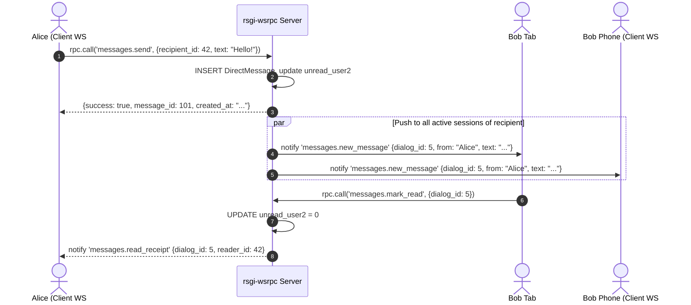

# RFC 0009: Direct Messaging & Real-Time Chat Subsystem (`plugins.messages`)

* **RFC Number:** 0009
* **Title:** Direct Messaging & Real-Time Chat Subsystem (`plugins.messages`)
* **Status:** 📝 Proposed / In Review
* **Author:** Architecture Team
* **Date:** September 2026

---

## 🧭 Table of Contents
1. [Summary](#1-summary)
2. [Motivation & Architecture](#2-motivation--architecture)
3. [Data Model Specification](#3-data-model-specification)
   * [3.1. One-on-One Dialogues (`DirectConversation`)](#31-one-on-one-dialogues-directconversation)
   * [3.2. Message Payloads & State (`DirectMessage`)](#32-message-payloads--state-directmessage)
   * [3.3. Polymorphic Context & Entity Attachments](#33-polymorphic-context--entity-attachments)
4. [Real-Time Delivery & Unread Counter Protocol](#4-real-time-delivery--unread-counter-protocol)
5. [WSRPC Handlers Specification](#5-wsrpc-handlers-specification)
6. [Tabular Compression for History Loading (RFC 0002)](#6-tabular-compression-for-history-loading-rfc-0002)
7. [Privacy & Security](#7-privacy--security)
8. [Implementation Roadmap](#8-implementation-roadmap)

---

## 1. Summary

This RFC specifies **`plugins.messages`** — the official 1-on-1 direct messaging, chat, and notification subsystem for the `rsgi-wsrpc` framework.

Effective user engagement requires instant interpersonal communication: direct messages between colleagues, client-to-manager chats, dispute resolution discussions, and contextual inquiries linked to application entities (orders, calculations, support tickets).

`plugins.messages` provides a complete, high-performance messaging pipeline featuring:
* Instant multi-device push via `plugins.broadcast` (`send_to_user`).
* Dual-counter unread tracking per participant.
* Polymorphic entity attachment references (`ref_type`, `ref_id`).
* Ultra-compact tabular chat history pagination compliant with RFC 0002.

---

## 2. Motivation & Architecture

Traditional REST-based chat implementations struggle with latency, double-read synchronization, and high server polling load. 

By taking advantage of `rsgi-wsrpc`'s persistent bidirectional transport:
1. When User A posts a message, the server writes to the database and immediately pushes an event to all open tabs and devices of User B using `send_to_user`.
2. When User B opens the dialogue, a single WSRPC call marks messages read and dispatches an instant delivery receipt back to User A.
3. Chat history is retrieved over the active socket in compact `$tabular` format with zero HTTP connection negotiation overhead.



---

## 3. Data Model Specification

### 3.1. One-on-One Dialogues (`DirectConversation`)
Manages state between two distinct users:
* `id`: Integer Primary Key.
* `user1_id`, `user2_id`: Foreign Keys to `auth_user.id` (enforced canonical order `min(id), max(id)` to prevent duplicate pairwise threads).
* `last_message`: Snippet preview for conversations list.
* `last_message_time`: UTC timestamp of the latest activity.
* `last_sender_id`: Tracks who sent the latest entry.
* `unread_user1`, `unread_user2`: Independent unread counters.
* `topic_ref_type`, `topic_ref_id`, `topic_ref_title`: Optional polymorphic association linking dialogue to an external entity.

### 3.2. Message Payloads & State (`DirectMessage`)
* `id`: Integer Primary Key.
* `conversation_id`: Foreign Key to `DirectConversation.id` with cascade deletion.
* `sender_id`: Foreign Key to `auth_user.id`.
* `text`: Message body (UTF-8, sanitized).
* `is_read`: Boolean read status flag.
* `attachments`: JSON array of stored file hashes (integrated with `plugins.files`).
* `created_at`: UTC timestamp with microsecond resolution.

### 3.3. Polymorphic Context & Entity Attachments
Rather than hardcoding foreign keys to specific application tables, the dialogue supports dynamic binding:
```python
# Starting a chat regarding an Order or Calculation:
await session.call("messages.get_or_create_dialogue", {
    "recipient_id": 88,
    "ref_type": "calculation",
    "ref_id": "calc_9042",
    "ref_title": "Tomato Fertilizer Recipe v3"
})
```

---

## 4. Real-Time Delivery & Unread Counter Protocol

1. **Immediate Multi-Session Push:** `send_to_user(recipient_id, "messages.new_message", payload)` targets all active sockets registered in `ACTIVE_SESSIONS_SET` matching the recipient ID.
2. **Total Badge Sync:** Whenever messages are received or marked read, the server automatically updates the total unread badge count for the user's interface.

---

## 5. WSRPC Handlers Specification

| Method | Role | Description |
| :--- | :--- | :--- |
| `messages.list_dialogues` | `user` | Returns all active dialogues sorted by `last_message_time` |
| `messages.get_or_create_dialogue` | `user` | Resolves or initializes dialogue between current user and target |
| `messages.get_history` | `user` | Tabular message history with cursor/offset pagination |
| `messages.send_message` | `user` | Sends message, increments counter, fires real-time push |
| `messages.mark_read` | `user` | Clears recipient unread counter, emits read receipt |
| `messages.get_unread_total` | `user` | Returns aggregate unread badge count |

---

## 6. Tabular Compression for History Loading (RFC 0002)

Because chat dialogues can span thousands of individual entries, `messages.get_history` utilizes RFC 0002 compact representation:
```python
@rpc_method("messages.get_history")
@tabular_response(fields=["id", "sender_id", "text", "is_read", "attachments", "created_at"])
async def get_history(session: JsonRpcSession, params: dict):
    ...
```
This minimizes mobile memory overhead and guarantees smooth 60 FPS scrolling in the chat UI.

---

## 7. Privacy & Security

1. **Strict Participant Isolation:** Queries enforce `WHERE (user1_id = :uid OR user2_id = :uid)` ensuring no user can read dialogues they are not part of.
2. **XSS Sanitization:** Message contents are stripped of executable script tags before database insertion.
3. **Blocklist Enforcement:** Checks for mutual blocking before permitting message delivery.

---

## 8. Implementation Roadmap

1. Package `plugins/messages/` in `rsgi-wsrpc`:
   * `plugins/messages/models.py`: Declarative ORM models
   * `plugins/messages/handlers.py`: WSRPC methods
   * `plugins/messages/service.py`: Dialogue manager & badge counter logic
2. In Agrita, replace `app/messages/` with a facade pointing to `plugins.messages`.
3. Add dual-language documentation in `docs/` and `docs_ru/`.
