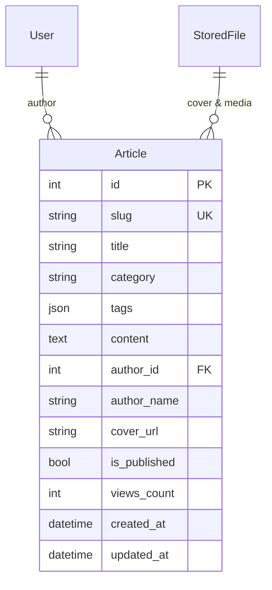

# RFC 0010: Knowledge Base & Article CMS Plugin (`plugins.articles`)

* **RFC Number:** 0010
* **Title:** Knowledge Base & Article CMS Plugin (`plugins.articles`)
* **Status:** 📝 Proposed / In Review
* **Author:** Architecture Team
* **Date:** September 2026

---

## 🧭 Table of Contents
1. [Summary](#1-summary)
2. [Motivation & Use Cases](#2-motivation--use-cases)
3. [Data Architecture & Content Model](#3-data-architecture--content-model)
   * [3.1. The `Article` Entity](#31-the-article-entity)
   * [3.2. Taxonomy: Categories & Multi-Tags](#32-taxonomy-categories--multi-tags)
   * [3.3. Asset Integration with `plugins.files`](#33-asset-integration-with-pluginsfiles)
4. [Reactive Caching Strategy (`plugins.smart_cache`)](#4-reactive-caching-strategy-pluginssmart_cache)
5. [WSRPC Handlers Specification](#5-wsrpc-handlers-specification)
6. [Tabular Payload Delivery (RFC 0002)](#6-tabular-payload-delivery-rfc-0002)
7. [SEO & Headless Rendering (SSR Bridge)](#7-seo--headless-rendering-ssr-bridge)
8. [Implementation Roadmap](#8-implementation-roadmap)

---

## 1. Summary

This RFC specifies **`plugins.articles`** — the official lightweight Knowledge Base, Documentation, and Content Management System (CMS) plugin for the `rsgi-wsrpc` framework.

Practically all modern SaaS, portal, and enterprise applications require structured content delivery: technical documentation, product guides, onboarding tutorials, release changelogs, FAQs, and marketing knowledge bases.

`plugins.articles` provides a high-speed, markdown-native CMS engineered around `rsgi-wsrpc` core tenets:
* **0 ms Perceived Latency:** Full integration with `plugins.smart_cache` ensures instant article switching without network wait.
* **Compact Media Attachments:** Tight coupling with `plugins.files` for banner covers and in-text image uploads.
* **RFC 0002 Tabular Grid Payloads:** Efficient indexing of thousands of articles.
* **Role-Based Publishing Workflows:** Draft/publish state control and editorial permissions.

---

## 2. Motivation & Use Cases

Traditional web CMS systems (WordPress, Strapi, Ghost) introduce heavy external dependencies, separate databases, and disjointed authentication models.

`plugins.articles` eliminates this operational fragmentation by delivering an embedded, high-performance publishing engine directly within the application's unified Python / SQLAlchemy / WSRPC stack:
1. **Product Knowledge Bases & FAQs:** Searchable help centers with categories and tags.
2. **Technical Documentation & Runbooks:** Markdown-rendered manuals with code snippets and version history.
3. **News & Announcements:** Chronological feed of blog posts and platform changelogs.

---

## 3. Data Architecture & Content Model



### 3.1. The `Article` Entity
* `id`: Integer Primary Key.
* `slug`: Unique, URL-friendly slug (e.g. `getting-started-guide`, `ph-ec-management-2026`).
* `title`: Plaintext headline.
* `category`: Broad classification topic (e.g. `Guides`, `Troubleshooting`, `Changelog`).
* `tags`: JSON array of indexed search tags.
* `content`: Full Markdown payload including GitHub-Flavored Markdown (GFM) tables, callouts, and fenced code blocks.
* `author_id`: Foreign Key to `auth_user.id`.
* `author_name`: Denormalized author display name for zero-join tabular lists.
* `cover_url`: Optional banner image link (served via Nginx `/files/`).
* `is_published`: Boolean visibility toggle.
* `views_count`: Monotonically incrementing read counter.

### 3.2. Taxonomy: Categories & Multi-Tags
Articles support dual-layer navigation:
1. Primary single category for directory tree structuring.
2. Secondary JSON tags for cross-cutting discovery and related-article recommendation algorithms.

### 3.3. Asset Integration with `plugins.files`
Images embedded within Markdown bodies leverage the atomic upload coordinator:
* Uploading an illustration emits `/files/<folder_hash>/figure1.webp`.
* Deleting or unpublishing an article flags associated media files for garbage collection.

---

## 4. Reactive Caching Strategy (`plugins.smart_cache`)

Reading articles is an overwhelmingly read-heavy workload ($>99\%$ reads). `plugins.articles` implements the feedback cache pattern:
1. When a user requests `articles.get_by_slug`, the frontend caches the markdown body in L1 IndexedDB tagged as `article:{slug}`.
2. Subsequent visits to the same article render in **0 ms synchronously**.
3. When an editor updates an article:
   ```python
   @rpc_method("articles.update", role="editor")
   @invalidates("articles:list", "article:{slug}")
   async def update_article(session, params):
       ...
   ```
   The server increments the tag version in the database and pushes `cache.invalidate` to all connected browsers.

---

## 5. WSRPC Handlers Specification

| Method | Role Required | Description |
| :--- | :--- | :--- |
| `articles.list` | Any | Tabular list of published articles with category/tag filters |
| `articles.get_by_slug` | Any | Full article body, view increment, author details |
| `articles.get_categories`| Any | Unique list of active categories with article counts |
| `articles.create` | `editor` / `admin` | Creates new article in draft or published state |
| `articles.update` | `editor` / `admin` | Modifies content, tags, or cover; dispatches invalidation |
| `articles.delete` | `editor` / `admin` | Deletes article and unlinks media |
| `articles.admin_list` | `editor` / `admin` | Tabular list including unpublished drafts |

---

## 6. Tabular Payload Delivery (RFC 0002)

The article index utilizes `@tabular_response` to stream catalogue listings:
```python
@rpc_method("articles.list")
@tabular_response(fields=[
    "id", "slug", "title", "category", "tags",
    "author_name", "cover_url", "views_count", "created_at"
])
async def list_articles(session: JsonRpcSession, params: dict):
    ...
```
Omitting the heavy Markdown `content` field and eliminating JSON key redundancy allows transmitting hundreds of article previews in a single 15 KB packet.

---

## 7. SEO & Headless Rendering (SSR Bridge)

For public search engine indexing (Googlebot, Yandex):
* `plugins.articles` includes an optional HTTP route:
  `@http_route("/articles/{slug}", methods=["GET"])`
* If accessed by a search engine crawler (detected via `User-Agent`), the gateway pre-renders semantic HTML `<article>` tags with OpenGraph metadata, allowing indexing without requiring client-side JavaScript execution.

---

## 8. Implementation Roadmap

1. Package `plugins/articles/` in `rsgi-wsrpc`:
   * `plugins/articles/models.py`: Declarative ORM models
   * `plugins/articles/handlers.py`: WSRPC methods
   * `plugins/articles/service.py`: Slug generator, view counter buffer, SSR renderer
2. Update Agrita: Replace `app/articles/` with a facade pointing to `plugins.articles`.
3. Add dual-language documentation in `docs/` and `docs_ru/`.
