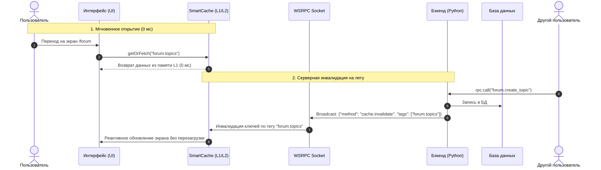

# RFC 0001: Реактивный умный кэш с обратной связью (Smart Event-Driven Cache)

* **Номер RFC:** 0001
* **Название:** Smart Event-Driven Cache Plugin (`plugins/smart_cache`)
* **Статус:** 💡 Proposed (На обсуждении)
* **Автор:** Agrita Core Team
* **Дата:** Сентябрь 2026

---

## 🧭 Содержание
1. [Краткое резюме (Summary)](#1-краткое-резюме-summary)
2. [Мотивация и проблематика (Motivation)](#2-мотивация-и-проблематика-motivation)
3. [Фундаментальная концепция](#3-фундаментальная-концепция)
4. [Детальная архитектура и спецификация](#4-детальная-архитектура-и-спецификация)
   * [Уровень 1: Бэкенд (Python)](#уровень-1-бэкенд-python)
   * [Уровень 2: Фронтенд (TypeScript)](#уровень-2-фронтенд-typescript)
   * [Уровень 3: Протокол синхронизации при реконнекте](#уровень-3-протокол-синхронизации-при-реконнекте)
5. [Сценарии использования (Use Cases)](#5-сценарии-использования-use-cases)
6. [Сравнение с аналогами (SWR, TanStack Query, Apollo)](#6-сравнение-с-аналогами)
7. [План поэтапной реализации](#7-план-поэтапной-реализации)

---

## 1. Краткое резюме (Summary)

Предлагается разработка официального системного плагина **`plugins/smart_cache`** (и сопутствующего фронтенд-модуля `smartCache.ts`) для фреймворка `rsgi-wsrpc`.

Цель плагина — достичь **времени отклика интерфейса 0 мс (мгновенное открытие любых экранов)** при **100% гарантии актуальности данных**, полностью исключив слепой polling (опрос сервера) и показ устаревшей информации.

Ключевой принцип:
> **«Сервер знает, когда данные изменились. Клиент хранит всё локально и обновляет экран только тогда, когда сервер явно командует это сделать.»**

---

## 2. Мотивация и проблематика (Motivation)

### Почему традиционные подходы к кэшированию устарели:

1. **HTTP Cache-Control / ETag (Эпоха Web 2.0)**:
   * Рассчитан на одноразовые HTTP-запросы.
   * Если сервер изменил данные, он **не может** постучаться в открытые браузеры пользователей и сказать: *«Эй, новость №5 обновилась, сотрите старую копию»*. Пользователь смотрит на тухлый кэш, пока не истечет таймер `max-age` или он не нажмет Ctrl+F5.

2. **Слепой Polling (TanStack Query / SWR / setInterval)**:
   * Клиент каждые 5–15 секунд долбит сервер запросами: *«Есть что-то новое? А сейчас? А сейчас?»*.
   * На 10 000 онлайн-пользователей это создает миллионы бессмысленных пустых запросов, высаживает батарею на смартфонах и перегружает БД.

3. **Ручная инвалидация в WebSockets**:
   * Разработчики пишут спагетти-код из разрозненных сообщений: `socket.on("message", ...)` и вручную ищут, какой стор обновить. Это приводит к рассинхронизации данных и багам.

В `rsgi-wsrpc` у нас уже есть постоянное симметричное WSRPC-соединение. Smart Cache превращает его в идеальную двустороннюю шину синхронизации состояния.

---

## 3. Фундаментальная концепция



---

## 4. Детальная архитектура и спецификация

### Уровень 1: Бэкенд (Python)

#### 1. Модуль управления версиями и тегами (`plugins/smart_cache/engine.py`)
Сервер ведет реестр монотонных версий для тегов сущностей:
* `forum.topics` -> версия `1042`
* `forum.topic:55` -> версия `310`
* `user:10:profile` -> версия `12`

#### 2. Декоратор `@invalidates`
Вешается на мутирующие RPC-методы:
```python
from plugins.smart_cache import invalidates

@rpc_method("forum.create_reply")
@invalidates(tags=lambda params: [f"forum.topic:{params['topic_id']}", "forum.topics"])
async def create_reply(session, params):
    # Бизнес-логика создания ответа...
    return {"reply_id": reply.id}
```
После успешного завершения хендлера сервер:
1. Инкрементирует версию указанных тегов в реестре.
2. Автоматически отправляет сигнал активным сокетам.

#### 3. Два типа реактивных сигналов:
* **`cache.invalidate` (Легковесный сигнал по тегам)**:
  ```json
  {
    "jsonrpc": "2.0",
    "method": "cache.invalidate",
    "params": {
      "tags": ["forum.topics", "forum.topic:55"],
      "version": 1043
    }
  }
  ```
  *Применение*: изменился список записей, удалена сущность. Клиент помечает кэш «грязным» (stale) и фоново обновляет его, только если экран открыт прямо сейчас.

* **`cache.patch` (Точечная дельта без повторного запроса к БД)**:
  ```json
  {
    "jsonrpc": "2.0",
    "method": "cache.patch",
    "params": {
      "tag": "forum.topic:55",
      "action": "append",
      "field": "replies",
      "item": { "id": 99, "author": "Alex", "text": "Полностью согласен!" }
    }
  }
  ```
  *Применение*: новый комментарий, лайк, смена статуса. Данные встраиваются в локальный кэш браузера мгновенно **без единого сетевого запроса**.

---

### Уровень 2: Фронтенд (TypeScript: `smartCache.ts`)

Двухуровневое хранилище (L1 + L2):
* **L1 (RAM State Map)**: Мгновенный синхронный доступ за **0 мс** для активной вкладки.
* **L2 (IndexedDB / localStorage)**: Долговечное сохранение между F5 и для автономной работы PWA.

#### Унифицированный метод `smartCache.getOrFetch()`:
Компонентам больше не нужно писать ручные проверки `if (cache) ...`:

```typescript
import { smartCache } from '$lib/smartCache';
import { rpc } from '$lib/wsrpc';

// Запрос данных с автоматическим кэшированием
const topics = await smartCache.getOrFetch(
    'forum.topics',
    () => rpc.call('forum.get_topics', {}),
    {
        tags: ['forum.topics'],
        persist: true, // Сохранять в L2 IndexedDB между перезагрузками
        ttlSec: 3600   // Резервный тайм-аут
    }
);
```

#### Поведение при получении сигнала от сервера:
1. При получении `cache.invalidate`:
   * Если компонент, отображающий эти данные, **смонтирован на экране** — `smartCache` в тихом фоне выполняет повторный вызов и плавно обновляет реактивный стор (без прыжков интерфейса и скелетонов).
   * Если пользователь **находится на другом экране** — запись просто помечается как `stale` (устаревшая) и будет мгновенно перезапрошена только при следующем переходе пользователя на этот экран.

---

### Уровень 3: Протокол синхронизации при реконнекте (Sync Handshake)

Что происходит, если пользователь закрыл ноутбук, открыл его утром или ехал в метро без связи 30 минут?

1. При открытии сокета клиент отправляет карту версий своих сохраненных в L2 тегов:
   ```json
   {
     "jsonrpc": "2.0",
     "method": "cache.sync_check",
     "params": {
       "tags": {
         "forum.topics": 1040,
         "user:42:profile": 12
       }
     }
   }
   ```
2. Сервер сравнивает присланные версии со своими актуальными:
   * `user:42:profile` остался `12` ➔ клиент не тратит трафик, кэш актуален!
   * `forum.topics` стал `1045` ➔ сервер возвращает список устаревших тегов `["forum.topics"]`.
3. Клиент обновляет **только те экраны, где данные реально изменились**.

---

## 5. Сценарии использования (Use Cases)

| Сценарий | Традиционный подход | Решение со Smart Cache |
| :--- | :--- | :--- |
| **Список тем форума** | Загрузка с сервера при каждом входе (150–300 мс) | **Мгновенный показ из L1/L2 (0 мс)**. Фоновое обновление только при появлении новой темы. |
| **Счетчик непрочитанных сообщений** | Polling каждые 10 секунд | **0 запросов**. Сервер присылает `cache.patch` в момент отправки сообщения собеседником. |
| **Карточка заявки / заказа** | Риск перезаписать чужие правки при совместной работе | Сервер инвалидирует карточку у всех менеджеров в момент нажатия кнопки «Сохранить» первым менеджером. |
| **Мобильное PWA в оффлайне** | Белый экран ошибки сети | Полнофункциональный интерфейс на базе L2 IndexedDB с индикатором «Оффлайн». |

---

## 6. Сравнение с аналогами

| Параметр | TanStack Query (React/Svelte Query) | Apollo GraphQL Cache | `rsgi-wsrpc` Smart Cache |
| :--- | :--- | :--- | :--- |
| **Транспорт** | REST HTTP | GraphQL HTTP | **WSRPC (WebSocket RSGI)** |
| **Серверный Push** | ❌ Нет (только поллинг `refetchInterval`) | ⚠️ Требует GraphQL Subscriptions | ✅ **Нативно (`cache.invalidate`/`patch`)** |
| **Задержка отображения** | 50–200 мс (или мерцание stale) | 50–150 мс | **0 мс (чистый L1 RAM state)** |
| **Синхронизация при реконнекте**| ❌ Полный сброс всех запросов | ❌ Ручная настройка | ✅ **Автоматический handshake версий** |
| **Расход токенов с ИИ** | Высокий (клиентские мутации и ключи) | Очень высокий (GraphQL схемы) | **Минимальный (`@invalidates`)** |

---

## 7. План поэтапной реализации

### Этап 1: Бэкенд плагина (`plugins/smart_cache`)
* [ ] Класс `VersionRegistry` (хранение версий тегов в памяти процесса + персистентность в SQLite).
* [ ] Декоратор `@invalidates(tags=[...])` для оборачивания RPC-методов.
* [ ] Генератор широковещательных событий `cache.invalidate` и `cache.patch` через `app/system/broadcast.py`.
* [ ] RPC-метод `cache.sync_check` для сверки версий при подключении.

### Этап 2: Фронтенд-клиент (`client/smartCache.ts`)
* [ ] Хранилище L1 (JavaScript `Map` / реактивный стор).
* [ ] Хранилище L2 (асинхронный адаптер IndexedDB / localStorage).
* [ ] Метод `smartCache.getOrFetch(key, fetcher, options)`.
* [ ] Автоматическая подписка на `rpc.on("cache.invalidate")` и `rpc.on("cache.patch")`.
* [ ] Интеграция рукопожатия версий в хук `rpc.onConnect`.

### Этап 3: Документация и интеграция в приложение
* [ ] Создание руководства `docs/smart_cache.md` и `docs_ru/smart_cache.md`.
* [ ] Тестовое внедрение в модуль форума (`app/forum`) и статей (`app/articles`).
