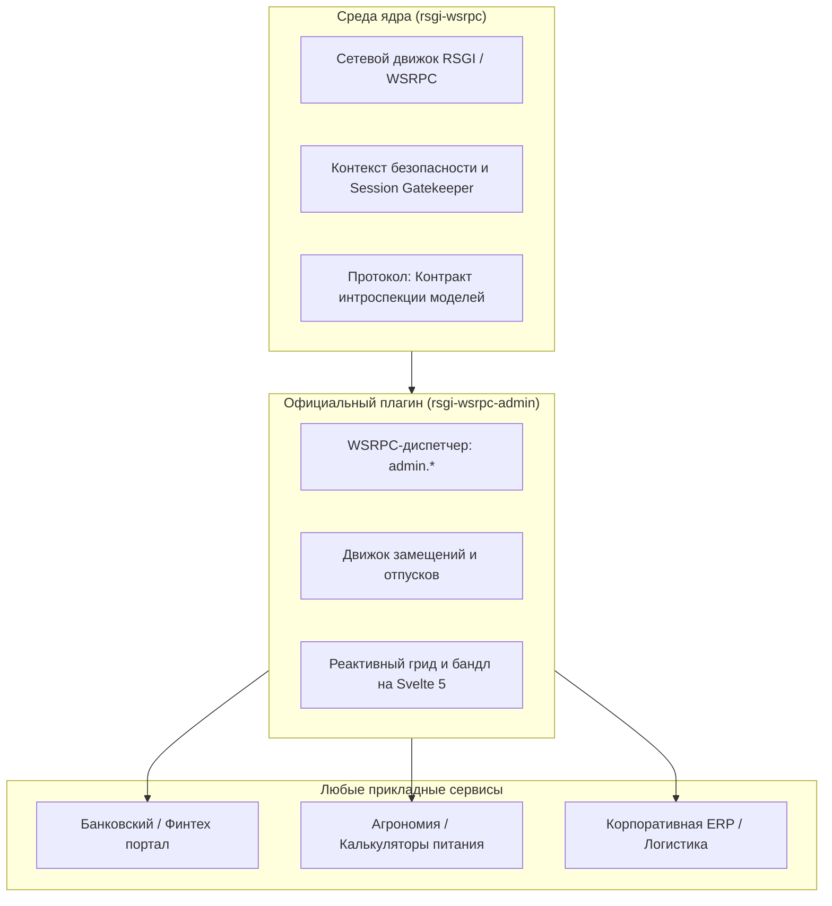

# RFC 0003: Плагин реактивной панели управления и архитектура корпоративного делегирования

* **Номер RFC:** 0003
* **Название:** Плагин реактивной панели управления и архитектура корпоративного делегирования (`rsgi-wsrpc-admin`)
* **Статус:** 📝 Предложен / Проект (Draft)
* **Автор:** Core Architecture Team
* **Дата:** Сентябрь 2026

---

## 🧭 Содержание
1. [Краткое содержание](#1-краткое-содержание)
2. [Мотивация и предпосылки](#2-мотивация-и-предпосылки)
3. [Архитектурное разделение: Движок Core vs Плагин](#3-архитектурное-разделение-движок-core-vs-плагин)
4. [Протокол интроспекции моделей (`admin.schema`)](#4-протокол-интроспекции-моделей-adminschema)
5. [Корпоративные команды, RLS и механизм делегирования](#5-корпоративные-команды-rls-и-механизм-делегирования)
6. [WSRPC-хэндлеры и протокол реактивного DataGrid](#6-wsrpc-хэндлеры-и-протокол-реактивного-datagrid)
7. [Фронтенд-архитектура (Svelte 5 и командная палитра)](#7-фронтенд-архитектура-svelte-5-и-командная-палитра)
8. [Журнал аудита и принцип «четырех глаз»](#8-журнал-аудита-и-принцип-четырех-глаз)
9. [Пример подключения](#9-пример-подключения)

---

## 1. Краткое содержание

Настоящий RFC определяет архитектуру **`rsgi-wsrpc-admin`** — официального, доменно-независимого плагина первого уровня для фреймворка `rsgi-wsrpc`, предоставляющего корпоративную реактивную панель управления и универсальный CRUD-движок нового поколения.

В отличие от устаревших систем администрирования (таких как Django Admin), построенных на базе синхронного протокола WSGI, полных перезагрузок страниц и плоских прав доступа на уровне моделей, `rsgi-wsrpc-admin` опирается на фундаментальные преимущества платформы `rsgi-wsrpc`:
* **Реактивный двунаправленный транспорт (WSRPC)** с мгновенной синхронизацией изменений между всеми активными операторами.
* **Нативный контроль доступа на уровне строк (Row-Level Security / RLS) и мультиарендность** на базе `RowSecureModel` (`creator_id` и `team_id`).
* **Динамический движок делегирования (Delegation Engine)**: прозрачная временная передача портфелей и клиентов при уходе сотрудников в отпуск или на больничный.
* **Детерминированное табличное сжатие (`$tabular: true`)** согласно стандарту RFC 0002 для скоростной передачи списков данных.
* **Современный интерфейс DataGrid на Svelte 5 (Runes)** с виртуальным скроллингом, инлайн-редактированием ячеек, командной палитрой Cmd+K и переключением контекста команд.

---

## 2. Мотивация и предпосылки

### Корпоративное и банковское происхождение ядра
Ядро платформы `rsgi-wsrpc` было выделено из защищенного программного комплекса банковского сектора. В таких системах данные (кредитные заявки, счета, клиенты, портфели договоров) неразрывно связаны с **Командами (Teams)** и **Владением (Ownership)**:
1. Кредитный инспектор видит исключительно клиентов своего филиала или команды (`row_level_only = True`).
2. При уходе инспектора в отпуск или командировку его клиентский портфель должен прозрачно делегироваться коллеге-заместителю без изменения первичных связей в базе данных.
3. Руководителям и контролерам необходима мгновенная смена контекста просмотра («Просмотр от лица команды №3») без необходимости выходить из учетной записи.

### Ограничения Django Admin в 2026 году
Несмотря на революционность Django Admin в 2005 году, сегодня его концепция не отвечает современным вызовам:
* **Отсутствие реактивной совместной работы:** Если коллега обновил статус заявки, другой менеджер не увидит этого до ручного обновления страницы (F5), что ведет к коллизиям и перезаписи чужих данных.
* **Сложность внедрения RLS:** Разграничение по командам требует ручного переопределения `get_queryset()` и `has_change_permission()` для каждого класса `ModelAdmin`.
* **Нет механизма делегирования:** Для передачи клиентов на время отпуска приходится писать отдельные самописные сервисы вне админки.
* **Сетевые накладные расходы:** Изменение одного значения в таблице вызывает тяжелый HTTP POST и полную перерисовку HTML-страницы вместо быстрого RPC-вызова за 10 мс.

---

## 3. Архитектурное разделение: Движок Core vs Плагин

Для сохранения чистоты, легковесности и высокой скорости ядра `rsgi-wsrpc` функционал администрирования разделен на **Тонкий контракт ядра** и **Подключаемый плагин-расширение**:



### Обязанности ядра (`rsgi-wsrpc`):
1. **Контракт интроспекции**: Базовые интерфейсы отражения полей, типов данных, ограничений и связей ORM-моделей.
2. **Передача контекста безопасности**: Гарантированная передача `UserContext` (`user_id`, `roles`, `team_ids`) во все обработчики.
3. **Защита сокетов**: Session Gatekeeper, исключающий неавторизованные утечки данных при подключении.

### Обязанности плагина (`rsgi-wsrpc-admin`):
1. **Экспорт схемы (`admin.schema`)**: Трансляция моделей в метаданные для интерфейса (колонки, виджеты ввода, валидаторы).
2. **Табличные CRUD-хэндлеры (`admin.list`, `admin.update_cell`, `admin.bulk_action`)**.
3. **Контроллер делегирования**: Управление графиком замещений и расширение условий SQL-запросов RLS.
4. **Интерактивный UI**: Компонентная библиотека или автономное SPA на Svelte 5.

---

## 4. Протокол интроспекции моделей (`admin.schema`)

Фронтенд не содержит жестко зашитых колонок. При загрузке клиент вызывает метод `admin.schema` по WSRPC и получает динамический реестр моделей и прав для текущего пользователя:

```json
{
  "jsonrpc": "2.0",
  "method": "admin.schema",
  "result": {
    "models": [
      {
        "key": "client",
        "verbose_name": "Банковский клиент",
        "verbose_name_plural": "Клиенты",
        "is_row_secure": true,
        "permissions": {
          "can_create": true,
          "can_read": true,
          "can_update": true,
          "can_delete": false,
          "row_level_only": true
        },
        "fields": [
          {"name": "id", "type": "integer", "primary_key": true, "read_only": true},
          {"name": "full_name", "type": "string", "label": "ФИО / Наименование", "searchable": true},
          {"name": "tin", "type": "string", "label": "ИНН", "unique": true},
          {"name": "status", "type": "enum", "options": ["active", "suspended", "review"], "editable": true},
          {"name": "team_id", "type": "fk", "target_model": "team", "label": "Отделение / Команда"},
          {"name": "creator_id", "type": "fk", "target_model": "user", "label": "Ответственный менеджер"}
        ]
      }
    ]
  }
}
```

---

## 5. Корпоративные команды, RLS и механизм делегирования

### 5.1 Модель делегирования прав
Временное замещение на период отсутствия описывается моделью:

```python
class DelegationRule(RowSecureModel):
    """
    Корпоративное делегирование: временно предоставляет замещающему 
    сотруднику доступ к клиентскому портфелю отсутствующего коллеги.
    """
    __tablename__ = "auth_delegation_rule"

    delegator_id: Mapped[int] = mapped_column(ForeignKey("auth_user.id", ondelete="CASCADE"), index=True)
    substitute_id: Mapped[int] = mapped_column(ForeignKey("auth_user.id", ondelete="CASCADE"), index=True)
    
    # Область действия: None = все модели; либо конкретная сущность ("client", "order")
    model_scope: Mapped[Optional[str]] = mapped_column(String(50), nullable=True)
    
    # Ограничение по команде/филиалу
    team_id: Mapped[Optional[int]] = mapped_column(ForeignKey("auth_team.id", ondelete="CASCADE"), nullable=True)
    
    valid_from: Mapped[datetime] = mapped_column(DateTime, index=True)
    valid_to: Mapped[datetime] = mapped_column(DateTime, index=True)
    is_active: Mapped[bool] = mapped_column(Boolean, default=True)
    reason: Mapped[str] = mapped_column(String(255))  # Например: "Ежегодный оплачиваемый отпуск"
```

### 5.2 Динамическая модификация RLS-запросов
При выполнении выборки через `admin.list`:
1. Проверяется, включен ли у роли флаг `row_level_only = True`.
2. Находятся активные правила замещения, где `substitute_id == current_user.id` и `valid_from <= now <= valid_to`.
3. Условие `WHERE` в SQL автоматически дополняется:

$$\text{Видимые строки} = (creator\_id = user\_id) \lor (team\_id \in team\_ids) \lor (creator\_id \in delegated\_user\_ids)$$

Не требуется перепривязывать внешние ключи; по окончании отпуска доступ отзывается автоматически и строго по расписанию.

---

## 6. WSRPC-хэндлеры и протокол реактивного DataGrid

### 6.1 Запрос списка (`admin.list`) в формате RFC 0002
Выборки возвращаются в компактном табличном виде без дублирования ключей:

```json
// Запрос
{"jsonrpc": "2.0", "id": 1, "method": "admin.list", "params": {"model": "client", "page": 1, "page_size": 50, "team_id": 2}}

// Ответ
{
  "jsonrpc": "2.0",
  "id": 1,
  "result": {
    "total": 420,
    "page": 1,
    "page_size": 50,
    "$tabular": true,
    "fields": ["id", "full_name", "tin", "status", "team_id", "creator_id"],
    "rows": [
      [101, "ООО Северный Лес", "7701234567", "active", 2, 4],
      [102, "ПАО Энергия", "7709876543", "review", 2, 8]
    ]
  }
}
```

### 6.2 Быстрое редактирование ячеек (`admin.update_cell`)
```json
// Запрос изменения
{"jsonrpc": "2.0", "id": 2, "method": "admin.update_cell", "params": {"model": "client", "id": 101, "field": "status", "value": "suspended"}}

// Сервер транслирует событие остальным операторам команды
{"jsonrpc": "2.0", "method": "cache.patch", "params": {"model": "client", "id": 101, "changes": {"status": "suspended"}, "by_user": "Иван Смирнов"}}
```

### 6.3 Потоковые массовые операции (`stream: true`)
Для тяжелых пакетных операций (перенос 5 000 договоров, пересчет индексов):
* Сервер возвращает промежуточные статусы (`{"progress": 25, "processed": 1250, "status": "running"}`).
* В интерфейсе в реальном времени отображается анимированный прогресс-бар без блокировки соединения.

---

## 7. Фронтенд-архитектура (Svelte 5 и командная палитра)

Пакет интерфейса (`@rsgi-wsrpc/admin-ui`) реализован на базе Svelte 5:
* **Виртуализированный DataGrid**: Отрисовывает только видимые строки во вьюпорте, легко выдерживая 50 000+ записей в DOM.
* **Контекстный селектор команд**: Виджет в шапке с бейджами замещения (*«🏖️ Вы замещаете Петрова А. (до 25 сен)»*) и быстрым переключением отделов.
* **Командная палитра (Cmd + K)**:
  * Нечеткий (fuzzy) поиск по всем сущностям и реестрам.
  * Прямой запуск действий (`«Делегировать клиентов...»`, `«Экспорт в Excel»`, `«Фильтр по статусу: на проверке»`).
* **Совместное присутствие (Presence)**: Отображение аватаров коллег на ячейках, которые они редактируют в данный момент, для предотвращения конфликтов.

---

## 8. Журнал аудита и принцип «четырех глаз»

Для соответствия требованиям регуляторов (банковский сектор, безопасность данных):
1. **Автоматический аудит изменений**: Все операции `create`, `update_cell`, `delete` и пакетные действия протоколируются в `auth_audit_log` (дата, ID сотрудника, IP-адрес, старое и новое значения).
2. **Принцип четырех глаз (`admin.request_approval`)**:
   * Критические операции (удаление клиента, закрытие счета) могут требовать акцепта вторым лицом.
   * Отправляет моментальное WSRPC-уведомление контролеру с кнопками подтверждения или отклонения.

---

## 9. Пример подключения

Подключение `rsgi-wsrpc-admin` в любой проект занимает считанные строки:

```python
from rsgi_wsrpc import App
from rsgi_wsrpc_admin import AdminPlugin, ModelAdmin
from my_app.models import Client, Account, Team, User

app = App()

# Опциональная настройка модели
class ClientAdmin(ModelAdmin):
    model = Client
    list_display = ["full_name", "tin", "status", "team_id"]
    search_fields = ["full_name", "tin"]
    enable_inline_edit = True
    four_eyes_approval = ["status"]

admin = AdminPlugin(
    title="Корпоративная панель управления",
    route_prefix="/_admin",
    models=[ClientAdmin, Account, Team, User],
    enable_delegation=True,
    enable_audit_log=True,
)

app.register_plugin(admin)
```

---

## 10. Заключение
RFC 0003 закладывает фундамент открытого, реактивного и готового к корпоративным нагрузкам стандарта администрирования. Разделение контрактов интроспекции в ядре и богатой визуальной реализации в плагине позволяет `rsgi-wsrpc` предоставлять первоклассные инструменты управления без раздувания кодовой базы основного рантайма.
