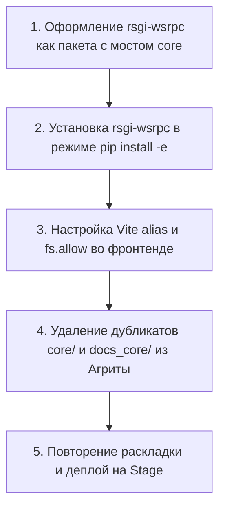

# RFC 0004: Мультипроектная архитектура рабочей области и устранение двойственности фреймворка

* **Номер RFC:** 0004
* **Название:** Мультипроектная архитектура рабочей области и устранение двойственности фреймворка (`Single Source of Truth`)
* **Статус:** 📝 Предложен / Проект (Draft)
* **Автор:** Core Architecture Team
* **Дата:** Сентябрь 2026

---

## 🧭 Содержание
1. [Краткое содержание](#1-краткое-содержание)
2. [Мотивация и проблема двойственности](#2-мотивация-и-проблема-двойственности)
3. [Принцип единого источника правды (Single Source of Truth)](#3-принцип-единого-источника-правды-single-source-of-truth)
4. [Доменная автономия: Юзеры у приложения, у Ядра их нет](#4-доменная-автономия-юзеры-у-приложения-у-ядра-их-нет)
5. [Целевая архитектура рабочей области (Umbrella Workspace)](#5-целевая-архитектура-рабочей-области-umbrella-workspace)
6. [Пакет бэкенда Python и канонический неймспейс (`rsgi_wsrpc`)](#6-пакет-бэкенда-python-и-канонический-неймспейс-rsgi_wsrpc)
7. [Интеграция фронтенд-клиента и настройка Vite `fs.allow`](#7-интеграция-фронтенд-клиента-и-настройка-vite-fsallow)
8. [Симметрия среды на Stage-сервере (`195.133.5.32`)](#8-симметрия-среды-на-stage-сервере-195133532)
9. [Поэтапный план миграции](#9-поэтапный-план-миграции)
10. [Заключение](#10-заключение)

---

## 1. Краткое содержание

Настоящий RFC устанавливает целевой архитектурный стандарт организации мультипроектных решений на базе фреймворка **`rsgi-wsrpc`**.

Главная цель стандарта — **полное устранение двойственности** (дублирования кода, зеркалирования документации и рассинхронизации клиентских библиотек). В соответствии с RFC 0004:
* **Фреймворк Ядра (`rsgi-wsrpc`)** существует строго как автономный, самодостаточный Git-репозиторий и Python-пакет.
* **Прикладные проекты (Agrita, банковские CRM, ERP)** размещаются в каталоге приложений (`apps/<app_name>`) и не содержат внутри себя встроенных копий рантайма фреймворка.
* **Юзеры принадлежат приложению, у Ядра их нет**: фреймворк не навязывает жестких схем таблиц БД для пользователей и паролей; он оперирует исключительно абстрактным транспортным контекстом сессии (`UserContext`).
* **Канонический неймспейс Python (`rsgi_wsrpc`)**: все примитивы фреймворка импортируются явно из `rsgi_wsrpc` (с временным мостом обратной совместимости `core`), полностью исключая конфликты имен.
* **Единый источник правды для фронтенда**: TypeScript-клиент (`wsrpc.ts`, `smartCache.ts`) находится исключительно в репозитории `rsgi-wsrpc/client/` и подключается в приложения напрямую через алиасы Vite и директиву `fs.allow`.
* **Полная симметрия Stage-сервера**: файловая структура на боевом/тестовом сервере на 100% совпадает с локальной средой разработки.

---

## 2. Мотивация и проблема двойственности

### 2.1 Исторический компромисс
На ранних этапах разработки рантайм `rsgi-wsrpc` находился непосредственно внутри репозитория приложения `hydro_calc` в локальной папке `core/`. По мере развития фреймворка в самостоятельную открытую платформу такой подход стал источником постоянного трения:

1. **Двойные копии Ядра:** одновременно существовали `hydro_calc/core/` и `/home/alex/rsgi-wsrpc/core/`, создавая риск расхождения версий и потери исправлений.
2. **Двойная документация (накладные расходы на «папки-близнецы»):** документация фреймворка велась внутри `docs_core/` в приложении, требуя постоянного ручного или полуавтоматического копирования в отдельный репозиторий `rsgi-wsrpc`.
3. **Двойные клиентские реализации:** доработки сетевого клиента в `frontend/src/lib/wsrpc.ts` приходилось вручную переносить в `rsgi-wsrpc/client/wsrpc.ts`.
4. **Неоднозначность пространства имен:** импорт вида `from core.session import ...` слишком абстрактен и создает риск коллизий со сторонними пакетами в экосистеме Python.
5. **Засорение Git-истории:** прикладные коммиты по агрономии и системные коммиты по сетевому транспорту ядра перемешивались в истории.

### 2.2 Почему двойственность фатальна для корпоративных систем
В ответственных проектах (финтех, банки, IoT) двойственность порождает:
* **«Блуждающие» баги:** критическая гонка, исправленная в репозитории фреймворка, остается незакрытой в приложении из-за старой локальной копии.
* **Устаревание документации:** разработчики смотрят в локальную папку, которая отстает от актуального апстрима.
* **Ментальную усталость:** программист вынужден каждый раз думать: *«Это относится к Агрите или к Ядру? Куда коммитить? Какой файл сейчас исполняется?»*.

---

## 3. Принцип единого источника правды (Single Source of Truth)

RFC 0004 закрепляет жесткое следование принципу **Single Source of Truth (SSOT)**:

| Ресурс | Текущее состояние (Двойственность) | Целевое состояние (RFC 0004 SSOT) |
| :--- | :--- | :--- |
| **Код Ядра на Python** | Продублирован в `hydro_calc/core/` и `rsgi-wsrpc/core/` | **Строго в `rsgi-wsrpc/`**, подключен через `pip install -e` |
| **Документация Ядра и RFC** | Зеркалируется в `docs_core/` и `rsgi-wsrpc/docs/` | **Строго в `rsgi-wsrpc/docs/` и `docs_ru/`** |
| **Клиент фронтенда** | Продублирован в `frontend/src/lib/` и `rsgi-wsrpc/client/` | **Строго в `rsgi-wsrpc/client/`**, подключен через Vite alias |
| **Схема пользователей (Identity)** | Размыта между ядром и приложением | **Строго в приложении**; у Ядра нет моделей пользователей |
| **Неймспейс Python** | Общий и размытый `from core...` | Канонический **`from rsgi_wsrpc...`** |
| **Документация приложения** | Перемешана в корне приложения | **Строго прикладная** (`apps/agrita/docs/`) |

---

## 4. Доменная автономия: Юзеры у приложения, у Ядра их нет

Краеугольный архитектурный принцип экосистемы `rsgi-wsrpc` — абсолютное разделение **Сетевого контекста сессии** и **Сущности пользователя**:

> **«Юзеры принадлежат приложению. У Ядра их нет.»**

### 4.1 Почему в Ядре нет моделей пользователей
Фреймворки, навязывающие готовую таблицу `User` в базе данных (как делал ранний Django со своей жесткой таблицей `auth_user`), создают непреодолимые проблемы при интеграции. Разные бизнес-домены определяют пользователя совершенно по-разному:
* **Агрита (Агрономия / B2C)**: У пользователя есть Telegram ID, пресеты теплиц, подписки на калькулятор, дневники гровера.
* **Банкинг / Финтех**: У пользователя есть табельный номер сотрудника, сертификат ЭЦП, уровень допуска безопасности, код филиала.
* **Промышленный IoT / Телеметрия**: Людей-пользователей нет вообще — сущностями являются промышленные контроллеры, расходомеры и шлюзы.

### 4.2 Транспортный контракт сессии (`UserContext`)
В Ядре `rsgi-wsrpc` **нет таблиц БД для пользователей, нет полей паролей и нет колонок email**. Ядро знает только про оперативный контекст сессии сокета:

```python
# Единственная структура, с которой оперирует рантайм rsgi-wsrpc:
@dataclass
class UserContext:
    user_id: Any                    # int, UUID, строка или ID контроллера
    roles: List[str]                # Строковые имена ролей: ["admin", "operator"]
    team_ids: List[Union[int, str]] # Список видимых команд/филиалов
    metadata: Dict[str, Any]        # Произвольные доменные метаданные
```

### 4.3 Поток исполнения
1. **Приложение** объявляет свою собственную ORM-модель (например, `AgritaUser`, `BankEmployee`, `DeviceToken`).
2. **Приложение** валидирует учетные данные в своем хэндлере логина (пароли с RSA, OAuth2, LDAP, токены).
3. **Приложение** передает готовый контекст в активную сессию сокета:
   ```python
   session.set_user_context(
       user_id=user.id,
       roles=[r.name for r in user.roles],
       team_ids=user.get_team_ids()
   )
   ```
4. **Ядро** прозрачно передает этот контекст во все последующие RPC-вызовы, валидаторы Smart Cache и RLS-фильтры.

---

## 5. Целевая архитектура рабочей области (Umbrella Workspace)

Среда разработки объединяется в единый зонтичный каталог (например, `/home/alex/workspace/` или `/home/alex/projects/`). Имя внешней папки ни на что не влияет и служит только удобным контейнером:

```text
workspace/                                  # Зонтичная рабочая область (Umbrella Workspace)
├── .venv/                                  # ЕДИНОЕ виртуальное окружение Python (3.11+)
│
├── rsgi-wsrpc/                             # РЕПОЗИТОРИЙ 1: Ядро платформы (Git: origin/main)
│   ├── rsgi_wsrpc/                         # Канонический Python-пакет (сетевой движок, WSRPC, tabular, auth)
│   │   ├── __init__.py
│   │   ├── session.py
│   │   ├── tabular.py
│   │   ├── logger.py
│   │   └── security.py
│   ├── client/                             # Канонический TypeScript-клиент
│   │   ├── wsrpc.ts                        # WSRPC-клиент с Session Gatekeeper и распаковкой tabular
│   │   └── smartCache.ts                   # Клиентский реактивный кэш
│   ├── docs/ & docs_ru/                    # Каноническая документация Ядра и RFC (0001-0004)
│   ├── tests/                              # Автономные тесты фреймворка
│   └── pyproject.toml                      # Конфигурация сборки пакета
│
├── rsgi-wsrpc-admin/                       # РЕПОЗИТОРИЙ 2 (Опциональный): Плагин реактивной админки (RFC 0003)
│   ├── backend/
│   └── frontend/
│
└── apps/                                   # Каталог прикладных сервисов
    └── agrita/                             # РЕПОЗИТОРИЙ 3: Платформа Агрита (Git: agrita)
        ├── backend/                        # Бэкенд приложения
        │   ├── main.py                     # Точка входа (запуск Granian RSGI через rsgi_wsrpc)
        │   ├── models/                     # Агрономические ORM-модели (User, Fertilizers, Recipes)
        │   ├── handlers/                   # WSRPC бизнес-методы (login.*, calc.*, forum.*)
        │   ├── settings.yaml               # Настройки БД и приложения
        │   └── migrations/                 # Миграции базы данных (Alembic)
        ├── frontend/                       # SvelteKit интерфейс
        │   ├── src/
        │   ├── vite.config.ts              # Алиас к ../../rsgi-wsrpc/client
        │   └── package.json
        ├── content/                        # Статьи базы знаний (Markdown)
        ├── docs/                           # Чисто агрономическая документация (формулы, паспорта)
        └── deploy-stage.sh                 # Скрипт развертывания на Stage/Prod
```

---

## 6. Пакет бэкенда Python и канонический неймспейс (`rsgi_wsrpc`)

### 6.1 Описание пакета в `rsgi-wsrpc/pyproject.toml`
Фреймворк собирается под каноническим, однозначным именем `rsgi_wsrpc`:

```toml
[build-system]
requires = ["setuptools>=61.0"]
build-backend = "setuptools.build_meta"

[project]
name = "rsgi-wsrpc"
version = "0.2.0"
dependencies = [
    "granian>=1.6.0",
    "orjson>=3.9.0",
    "pyjwt>=2.8.0",
    "pyyaml>=6.0.1",
    "cryptography>=42.0.0",
    "argon2-cffi>=23.1.0",
    "sqlalchemy>=2.0.0",
]
```

### 6.2 Канонический стиль импортов
Разработчик пишет понятный, выразительный код:

```python
# Чистый канонический стиль импорта
from rsgi_wsrpc import rpc_method, RPCError, pack_tabular
from rsgi_wsrpc.logger import logger
from rsgi_wsrpc.security import current_user_ctx
from rsgi_wsrpc.tabular import tabular_response
```

### 6.3 Мост обратной совместимости (Zero-Breakage Bridge)
Чтобы не переписывать сотни файлов приложения одномоментно, пакет `rsgi_wsrpc` предоставляет прозрачный псевдоним `core`:

```python
# rsgi_wsrpc/__init__.py
import sys
from rsgi_wsrpc import session, tabular, logger, security, constants

# Мост обратной совместимости для бесшовной миграции
sys.modules["core"] = sys.modules[__name__]
sys.modules["core.session"] = session
sys.modules["core.tabular"] = tabular
sys.modules["core.logger"] = logger
sys.modules["core.security"] = security
sys.modules["core.constants"] = constants
```

Существующие вызовы `from core.session import rpc_method` продолжают работать без единой ошибки до тех пор, пока разработчик не решит обновить импорты.

---

## 7. Интеграция фронтенд-клиента и настройка Vite `fs.allow`

### 7.1 Конфигурация Vite c `fs.allow`
По умолчанию Vite блокирует доступ к файлам, расположенным выше корня проекта. Для безопасного подключения клиента фреймворка из соседнего репозитория в `vite.config.ts` настраивается алиас и директива `server.fs.allow`:

```typescript
// apps/agrita/frontend/vite.config.ts
import { sveltekit } from '@sveltejs/kit/vite';
import { defineConfig } from 'vite';
import path from 'path';

export default defineConfig({
    plugins: [sveltekit()],
    resolve: {
        alias: {
            // Прямая ссылка на канонический клиент ядра
            '@wsrpc': path.resolve(__dirname, '../../../rsgi-wsrpc/client')
        }
    },
    server: {
        fs: {
            // Разрешение Vite dev-серверу читать файлы канонического клиента ядра
            allow: [
                '..',
                path.resolve(__dirname, '../../../rsgi-wsrpc/client')
            ]
        }
    }
});
```

### 7.2 Прозрачное использование в компонентах
В любом компоненте Svelte, сторе или сервисе:
```typescript
import { rpc, wsConnected } from '@wsrpc/wsrpc';
import { smartCache } from '@wsrpc/smartCache';
```

Если инженер оптимизирует код в `rsgi-wsrpc/client/wsrpc.ts`:
1. Механизм Vite HMR мгновенно обновляет запущенную страницу в браузере.
2. Не требуется никаких ручных синхронизаций или сборки npm-пакетов в локальной среде.
3. Все прикладные сервисы в `apps/` мгновенно получают актуальный сетевой клиент.

---

## 8. Симметрия среды на Stage-сервере (`195.133.5.32`)

Для исключения сюрпризов при развертывании раскладка на боевом/тестовом сервере на 100% повторяет локальное рабочее место разработчика.

### 8.1 Файловая структура на сервере (`/home/alex/workspace/`)
```text
/home/alex/workspace/                       # Единый корень на Stage
├── .venv/                                  # Единое виртуальное окружение
├── rsgi-wsrpc/                             # Репозиторий Ядра (клон с GitHub)
└── apps/
    └── agrita/                             # Репозиторий Агриты (клон с GitHub)
        ├── backend/
        ├── frontend/
        └── content/
```

### 8.2 Конфигурация службы Systemd (`/etc/systemd/system/agrita-stage.service`)
```ini
[Unit]
Description=Agrita Stage Application (RSGI Granian)
After=network.target postgresql.service

[Service]
User=alex
Group=alex
WorkingDirectory=/home/alex/workspace/apps/agrita/backend
Environment="PATH=/home/alex/workspace/.venv/bin"
Environment="DATABASE_URL=postgresql+asyncpg://agrita_user:AgritaSecurePass2026@/agrita_stage?host=/var/run/postgresql"
ExecStart=/home/alex/workspace/.venv/bin/python main.py
Restart=always
RestartSec=3
StandardOutput=journal
StandardError=journal

[Install]
WantedBy=multi-user.target
```

### 8.3 Конфигурация Nginx (`/etc/nginx/sites-available/stage.agrita.ru`)
* Статический бандл фронтенда: `root /home/alex/workspace/apps/agrita/frontend/build/client;`
* Загруженные медиафайлы: `alias /home/alex/workspace/apps/agrita/backend/data/files/;`
* Проксирование WSRPC и API: без изменений (на порт Granian 8092 через localhost или Unix Domain Socket).

### 8.4 Детерминированный скрипт деплоя (`deploy-stage.sh`)
```bash
#!/usr/bin/env bash
set -e

WORKSPACE="/home/alex/workspace"
CORE_DIR="$WORKSPACE/rsgi-wsrpc"
APP_DIR="$WORKSPACE/apps/agrita"

echo "=== 1. Обновление репозитория Ядра ==="
git -C "$CORE_DIR" pull origin main

echo "=== 2. Обновление репозитория Приложения ==="
git -C "$APP_DIR" pull origin main

echo "=== 3. Сборка фронтенда SvelteKit ==="
cd "$APP_DIR/frontend"
npm install --silent
npm run build

echo "=== 4. Перезапуск службы ==="
sudo systemctl restart agrita-stage

echo "✅ Деплой Stage успешно завершен!"
```

---

## 9. Поэтапный план миграции

Для обеспечения 100% бесперебойной работы сервиса переход выполняется в 5 безопасных шагов:



1. **Шаг 1: Подготовка пакета и моста совместимости**
   * Организация пакета `rsgi_wsrpc` с алиасом `core` в `rsgi-wsrpc`.
   * Тестирование чистой установки через `pip install -e .`.
2. **Шаг 2: Связывание с виртуальным окружением**
   * Регистрация editable-пакета в `.venv`.
   * Запуск тестов (`tests/run.py --target local`) без локальной папки `core/` на путях `sys.path`.
3. **Шаг 3: Настройка фронтенда и `fs.allow`**
   * Добавление алиаса `@wsrpc` и директивы `server.fs.allow` в `apps/agrita/frontend/vite.config.ts`.
   * Замена дубликата `frontend/src/lib/wsrpc.ts` однострочным реэкспортом: `export * from '@wsrpc/wsrpc';`.
   * Проверка сборки фронтенда (`npm run build`).
4. **Шаг 4: Удаление мертвого кода**
   * Удаление каталогов-дубликатов `hydro_calc/core/` и `hydro_calc/docs_core/`.
   * Упразднение устаревших правил `core_integrity` и `framework_docs_twins` из локальных конфигураций проекта.
5. **Шаг 5: Верификация на Stage-сервере**
   * Развертывание новой симметричной раскладки на Stage (`195.133.5.32`).
   * Прогон интеграционного набора тестов (`tests/run.py --target stage`).

---

## 10. Заключение

RFC 0004 окончательно устраняет архитектурные компромиссы раннего этапа, разделяя независимый рантайм `rsgi-wsrpc` и прикладные сервисы.

Благодаря устранению дублирования, четкому правилу об автономии пользователей в приложениях, централизации документации фреймворка и абсолютной симметрии серверов достигается максимальная прозрачность кода, высокая скорость разработки и масштабируемость платформы под неограниченное число новых проектов.
