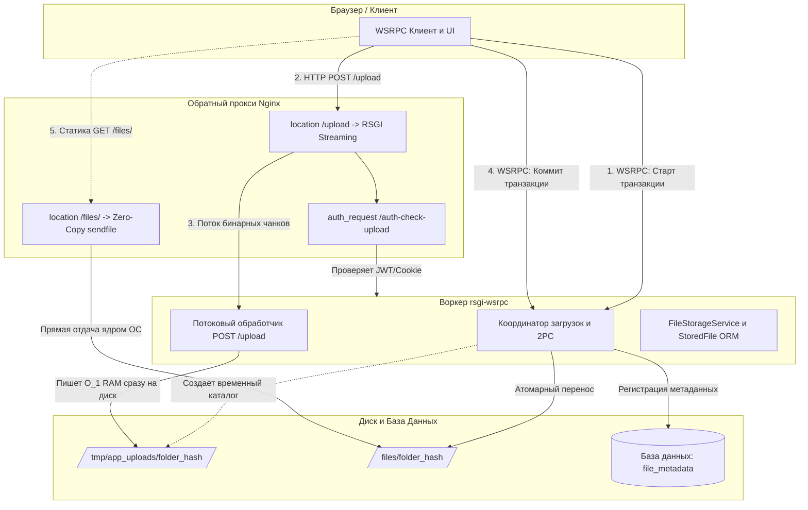
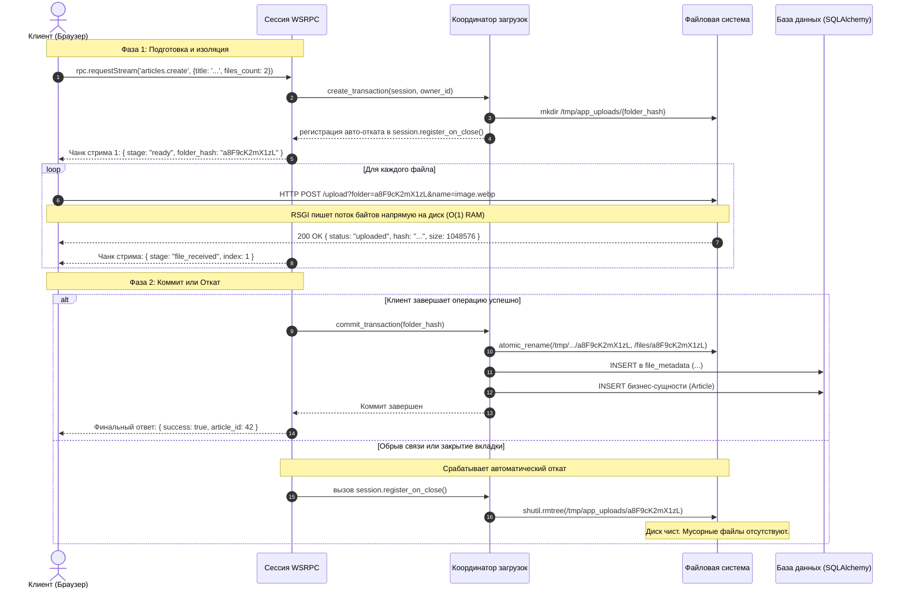

# RFC 0005: Подсистема хранения файлов и двухфазного коммита загрузок (`plugins.files`)

* **Номер RFC:** 0005
* **Название:** Подсистема хранения файлов и двухфазного коммита загрузок (`plugins.files`)
* **Статус:** 📝 На рассмотрении (Proposed / In Review)
* **Автор:** Архитектурная команда
* **Дата:** Сентябрь 2026

---

## 🧭 Содержание
1. [Краткое резюме](#1-краткое-резюме)
2. [Мотивация и проблематика](#2-мотивация-и-проблематика)
3. [Ключевые архитектурные принципы](#3-ключевые-архитектурные-принципы)
4. [Детальная спецификация](#4-детальная-спецификация)
   * [4.1. Жизненный цикл двухфазного коммита (2PC)](#41-жизненный-цикл-двухфазного-коммита-2pc)
   * [4.2. Потоковый RSGI-обработчик (`POST /upload`)](#42-потоковый-rsgi-обработчик-post-upload)
   * [4.3. Предварительная проверка авторизации в Nginx (`/auth-check-upload`)](#43-предварительная-проверка-авторизации-в-nginx-auth-check-upload)
   * [4.4. Автоматический откат при обрыве сокета (Auto-Rollback)](#44-автоматический-откат-при-обрыве-сокета-auto-rollback)
   * [4.5. Универсальный реестр метаданных (`StoredFile`)](#45-универсальный-реестр-метаданных-storedfile)
   * [4.6. Высокоскоростная раздача статики через Nginx (Offloading)](#46-высокоскоростная-раздача-статики-через-nginx-offloading)
5. [RPC-хендлеры и протокол стриминга WSRPC](#5-rpc-хендлеры-и-протокол-стриминга-wsrpc)
6. [Вопросы безопасности](#6-вопросы-безопасности)
7. [План внедрения](#7-план-внедрения)

---

## 1. Краткое резюме

Настоящий RFC специфицирует официальную подсистему работы с файлами и бинарными загрузками для фреймворка `rsgi-wsrpc`: **`plugins.files`**.

Подсистема разрешает классический архитектурный конфликт реактивных WebSocket-приложений: **как загружать тяжелые бинарные файлы эффективно, безопасно и надежно, не передавая Base64 через WebSockets, не переполняя оперативную память сервера (RAM) и не оставляя на диске "висячих" мусорных файлов при обрыве сети.**

Ключевые возможности:
* **Гибридный транспорт:** WSRPC (JSON-RPC 2.0) выступает координатором транзакций и метаданных, а потоковый RSGI HTTP POST передает сырые бинарные байты.
* **Двухфазный коммит (2PC):** Файлы сначала принимаются в изолированный временный каталог и атомарно фиксируются в постоянном хранилище только при успешном завершении объемлющей бизнес-операции.
* **Гарантированный откат (Rollback on Disconnect):** Нескоммиченные файлы немедленно удаляются с диска, если пользователь закрыл вкладку или потерял соединение во время загрузки.
* **Раздача на уровне ядра (Kernel Offload):** Постоянные файлы отдаются через Nginx (`sendfile` / `X-Accel-Redirect`) в обход воркеров Python с нулевым расходом CPU приложения.
* **Дедупликация и целостность:** Встроенный расчет SHA-256, валидация MIME-типов и контроль квот пользователя.

---

## 2. Мотивация и проблематика

Традиционные веб-фреймворки при работе с реактивными сокетами сталкиваются с тремя критическими проблемами:

1. **Base64 в WebSockets (Антипаттерн):**
   * Накладные расходы +33% к объему передаваемых данных.
   * Блокировка цикла событий (Event Loop) при парсинге гигантских строк JSON, вызывающая лаги и просадки FPS в сокетном интерфейсе.
2. **Multipart Form-Data напрямую в целевую папку:**
   * Если сеть оборвалась посреди загрузки или упала валидация бизнес-сущности в БД — на диске навсегда остаются файлы-сироты.
   * Требуются ненадежные фоновые скрипты очистки мусора, рискующие удалить актуальные данные.
3. **Буферизация в оперативной памяти (O(N) RAM DoS):**
   * Обработчики WSGI/ASGI нередко накапливают тело запроса в оперативной памяти, что делает сервер уязвимым для DoS-атак при одновременной загрузке нескольких видео или архивов.

`plugins.files` устраняет эти проблемы за счет потокового ввода-вывода RSGI ($O(1)$ потребление RAM) и интеграции с хуками жизненного цикла сокет-сессии.

---

## 3. Ключевые архитектурные принципы



1. **Контроль через WSRPC, байты через HTTP:** Метаданные, этапы прогресса и подтверждение коммита передаются через JSON-RPC 2.0. Сырые байты передаются потоковым HTTP POST.
2. **Изоляция транзакций:** Файлы пишутся в `/tmp/app_uploads/<folder_hash>/`. Хэш генерируется криптографически стойким генератором (12 символов) и привязывается к активной сессии пользователя.
3. **Атомарный коммит за 0 мс:** Перенос файлов из временной папки в постоянную (`/files/<folder_hash>/`) происходит через атомарное переименование каталога файловой системы в пределах одной точки монтирования ($O(1)$ операция файловой системы).
4. **Zero-Copy отдача:** Python не тратит процессорное время на отдачу статики клиентам. Публичные файлы отдает Nginx напрямую, а защищенные — через `X-Accel-Redirect`.

---

## 4. Детальная спецификация

### 4.1. Жизненный цикл двухфазного коммита (2PC)



### 4.2. Потоковый RSGI-обработчик (`POST /upload`)

* **Маршрут:** `@http_route("/upload", methods=["POST"])`
* **Параметры / Заголовки:**
  * `folder`: `str` — Идентификатор транзакции, выданный на этапе инициализации.
  * `filename`: `str` — Безопасное имя файла (или заголовок `X-File-Name`).
* **Потоковый протокол:**
  ```python
  async def stream_request_to_disk(proto, dest_path: str) -> int:
      bytes_written = 0
      with open(dest_path, "wb") as f:
          while True:
              chunk = await proto.receive_bytes()
              if not chunk:
                  break
              f.write(chunk)
              bytes_written += len(chunk)
      return bytes_written
  ```
  Потоковое чтение чанков RSGI гарантирует строго плоский профиль памяти ($O(1)$) независимо от размера файла (хоть 100 КБ, хоть 5 ГБ).

### 4.3. Предварительная проверка авторизации в Nginx (`/auth-check-upload`)

Для защиты сервера от неавторизованного флуда тяжелыми телами запросов:
* Nginx использует директиву `auth_request` перед приемом тела запроса.
* Эндпоинт `@http_route("/auth-check-upload", methods=["GET", "POST"])` проверяет:
  1. `Authorization: Bearer <jwt>`
  2. `Cookie: rpc_jwt=<jwt>`
* Если токен отсутствует или недействителен, возвращается `HTTP 401 Unauthorized`. Nginx немедленно сбрасывает соединение, не расходуя трафик на проксирование тела.

### 4.4. Автоматический откат при обрыве сокета (Auto-Rollback)

В ядре `core/session.py` объект `JsonRpcSession` предоставляет хук закрытия соединения:
```python
def register_on_close(self, callback: Callable[['JsonRpcSession'], Any]) -> None
```
При инициализации транзакции загрузки:
```python
tx = upload_coordinator.create_transaction(session, owner_id=user.id)
session.register_on_close(lambda s: upload_coordinator.rollback_transaction(tx.folder_hash))
```
Если клиент закрыл браузер или произошел сетевой сбой, временный каталог `/tmp/app_uploads/<folder_hash>` немедленно удаляется через `shutil.rmtree(temp_folder, ignore_errors=True)`.

### 4.5. Универсальный реестр метаданных (`StoredFile`)

Все подтвержденные файлы регистрируются в таблице `file_metadata`:

```python
class StoredFile(Base):
    __tablename__ = "file_metadata"

    id: Mapped[int] = mapped_column(Integer, primary_key=True, autoincrement=True)
    folder_hash: Mapped[str] = mapped_column(String(64), index=True, nullable=False)
    filename: Mapped[str] = mapped_column(String(255), nullable=False)
    original_name: Mapped[Optional[str]] = mapped_column(Text, nullable=True)
    size: Mapped[int] = mapped_column(Integer, nullable=False)
    mime_type: Mapped[Optional[str]] = mapped_column(String(128), nullable=True)
    sha256: Mapped[Optional[str]] = mapped_column(String(64), index=True, nullable=True)
    owner_id: Mapped[int] = mapped_column(ForeignKey("auth_user.id", ondelete="CASCADE"), index=True)
    is_public: Mapped[bool] = mapped_column(Boolean, default=True, server_default="1")
    download_token: Mapped[Optional[str]] = mapped_column(String(512), nullable=True)
    created_at: Mapped[datetime] = mapped_column(
        DateTime(timezone=True),
        default=lambda: datetime.now(timezone.utc),
        server_default=func.now()
    )
```

### 4.6. Высокоскоростная раздача статики через Nginx (Offloading)

#### Публичные файлы
```nginx
location /files/ {
    alias /home/alex/hydro_calc/files/;
    sendfile on;
    tcp_nopush on;
    tcp_nodelay on;
    expires 30d;
    add_header Cache-Control "public, max-age=2592000, immutable";
    access_log off;
}
```

#### Защищенные документы (`X-Accel-Redirect`)
```python
@http_route("/download/protected", methods=["GET"])
async def download_protected(scope, proto):
    token = extract_token(scope)
    stored_file = await verify_download_token(token)
    if not stored_file:
        proto.response_str(status=403, headers=[], body="Forbidden")
        return

    proto.response_str(
        status=200,
        headers=[
            ("X-Accel-Redirect", f"/internal_files/{stored_file.folder_hash}/{stored_file.filename}"),
            ("Content-Type", stored_file.mime_type or "application/octet-stream"),
            ("Content-Disposition", f'attachment; filename="{stored_file.original_name}"'),
        ],
        body=""
    )
```

---

## 5. RPC-хендлеры и протокол стриминга WSRPC

Модуль `plugins.files` регистрирует следующие стандартные методы:

* `files.init_upload(files_count: int, total_expected_size: int) -> {folder_hash, upload_url}`: Создает изолированное рабочее пространство транзакции.
* `files.commit(folder_hash: str, metadata: list) -> {committed_files: list}`: Явный двухфазный коммит файлов без привязки к отдельной бизнес-сущности.
* `files.rollback(folder_hash: str) -> {status: "aborted"}`: Явная отмена со стороны клиента.
* `files.list_my_files(page: int, limit: int) -> $tabular`: Список файлов текущего пользователя.
* `files.delete(file_id: int) -> {deleted: true}`: Удаление записи и очистка файла на диске.

---

## 6. Вопросы безопасности

1. **Защита от Path Traversal:** Имена файлов очищаются через `os.path.basename`, имена каталогов состоят исключительно из Base62-символов фиксированной длины.
2. **Контроль квот пользователя:** Перед выдачей токена транзакции проверяется лимит дискового пространства пользователя/роли.
3. **Валидация MIME-типов:** Проверка заголовков и "магических чисел" через `python-magic` исключает загрузку исполняемых скриптов под видом картинок.
4. **Сборщик мусора (GC) для зависших транзакций:** Фоновая задача удаляет временные папки в `/tmp/app_uploads/`, существующие более 2 часов (на случай аварийной перезагрузки сервера питания).

---

## 7. План внедрения

1. Оформить каталог `plugins/files/` в `rsgi-wsrpc`:
   * `plugins/files/service.py`: `FileStorageService`
   * `plugins/files/upload.py`: `UploadCoordinator` и обработчики потоков
   * `plugins/files/models.py`: `StoredFile`
   * `plugins/files/handlers.py`: WSRPC-хендлеры
2. В приложении `Agrita` оставить фасад: `app/system/files/` с реэкспортом из `plugins.files`.
3. Обновить документацию: `docs/files.md` и `docs_ru/files.md`.
