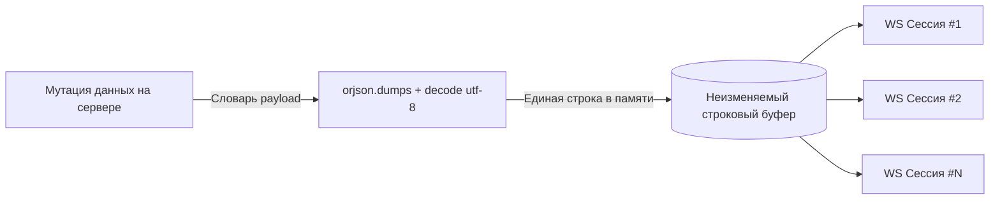

# RFC 0006: WebSocket-рассылки и шина событий реального времени (`plugins.broadcast`)

* **Номер RFC:** 0006
* **Название:** WebSocket-рассылки и шина событий реального времени (`plugins.broadcast`)
* **Статус:** 📝 На рассмотрении (Proposed / In Review)
* **Автор:** Архитектурная команда
* **Дата:** Сентябрь 2026

---

## 🧭 Содержание
1. [Краткое резюме](#1-краткое-резюме)
2. [Мотивация и цели](#2-мотивация-и-цели)
3. [Принцип Zero-Copy сериализации](#3-принцип-zero-copy-сериализации)
4. [Шаблоны адресации и доставки](#4-шаблоны-адресации-и-доставки)
   * [4.1. Глобальная широковещательная рассылка (Broadcast)](#41-глобальная-широковещательная-рассылка-broadcast)
   * [4.2. Таргетированный push пользователю (Multi-Device / Multi-Tab)](#42-таргетированный-push-пользователю-multi-device--multi-tab)
   * [4.3. Рассылка по ролям пользователей (RBAC Targeted Dispatch)](#43-рассылка-по-ролям-пользователей-rbac-targeted-dispatch)
   * [4.4. Pub/Sub каналы и подписки на топики](#44-pubsub-каналы-и-подписки-на-топики)
5. [Изоляция ошибок и неблокирующие сокеты](#5-изоляция-ошибок-и-неблокирующие-сокеты)
6. [Спецификация API и примеры](#6-спецификация-api-и-примеры)
7. [Горизонтальное масштабирование и кластеризация (Redis/NATS Bridge)](#7-горизонтальное-масштабирование-и-кластеризация-redisnats-bridge)
8. [План внедрения](#8-план-внедрения)

---

## 1. Краткое резюме

Настоящий RFC специфицирует архитектуру **`plugins.broadcast`** — официального плагина распределения событий и push-уведомлений реального времени для фреймворка `rsgi-wsrpc`.

В то время как классические WSRPC-запросы работают в парадигме «запрос-ответ» или стримов, инициированных клиентом, реактивным веб-приложениям необходимо **проактивно отправлять события с сервера** одному, группе или всем подключенным клиентам:
* Кадры мгновенной инвалидации кэша (`cache.invalidate`, `cache.patch`).
* Уведомления реального времени (новые сообщения в чате, системные алерты, завершение тяжелых фоновых задач).
* Обновление присутствия (Online/Offline) и оперативные оповещения.

`plugins.broadcast` обеспечивает высокую пропускную способность, неблокирующую отправку и фиксированные накладные расходы $O(1)$ по сериализации JSON даже при тысячах одновременных WebSocket-соединений.

---

## 2. Мотивация и цели

В традиционных реализациях WebSocket рассылка событий на тысячи клиентов сталкивается с характерными узкими местами:

1. **Избыточные накладные расходы на сериализацию:** Наивные циклы вызывают `json.dumps(payload)` в теле цикла для каждой сессии. При 10 000 подключений процессор тратит секунды на повторную кодировку одинаковых данных.
2. **Блокировка медленными клиентами (Head-of-Line Blocking):** Если один клиент на медленном мобильном интернете задерживает подтверждение TCP-пакетов, синхронный перебор тормозит доставку остальным пользователям.
3. **Фрагментация по устройствам и вкладкам:** Когда событие адресовано конкретному пользователю (например, Пользователю 42 пришло сообщение), сервер должен доставить push во все его открытые вкладки браузера и мобильные устройства одновременно.
4. **Чистота ядра (Decoupling):** Ядро фреймворка (`core/session.py`) хранит реестр активных сокетов (`ACTIVE_SESSIONS_SET`), но должно оставаться свободным от высокоуровневой логики маршрутизации. `plugins.broadcast` берет эту задачу на себя.

---

## 3. Принцип Zero-Copy сериализации

Для достижения околонулевой задержки `plugins.broadcast` строго реализует паттерн **«Сериализуй один раз, отправляй всем»** с использованием сверхбыстрого модуля `orjson`:



* Кадр JSON-RPC 2.0 (`{"jsonrpc": "2.0", "method": "...", "params": {...}}`) кодируется в бинарный UTF-8 **ровно один раз**.
* Полученная неизменяемая строка передается параллельно во все активные сокеты через `asyncio.gather(*tasks, return_exceptions=True)`.
* Расход оперативной памяти составляет $O(1)$ относительно количества получателей.

---

## 4. Шаблоны адресации и доставки

### 4.1. Глобальная широковещательная рассылка (Broadcast)
Отправляет уведомление всем активным сессиям:
```python
await broadcast_notification(
    method="system.maintenance_warning",
    params={"minutes_left": 5},
    exclude_current=True  # Исключить сессию инициатора при вызове из RPC-хендлера
)
```

### 4.2. Таргетированный push пользователю (Multi-Device / Multi-Tab)
Отправляет уведомление во все активные сокеты конкретного пользователя:
```python
await send_to_user(
    user_id=user_id,
    method="chat.message_received",
    params={"dialog_id": 14, "from_user": "Alice", "text": "Привет!"}
)
```
Диспетчер безопасно извлекает идентификатор пользователя (`session.uid` или `session.user_data["user_id"]`) и объединяет все соответствующие сокеты.

### 4.3. Рассылка по ролям пользователей (RBAC Targeted Dispatch)
Доставляет оповещение только тем пользователям, у которых есть указанная роль:
```python
await send_to_role(
    role="moderator",
    method="forum.flagged_post",
    params={"post_id": 99, "reason": "spam"}
)
```

### 4.4. Pub/Sub каналы и подписки на топики
Позволяет клиентам подписываться на узкие топики (например, `order:1024`, `chat:room:5`):
```python
# Сервер регистрирует подписку сессии
channel_manager.subscribe(session, topic="topic:forum:45")

# Отправка всем слушателям данного топика
await broadcast_to_topic(
    topic="topic:forum:45",
    method="forum.reply_added",
    params={"reply_id": 128}
)
```
При закрытии вкладки клиент автоматически удаляется из всех списков рассылки топиков через хук `session.register_on_close`.

---

## 5. Изоляция ошибок и неблокирующие сокеты

Сетевой сбой у отдельного клиента никогда не должен блокировать или ронять отправку остальным. Каждый вызов изолирован:

```python
async def _safe_send(session: JsonRpcSession, payload_str: str) -> bool:
    try:
        if getattr(session, "_closed", True) or not getattr(session, "ws", None):
            return False
        awaitable = session.ws.send_str(payload_str)
        if not hasattr(awaitable, "cancelled"):
            try:
                awaitable.cancelled = lambda: False
            except AttributeError:
                pass
        await awaitable
        return True
    except Exception as e:
        logger.debug(f"[Broadcast] Ошибка отправки в сессию {getattr(session, 'session_id', '?')}: {e}")
        return False
```

Сбои логируются на уровне `DEBUG` и не прерывают ход выполнения бизнес-логики.

---

## 6. Спецификация API и примеры

Модуль `plugins.broadcast` экспортирует следующие функции:

```python
from plugins.broadcast import (
    broadcast_notification,
    send_to_user,
    send_to_role,
    broadcast_to_topic,
    subscribe_topic,
    unsubscribe_topic,
)
```

### Пример использования: Реактивная инвалидация кэша
```python
from plugins.broadcast import broadcast_notification
from plugins.smart_cache import invalidate_tags

async def on_product_updated(product_id: int):
    # Обновляем версию тега в БД
    await invalidate_tags([f"product:{product_id}", "products:list"])
    # Уведомляем активные клиенты об изменении
    await broadcast_notification(
        method="cache.invalidate",
        params={"tags": [f"product:{product_id}", "products:list"]}
    )
```

---

## 7. Горизонтальное масштабирование и кластеризация (Redis/NATS Bridge)

При запуске `rsgi-wsrpc` в многопроцессорном режиме (несколько воркеров Granian) или на нескольких серверах:
* Локальный бродкаст доставляет кадры в сокеты **текущего воркера**.
* Для межворкерной синхронизации `plugins.broadcast` поддерживает опциональный адаптер:
  * `BroadcastEngine(adapter=RedisPubSubAdapter("redis://..."))`
  * Публикация события отправляет команду в Redis PUB; все воркеры слушают канал и доставляют кадры в свои локальные сокеты.

---

## 8. План внедрения

1. Создать каталог `plugins/broadcast/`:
   * `plugins/broadcast/__init__.py`: Публичный экспорт API
   * `plugins/broadcast/engine.py`: Ядро бродкаста и сериализации
   * `plugins/broadcast/channels.py`: Реестр топиков и подписок
2. В приложении `Agrita` оформить фасад `app/system/broadcast.py` с реэкспортом из `plugins.broadcast`.
3. Обновить документацию в `docs/` и `docs_ru/`.
