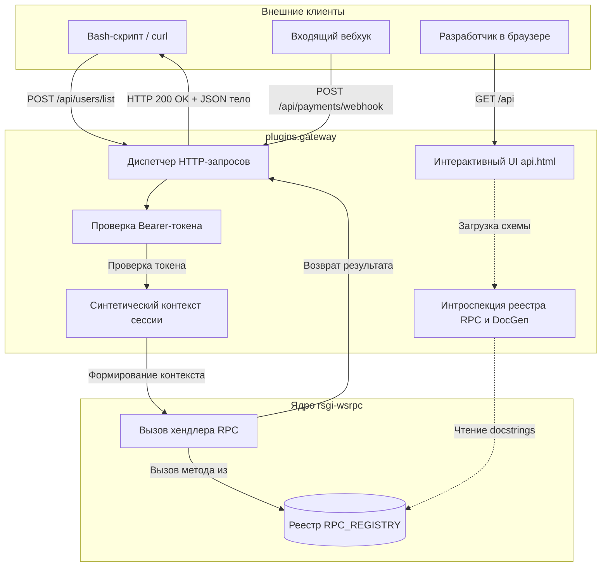

# RFC 0007: HTTP API Gateway и интерактивная документация RPC (`plugins.gateway`)

* **Номер RFC:** 0007
* **Название:** HTTP API Gateway и интерактивная документация RPC (`plugins.gateway`)
* **Статус:** 📝 На рассмотрении (Proposed / In Review)
* **Автор:** Архитектурная команда
* **Дата:** Сентябрь 2026

---

## 🧭 Содержание
1. [Краткое резюме](#1-краткое-резюме)
2. [Мотивация и сценарии использования](#2-мотивация-и-сценарии-использования)
3. [Архитектура: Мост между HTTP и WSRPC](#3-архитектура-мост-между-http-и-wsrpc)
4. [Детальная спецификация](#4-детальная-спецификация)
   * [4.1. Прозрачная маршрутизация (`POST /api/...`)](#41-прозрачная-маршрутизация-post-api)
   * [4.2. Авторизация по Bearer-токену для скриптов и систем](#42-авторизация-по-bearer-токену-для-скриптов-и-систем)
   * [4.3. Синтетический контекст сессии и трассировка логов](#43-синтетический-контекст-сессии-и-трассировка-логов)
   * [4.4. Автоматический генератор документации (`generate_docs.py`)](#44-автоматический-генератор-документации-generate_docspy)
   * [4.5. Встроенный интерактивный веб-проводник (`api.html`)](#45-встроенный-интерактивный-веб-проводник-apihtml)
5. [Схема конфигурации](#5-схема-конфигурации)
6. [Безопасность и защита от злоупотреблений](#6-безопасность-и-защита-от-злоупотреблений)
7. [План внедрения](#7-план-внедрения)

---

## 1. Краткое резюме

Настоящий RFC специфицирует **`plugins.gateway`** — официальный плагин HTTP-шлюза и интерактивной документации API для фреймворка `rsgi-wsrpc`.

Хотя браузерные клиенты и мобильные приложения взаимодействуют с `rsgi-wsrpc` через симметричный двунаправленный протокол WebSockets, в реальной эксплуатации неизбежно возникает необходимость взаимодействия с внешним миром:
* Входящие вебхуки от внешних платформ (платежные шлюзы, GitHub, мессенджеры).
* Серверные скрипты автоматизации, ETL-процессы по расписанию и вызовы через curl.
* Быстрое интерактивное исследование и тестирование API без необходимости устанавливать Postman или писать кастомные сокетные клиенты.

`plugins.gateway` устраняет этот разрыв, прозрачно проксируя входящие HTTP-запросы в существующие обработчики `@rpc_method` с нулевым дублированием кода, и автоматически формирует самодостаточную интерактивную веб-страницу документации (`/api`).

---

## 2. Мотивация и сценарии использования

1. **Антипаттерн дублирования кодовой базы:** Когда разработчикам требуется предоставить HTTP API параллельно с WebSockets, они часто пишут дублирующие эндпоинты (например, в FastAPI/Flask), вызывающие те же сервисы. Это ведет к рассинхронизации валидации, двойным схемам и разным моделям авторизации.
2. **Внешние вебхуки и скрипты:** Сторонние сервисы не умеют открывать JSON-RPC 2.0 WebSockets. Они ожидают стандартный эндпоинт HTTP POST с детерминированными кодами ответа и JSON телом.
3. **Удобство разработчиков (DX):** Фронтендерам и партнерам крайне полезна интерактивная веб-песочница (аналог Swagger UI), где можно наглядно увидеть список методов, типы параметров и выполнить боевой вызов в один клик.

`plugins.gateway` позволяет вызвать любой `@rpc_method` через HTTP без переписывания его реализации.

---

## 3. Архитектура: Мост между HTTP и WSRPC



---

## 4. Детальная спецификация

### 4.1. Прозрачная маршрутизация (`POST /api/...`)

При поступлении HTTP-запроса в шлюз:
1. URL-путь сопоставляется с именем RPC-метода:
   * `POST /api/users/list` $\rightarrow$ вызывает `users.list`
   * `POST /api/billing/invoice` $\rightarrow$ вызывает `billing.invoice`
2. Тело HTTP-запроса (JSON) десериализуется через `orjson` и передается в качестве аргумента `params`.
3. Ответ сериализуется в стандартный HTTP-формат:
   * Успех: `HTTP 200 OK` с телом `{"status": "ok", "result": ...}`.
   * Ошибка логики (`RPCError`): `HTTP 400 Bad Request` с телом `{"status": "error", "message": "..."}`.
   * Нет доступа: `HTTP 403 Forbidden`.
   * Метод не найден: `HTTP 404 Not Found`.

### 4.2. Авторизация по Bearer-токену для скриптов и систем

Вызовы из скриптов и вебхуков авторизуются с помощью API-токена:
* Заголовок: `Authorization: Bearer <api_token>`
* Токен сверяется с настройкой `settings.gateway.token` или динамическими ключами сервисных аккаунтов в БД.

### 4.3. Синтетический контекст сессии и трассировка логов

Поскольку сигнатура `@rpc_method` принимает `session: JsonRpcSession` и устанавливает переменные контекста (`current_session_ctx`, `current_transport_ctx`), шлюз конструирует легковесную сессию-заглушку `MockTransportSession`:

```python
class MockTransportSession:
    def __init__(self, ip: str, token_id: str):
        self.ip = ip
        self.session_id = f"http-gw-{token_id[:8]}"
        self.user_data = {"role": "service_account", "auth_type": "api_token"}
```
Благодаря этому система аудита, контекстные проверки прав и логирование работают идентично для вызовов из WebSockets и через HTTP.

### 4.4. Автоматический генератор документации (`generate_docs.py`)

На этапе старта или по запросу шлюз опрашивает словарь `RPC_REGISTRY`:
* Извлекает описания, таблицы параметров и возвращаемые структуры из docstrings функций.
* Анализирует аннотации типов через модуль `inspect`.
* Формирует единый JSON-каталог доступных методов, прав доступа и примеров полезной нагрузки.

### 4.5. Встроенный интерактивный веб-проводник (`api.html`)

При обращении к `GET /api/` отдается автономная интерактивная HTML-страница:
* Поиск методов и фильтрация по категориям/тегам.
* Редактор параметров с подсветкой синтаксиса JSON.
* Кнопка «Выполнить запрос», отправляющая реальный HTTP POST на шлюз с замером времени ответа и отображением результата.

---

## 5. Схема конфигурации

В файле `app_settings.yaml`:
```yaml
gateway:
  enabled: true
  prefix: "/api"
  # Секретный токен для служебных скриптов
  token: "secret-production-gateway-token"
  # Включение интерактивного UI документации
  enable_ui: true
  # Открывать только методы с @rpc_method(http=True) или весь реестр
  expose_all: false
```

---

## 6. Безопасность и защита от злоупотреблений

1. **Выборочный доступ (`http=True`):** По умолчанию через шлюз доступны только методы, явно помеченные флагом `http=True`, что предотвращает случайное открытие внутренних сокетных процедур.
2. **Сравнение токенов с защитой от тайминг-атак:** Проверка секретов выполняется через функцию `secrets.compare_digest`.
3. **Ограничение размера тела запроса:** Обработчик RSGI отклоняет запросы с телом, превышающим `settings.gateway.max_body_size` (по умолчанию 10 МБ), для предотвращения DoS-атак.

---

## 7. План внедрения

1. Выделить и оформить плагин `plugins/gateway/`:
   * `plugins/gateway/__init__.py`: Инициализация и регистрация HTTP-роутов
   * `plugins/gateway/router.py`: Диспетчер HTTP $\rightarrow$ RPC
   * `plugins/gateway/introspect.py`: Генератор документации и схем
   * `plugins/gateway/static/api.html`: Автономный веб-интерфейс
2. В приложении `Agrita` заменить модуль `app/system/internal_api/` на фасад к `plugins.gateway`.
3. Обновить документацию на двух языках в `docs/` и `docs_ru/`.
