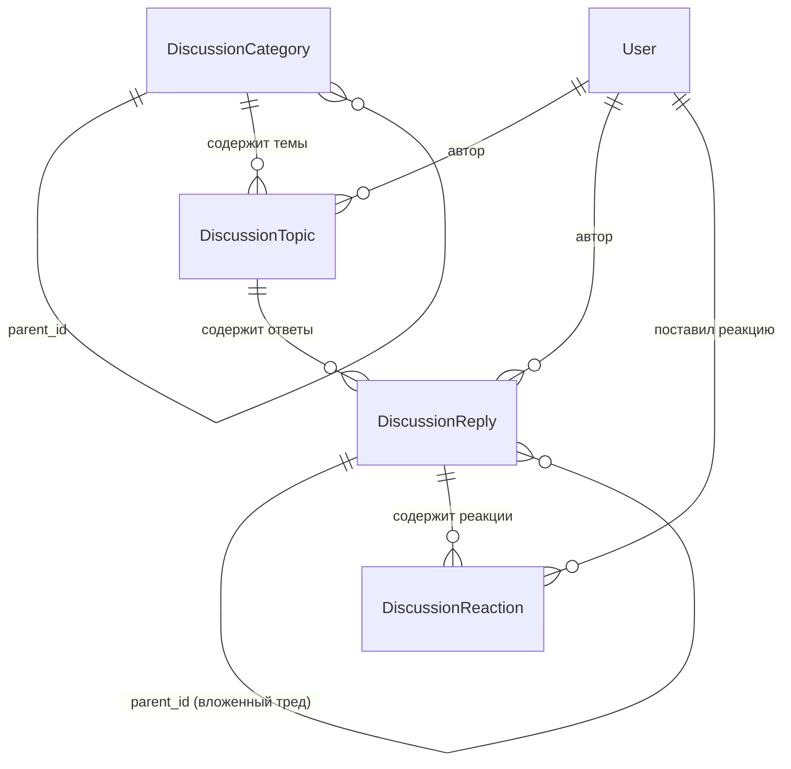

# RFC 0008: Вложенные обсуждения и форум сообщества (`plugins.discussions`)

* **Номер RFC:** 0008
* **Название:** Вложенные обсуждения и форум сообщества (`plugins.discussions`)
* **Статус:** 📝 На рассмотрении (Proposed / In Review)
* **Автор:** Архитектурная команда
* **Дата:** Сентябрь 2026

---

## 🧭 Содержание
1. [Краткое резюме](#1-краткое-резюме)
2. [Мотивация и целевые сценарии](#2-мотивация-и-целевые-сценарии)
3. [Архитектура доменной модели](#3-архитектура-доменной-модели)
   * [3.1. Категории и иерархическая таксономия](#31-категории-и-иерархическая-таксономия)
   * [3.2. Темы и флаги модерации](#32-темы-и-флаги-модерации)
   * [3.3. Вложенные ответы и принятые решения](#33-вложенные-ответы-и-принятые-решения)
   * [3.4. Движок эмодзи-реакций](#34-движок-эмодзи-реакций)
4. [WSRPC-хендлеры и реактивный поток данных](#4-wsrpc-хендлеры-и-реактивный-поток-данных)
5. [Табличное сжатие данных (RFC 0002)](#5-табличное-сжатие-данных-rfc-0002)
6. [Живые подписки и push-уведомления](#6-живые-подписки-и-push-уведомления)
7. [Безопасность и разграничение прав (RBAC)](#7-безопасность-и-разграничение-прав-rbac)
8. [План внедрения](#8-план-внедрения)

---

## 1. Краткое резюме

Настоящий RFC специфицирует **`plugins.discussions`** — официальный доменно-нейтральный плагин комьюнити-обсуждений, форума и Q&A-системы для фреймворка `rsgi-wsrpc`.

Современным веб-приложениям все чаще требуются встроенные инструменты взаимодействия пользователей: сообщества поддержки клиентов, внутренние корпоративные базы вопросов и ответов, разбор инцидентов и обсуждения задач.

`plugins.discussions` предоставляет высокопроизводительную платформу обсуждений, полностью бесшовно интегрированную со стеком ядра:
* **`plugins.auth`:** Авторизация авторов, проверка ролей модераторов (`moderator`, `admin`).
* **`plugins.broadcast`:** Мгновенная доставка новых ответов и реакций активным вкладкам.
* **`plugins.smart_cache`:** Мгновенный рендеринг без ожидания сети с реактивной инвалидацией при правках.
* **RFC 0002 Tabular Payloads:** Экономия до 80% сетевого трафика при передаче списков тем.

---

## 2. Мотивация и целевые сценарии

Разработка системы обсуждений с нуля внутри отдельного проекта ведет к колоссальному дублированию бойлерплейта:
* Построение иерархии категорий и вложенных деревьев комментариев.
* Антиспам, закрепление тем, блокировка и инструменты модерации.
* Счетчики непрочитанного, агрегация лайков и реакций.

`plugins.discussions` предоставляет готовый движок для следующих задач:
1. **Публичные форумы сообщества:** Обратная связь по продукту, клуб пользователей и служба поддержки.
2. **Корпоративный Q&A:** Формат вопросов и ответов с возможностью отметить «Принятый ответ».
3. **Обсуждения к сущностям:** Ветка комментариев, прикрепляемая к записям бизнес-моделей.

---

## 3. Архитектура доменной модели



### 3.1. Категории и иерархическая таксономия (`DiscussionCategory`)
* `id`: Первичный ключ (Integer).
* `slug`: Уникальный URL-идентификатор (например, `announcements`, `support`).
* `title`, `description`, `icon`: Презентационные атрибуты.
* `parent_id`: Рекурсивный внешний ключ, обеспечивающий произвольную вложенность подкатегорий.
* `sort_order`: Индекс порядка сортировки при выводе в UI.

### 3.2. Темы и флаги модерации (`DiscussionTopic`)
* `category_id`: Внешний ключ на категорию.
* `author_id`: Внешний ключ на пользователя (`auth_user.id`).
* `title`, `content`: Заголовок и Markdown-текст темы.
* `tags`: JSON-массив тегов темы.
* `is_pinned`: Закрепление темы наверху списка.
* `is_locked`: Запрет на добавление новых ответов (флаг модерации).
* `views_count`, `replies_count`: Денормализованные счетчики для мгновенного рендеринга таблицы тем.

### 3.3. Вложенные ответы и принятые решения (`DiscussionReply`)
* `topic_id`: Внешний ключ на тему форума.
* `author_id`: Внешний ключ на автора.
* `parent_id`: Опциональный внешний ключ на родительский ответ (`DiscussionReply.id`) для построения древовидных веток.
* `content`: Текст сообщения в формате Markdown.
* `is_accepted_answer`: Булев флаг лучшего/принятого ответа (режим Q&A).

### 3.4. Движок эмодзи-реакций (`DiscussionReaction`)
* `reply_id`: Внешний ключ на сообщение.
* `user_id`: Внешний ключ на пользователя.
* `emoji`: Символ эмодзи (например, `👍`, `❤️`, `💡`, `🎉`).
* Составной уникальный индекс `(reply_id, user_id, emoji)`.

---

## 4. WSRPC-хендлеры и реактивный поток данных

Модуль регистрирует следующие методы:

| Метод | Требуемая роль | Описание |
| :--- | :--- | :--- |
| `discussions.list_categories` | Любая | Список категорий со счетчиками тем и ответов |
| `discussions.list_topics` | Любая | Табличный список тем внутри категории с фильтрами |
| `discussions.get_topic` | Любая | Полные данные темы и список первых сообщений |
| `discussions.create_topic` | `user` | Создание темы и отправка инвалидации кэша |
| `discussions.update_topic` | Автор / Модератор | Редактирование темы |
| `discussions.post_reply` | `user` | Добавление ответа в тред и push-оповещение участников |
| `discussions.toggle_reaction`| `user` | Добавление/снятие эмодзи-реакции |
| `discussions.mark_accepted` | Автор / Модератор | Установка отметки `is_accepted_answer = True` |
| `discussions.pin_topic` | Модератор / Админ | Переключение статуса закрепления |
| `discussions.lock_topic` | Модератор / Админ | Блокировка/разблокировка темы |

---

## 5. Табличное сжатие данных (RFC 0002)

Получение списка тем оптимизировано декоратором `@tabular_response`:
```python
@rpc_method("discussions.list_topics")
@tabular_response(fields=[
    "id", "title", "author_id", "author_name", "views_count",
    "replies_count", "is_pinned", "is_locked", "created_at"
])
async def list_topics(session: JsonRpcSession, params: dict):
    category_id = params["category_id"]
    ...
```
Это исключает повторение имен ключей JSON в каждой строке и уменьшает объем ответа на 65–80%.

---

## 6. Живые подписки и push-уведомления

При публикации нового ответа:
1. Запись сохраняется в базу данных, инкрементируется счетчик `replies_count`.
2. Модуль `plugins.smart_cache` обновляет версию тега `topic:{id}`.
3. Модуль `plugins.broadcast` мгновенно рассылает событие всем активным вкладкам:
   ```python
   await broadcast_to_topic(
       topic=f"topic:{topic_id}",
       method="discussions.new_reply",
       params=reply.to_dict()
   )
   ```

---

## 7. Безопасность и разграничение прав (RBAC)

* **Права автора:** Пользователь может редактировать и удалять собственные сообщения в течение разрешенного интервала (например, 24 часа), если тема не заблокирована.
* **Привилегии модератора:** Пользователи с ролями `moderator` или `admin` имеют право редактировать, удалять, блокировать и закреплять любые темы во всех разделах.
* **Мягкое удаление (Soft Delete):** Удаленные посты сохраняют запись в аудите и помечаются текстом `[сообщение удалено модератором]`, чтобы не нарушать целостность дерева ответов.

---

## 8. План внедрения

1. Оформить каталог `plugins/discussions/` в `rsgi-wsrpc`:
   * `plugins/discussions/models.py`: Модели данных
   * `plugins/discussions/handlers.py`: WSRPC-хендлеры
   * `plugins/discussions/service.py`: Бизнес-логика и агрегации
2. В Agrita модуль `app/forum/` трансформируется в тонкий адаптер, использующий `plugins.discussions`.
3. Документация синхронизируется в `docs/` и `docs_ru/`.
