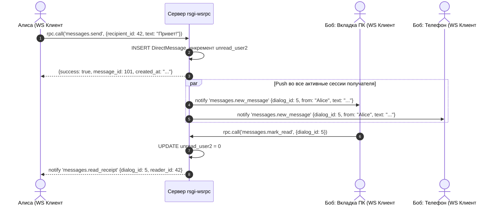

# RFC 0009: Подсистема личных сообщений и чата реального времени (`plugins.messages`)

* **Номер RFC:** 0009
* **Название:** Подсистема личных сообщений и чата реального времени (`plugins.messages`)
* **Статус:** 📝 На рассмотрении (Proposed / In Review)
* **Автор:** Архитектурная команда
* **Дата:** Сентябрь 2026

---

## 🧭 Содержание
1. [Краткое резюме](#1-краткое-резюме)
2. [Мотивация и архитектура](#2-мотивация-и-архитектура)
3. [Спецификация моделей данных](#3-спецификация-моделей-данных)
   * [3.1. Диалоги 1-на-1 (`DirectConversation`)](#31-диалоги-1-на-1-directconversation)
   * [3.2. Сообщения и статусы доставки (`DirectMessage`)](#32-сообщения-и-статусы-доставки-directmessage)
   * [3.3. Полиморфная привязка к сущностям приложения](#33-полиморфная-привязка-к-сущностям-приложения)
4. [Доставка сообщений и синхронизация счетчиков](#4-доставка-сообщений-и-синхронизация-счетчиков)
5. [Спецификация RPC-хендлеров](#5-спецификация-rpc-хендлеров)
6. [Табличное сжатие истории сообщений (RFC 0002)](#6-табличное-сжатие-истории-сообщений-rfc-0002)
7. [Безопасность и приватность переписки](#7-безопасность-и-приватность-переписки)
8. [План внедрения](#8-план-внедрения)

---

## 1. Краткое резюме

Настоящий RFC специфицирует **`plugins.messages`** — официальную подсистему личных сообщений (Direct Messages), чата 1-на-1 и синхронизации уведомлений для фреймворка `rsgi-wsrpc`.

Для удержания пользователей и оперативного взаимодействия платформам необходим надежный мессенджер: прямая связь между клиентами и менеджерами, рабочие переписки сотрудников, обсуждение деталей заказов и консультации по спорным вопросам.

`plugins.messages` предоставляет комплексное решение для обмена сообщениями со следующими свойствами:
* Мгновенный push на все активные устройства получателя через `plugins.broadcast` (`send_to_user`).
* Раздельные независимые счетчики непрочитанных для каждого участника.
* Полиморфные ссылки на контекст диалога (`ref_type`, `ref_id`).
* Сверхкомпактная табличная загрузка истории сообщений по стандарту RFC 0002.

---

## 2. Мотивация и архитектура

Классические REST-чаты страдают от задержек, сложной синхронизации прочитанных статусов на нескольких устройствах и паразитной нагрузки от частого опроса сервера.

Благодаря постоянному двунаправленному WSRPC-соединению:
1. При отправке сообщения сервер сохраняет его в БД и сразу пушит уведомление во все открытые вкладки браузера и мобильные клиенты получателя.
2. При открытии диалога получателем один легкий вызов сбрасывает счетчик и шлет отправителю подтверждение прочтения (Read Receipt).
3. История чата передается компактным табличным массивом (`$tabular: true`) без накладных расходов на повторные HTTP-рукопожатия.



---

## 3. Спецификация моделей данных

### 3.1. Диалоги 1-на-1 (`DirectConversation`)
Управляет состоянием беседы между двумя пользователями:
* `id`: Первичный ключ (Integer).
* `user1_id`, `user2_id`: Внешние ключи на `auth_user.id` (с каноническим упорядочиванием `min(id), max(id)` для исключения дублирования веток).
* `last_message`: Превью последнего сообщения для списка чатов.
* `last_message_time`: UTC-время последней активности.
* `last_sender_id`: Идентификатор автора последнего сообщения.
* `unread_user1`, `unread_user2`: Независимые счетчики непрочитанных сообщений.
* `topic_ref_type`, `topic_ref_id`, `topic_ref_title`: Опциональная полиморфная ассоциация с внешней бизнес-сущностью.

### 3.2. Сообщения и статусы доставки (`DirectMessage`)
* `id`: Первичный ключ (Integer).
* `conversation_id`: Внешний ключ на `DirectConversation.id` с каскадным удалением.
* `sender_id`: Внешний ключ на автора сообщения.
* `text`: Текст сообщения (санитизированный UTF-8).
* `is_read`: Булев статус прочтения.
* `attachments`: JSON-массив хэшей файлов (интеграция с `plugins.files`).
* `created_at`: UTC-метка времени с микросекундной точностью.

### 3.3. Полиморфная привязка к сущностям приложения
Вместо жесткой привязки внешних ключей к конкретным таблицам Agrita диалог поддерживает универсальное связывание:
```python
# Начало диалога относительно Заказа или Расчета:
await session.call("messages.get_or_create_dialogue", {
    "recipient_id": 88,
    "ref_type": "calculation",
    "ref_id": "calc_9042",
    "ref_title": "Рецепт удобрения для томатов v3"
})
```

---

## 4. Доставка сообщений и синхронизация счетчиков

1. **Мгновенный Push по сокетам:** Функция `send_to_user(recipient_id, "messages.new_message", payload)` адресует событие всем сокетам из `ACTIVE_SESSIONS_SET`, принадлежащим получателю.
2. **Синхронизация бейджей:** При получении нового сообщения или прочтении ветки сервер отправляет событие обновления суммарного счетчика бейджа непрочитанных сообщений.

---

## 5. Спецификация RPC-хендлеров

| Метод | Роль | Описание |
| :--- | :--- | :--- |
| `messages.list_dialogues` | `user` | Список всех диалогов пользователя с сортировкой по времени |
| `messages.get_or_create_dialogue` | `user` | Поиск или создание диалога с указанным пользователем |
| `messages.get_history` | `user` | Табличная история сообщений с пагинацией |
| `messages.send_message` | `user` | Отправка сообщения, инкремент счетчиков, сокетный push |
| `messages.mark_read` | `user` | Сброс счетчика непрочитанных, отправка уведомления о прочтении |
| `messages.get_unread_total` | `user` | Получение суммарного количества непрочитанных сообщений |

---

## 6. Табличное сжатие истории сообщений (RFC 0002)

Поскольку переписка может насчитывать тысячи сообщений, метод `messages.get_history` использует компактный формат RFC 0002:
```python
@rpc_method("messages.get_history")
@tabular_response(fields=["id", "sender_id", "text", "is_read", "attachments", "created_at"])
async def get_history(session: JsonRpcSession, params: dict):
    ...
```
Это снижает нагрузку на мобильные устройства и обеспечивает плавный скроллинг чата на 60 FPS.

---

## 7. Безопасность и приватность переписки

1. **Строгая изоляция участников:** SQL-запросы всегда содержат фильтр `WHERE (user1_id = :uid OR user2_id = :uid)`, исключающий доступ третьих лиц к чужой переписке.
2. **Санитизация против XSS:** Входящий текст очищается от тегов `<script>` перед сохранением в БД.
3. **Проверка черных списков:** Валидация блокировок между пользователями перед созданием и отправкой сообщений.

---

## 8. План внедрения

1. Оформить каталог `plugins/messages/` в `rsgi-wsrpc`:
   * `plugins/messages/models.py`: Модели SQLAlchemy
   * `plugins/messages/handlers.py`: RPC-методы
   * `plugins/messages/service.py`: Менеджер диалогов и счетчиков
2. В Agrita модуль `app/messages/` заменить на тонкий фасад к `plugins.messages`.
3. Документация синхронизируется в `docs/` и `docs_ru/`.
