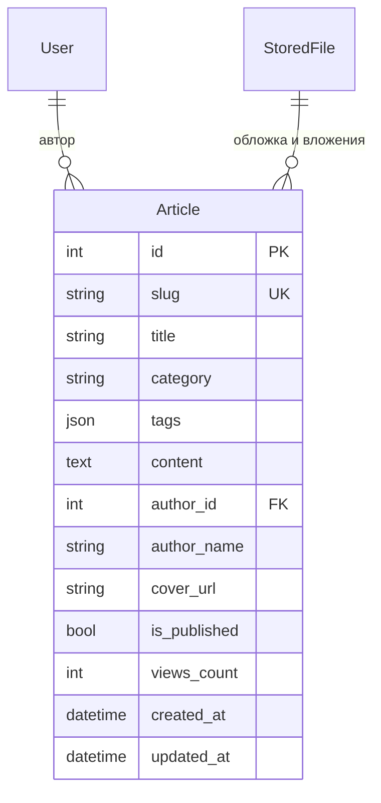

# RFC 0010: База знаний и система управления статьями (`plugins.articles`)

* **Номер RFC:** 0010
* **Название:** База знаний и система управления статьями (`plugins.articles`)
* **Статус:** 📝 На рассмотрении (Proposed / In Review)
* **Автор:** Архитектурная команда
* **Дата:** Сентябрь 2026

---

## 🧭 Содержание
1. [Краткое резюме](#1-краткое-резюме)
2. [Мотивация и сценарии использования](#2-мотивация-и-сценарии-использования)
3. [Архитектура данных и модель контента](#3-архитектура-данных-и-модель-контента)
   * [3.1. Сущность `Article`](#31-сущность-article)
   * [3.2. Таксономия: Категории и мульти-теги](#32-таксономия-категории-и-мульти-теги)
   * [3.3. Интеграция медиафайлов с `plugins.files`](#33-интеграция-медиафайлов-с-pluginsfiles)
4. [Реактивное кэширование (`plugins.smart_cache`)](#4-реактивное-кэширование-pluginssmart_cache)
5. [Спецификация RPC-хендлеров](#5-спецификация-rpc-хендлеров)
6. [Табличное сжатие данных (RFC 0002)](#6-табличное-сжатие-данных-rfc-0002)
7. [SEO и серверный рендеринг для поисковиков (SSR Bridge)](#7-seo-и-серверный-рендеринг-для-поисковиков-ssr-bridge)
8. [План внедрения](#8-план-внедрения)

---

## 1. Краткое резюме

Настоящий RFC специфицирует **`plugins.articles`** — официальный плагин базы знаний, технической документации и управления публикациями (CMS) для фреймворка `rsgi-wsrpc`.

Практически любое SaaS-приложение, портал или корпоративная система требуют структурированной публикации контента: руководств пользователя, инструкций по онбордингу, базы частых вопросов (FAQ), технических регламентов и ленты новостей/релизов.

`plugins.articles` предоставляет легковесный Markdown-ориентированный движок CMS, построенный на ключевых принципах `rsgi-wsrpc`:
* **Ощущаемая задержка 0 мс:** Бесшовная связка с `plugins.smart_cache` для мгновенного переключения между статьями без ожидания сети.
* **Надежные вложения файлов:** Интеграция с `plugins.files` для обложек и картинок внутри текста.
* **RFC 0002 Tabular Payloads:** Эффективная передача реестров сотен статей в одном легковесном пакете.
* **Ролевые воркфлоу публикации:** Статусы черновиков, разграничение прав редакторов и модераторов.

---

## 2. Мотивация и сценарии использования

Использование внешних тяжелых CMS (WordPress, Strapi, Ghost) несет накладные расходы на развертывание отдельных баз данных, синхронизацию пользователей и интеграцию разнородных API.

`plugins.articles` закрывает эти потребности непосредственно внутри единого стека Python / SQLAlchemy / WSRPC:
1. **Центры справки и FAQ:** База знаний с рубрикатором, тегами и быстрым поиском.
2. **Техническая документация:** Инструкции с блоками кода, предупреждениями и таблицами GitHub-Flavored Markdown.
3. **Новости и блог платформы:** Хронологическая лента статей и анонсов обновлений.

---

## 3. Архитектура данных и модель контента



### 3.1. Сущность `Article`
* `id`: Первичный ключ (Integer).
* `slug`: Уникальный текстовый идентификатор в URL (например, `kak-vybrat-osveshchenie`, `rukovodstvo-agronoma-2026`).
* `title`: Заголовок статьи.
* `category`: Основная рубрика (например, `Инструкции`, `Регламенты`, `Релизы`).
* `tags`: JSON-массив тегов для сквозного поиска и рекомендаций похожих материалов.
* `content`: Полный текст в формате Markdown с поддержкой GFM-таблиц, сносок и блоков кода.
* `author_id`: Внешний ключ на автора (`auth_user.id`).
* `author_name`: Денормализованное имя автора для ускоренного вывода таблиц без лишних `JOIN`.
* `cover_url`: Ссылка на обложку (раздается через Nginx `/files/`).
* `is_published`: Булев признак видимости (черновик / опубликовано).
* `views_count`: Монотонно растущий счетчик просмотров.

### 3.2. Таксономия: Категории и мульти-теги
Двухуровневая навигация:
1. Базовый рубрикатор (одна категория на статью) для древовидной структуры каталога.
2. Множественные теги для перекрестного связывания смежных тем.

### 3.3. Интеграция медиафайлов с `plugins.files`
Изображения внутри текста загружаются через двухфазный координатор:
* При загрузке картинки формируется URL вида `/files/<folder_hash>/image.webp`.
* При удалении статьи связанные файлы могут помечаться для сборщика мусора.

---

## 4. Реактивное кэширование (`plugins.smart_cache`)

Чтение статей — типичная read-heavy нагрузка ($>99\%$ чтений). Плагин применяет паттерн умного кэша:
1. При вызове `articles.get_by_slug` фронтенд кэширует Markdown-тело в IndexedDB под тегом `article:{slug}`.
2. Повторные открытия этой статьи происходят **синхронно за 0 мс**.
3. При редактировании статьи редактором:
   ```python
   @rpc_method("articles.update", role="editor")
   @invalidates("articles:list", "article:{slug}")
   async def update_article(session, params):
       ...
   ```
   Сервер инкрементирует монотонную версию тега в БД и пушит `cache.invalidate` всем активным клиентам.

---

## 5. Спецификация RPC-хендлеров

| Метод | Роль | Описание |
| :--- | :--- | :--- |
| `articles.list` | Любая | Табличный список опубликованных статей с фильтрами |
| `articles.get_by_slug` | Любая | Полный текст статьи, инкремент просмотров, данные автора |
| `articles.get_categories`| Любая | Список категорий со счетчиком материалов |
| `articles.create` | `editor` / `admin` | Создание новой статьи (черновик или публикация) |
| `articles.update` | `editor` / `admin` | Редактирование текста, смена обложки, рассылка инвалидации |
| `articles.delete` | `editor` / `admin` | Удаление статьи и отвязка медиафайлов |
| `articles.admin_list` | `editor` / `admin` | Табличный список всех статей, включая черновики |

---

## 6. Табличное сжатие данных (RFC 0002)

Выгрузка каталога использует `@tabular_response`:
```python
@rpc_method("articles.list")
@tabular_response(fields=[
    "id", "slug", "title", "category", "tags",
    "author_name", "cover_url", "views_count", "created_at"
])
async def list_articles(session: JsonRpcSession, params: dict):
    ...
```
Исключение тяжелого поля `content` и повторов ключей JSON сокращает объем передачи сотен статей до одного компактного пакета размером ~15 КБ.

---

## 7. SEO и серверный рендеринг для поисковиков (SSR Bridge)

Для индексации поисковыми роботами (Яндекс, Google):
* `plugins.articles` предоставляет опциональный HTTP-маршрут:
  `@http_route("/articles/{slug}", methods=["GET"])`
* При обращении поискового краулера (определяется по `User-Agent`) сервер отдает готовую семантическую HTML-разметку `<article>` с OpenGraph-метатегами, позволяя индексировать контент без выполнения JS на клиенте.

---

## 8. План внедрения

1. Оформить каталог `plugins/articles/` в `rsgi-wsrpc`:
   * `plugins/articles/models.py`: Модели SQLAlchemy
   * `plugins/articles/handlers.py`: WSRPC-методы
   * `plugins/articles/service.py`: Генератор слагов, буферизация просмотров, SSR-модуль
2. В Agrita модуль `app/articles/` заменить на тонкий фасад к `plugins.articles`.
3. Документация синхронизируется в `docs/` и `docs_ru/`.
